# 棒球赛事管理系统 · 用户使用手册

> 版本：v1.5 ｜ 更新：2026-10-06（2026-10-08 起生产已双轨上线，域名访问直通新版）｜ 适用：新版前端（`/bs-ball-next/`，生产与测试）· 账号权限体系重构（批次 1–7）后（含 #189/#191/#194/#236/#237 修复）
> 本次要点：① 建盟改为“**管理台申请→上级审核**”（门户无申请入口）；② **租管=租户内超管**，可见并代审本租户全部认领待办；③ 受限角色建档须归属球队（从球队入口进入自动带出）；④ 新增「负责人管理/解散」入口。
> 截图环境：测试环境 `test.bsdone.com`（示例账号：`demo_admin` 等演示号）
> 本手册按**角色层级从高到低**组织（超级管理员 → 租户管理员 → 赛事主办方 → 球队负责人 → 球员）。请先在第 1 节找到你的角色，再进入对应章节。

---

## 1. 角色与权限总览

系统按五个层级管理账号与数据（另有免登录的"游客"）：

| 层级 | 角色 | 一句话职责 | 数据范围 |
|---|---|---|---|
| 平台方 | **超级管理员** | 平台运营与最终处置 | 全部租户、全部数据 |
| 租户方 | **租户管理员** | 本租户运营（账号/角色/归还） | 本租户全量 |
| 办赛方 | **赛事主办方** | 组织赛事与赛程 | 自有联盟域内 |
| 球队方 | **球队负责人**（球队管理员） | 管理本队与队员 | 本队 |
| 球员 | **球员账号** | 维护本人档案、入队/离队 | 本人档案 |
| 访客 | 游客 | 浏览公开数据 | 公开信息 |

> 三层权限：登录与菜单（看得到）→ 接口权限（调得到）→ 行级数据范围（动得到）。越权时按钮隐藏、接口再拒（403）双保险。

**归属与接管规则（重要）**：
- 球队**无负责人**时，赛事主办方可代为管理（建队、批量建档等）；球队一旦有了负责人，主办方对该队转为**只读**。
- 球员档案被本人**认领**后，球队/主办方只能走流程（邀请、审核进队），不能直接改其档案。
- **建档即归属**：主办方/球队负责人新增球员时须选定「当前球队」（从球队入口进入会自动带出）；未归属球队的球员不会出现在受限角色的球员列表，也无法再编辑绑定。

---

## 2. 通用：门户与登录

### 2.1 门户（所有人）

- 地址：`https://<域名>/<新版前缀>/<租户码>`（生产：`https://www.bsdone.com/bs-ball-next/<租户码>`；测试环境：`https://test.bsdone.com/bs-ball-next/bs-ball`）。
- 门户首页可浏览：赛事一览、联盟球队、资讯公告等。
- 右上角**账号菜单**：登录/注册、**进入管理后台**（有管理权限的账号才出现）、个人资料、退出登录。

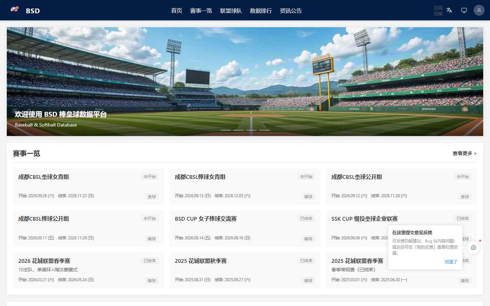

### 2.2 登录

- 门户登录：右上角「登录」→ 账号登录页（可用手机号/用户名）。

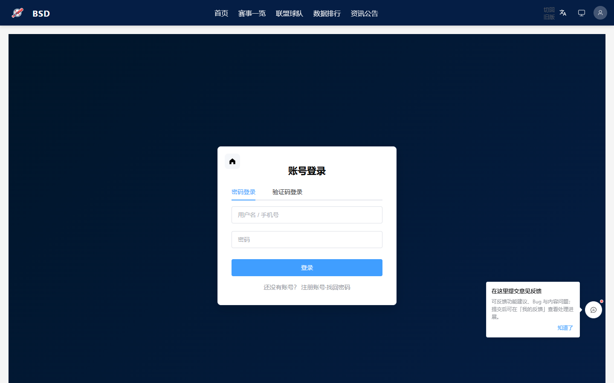

- 管理后台登录：`https://<域名>/<新版前缀>/<租户码>/admin/login`（用户名+密码；测试环境无图形验证码）。
- 登录后自动进入**你第一个有权限的菜单**（如超级管理员进"工作台"、球队负责人进"球队管理"）。

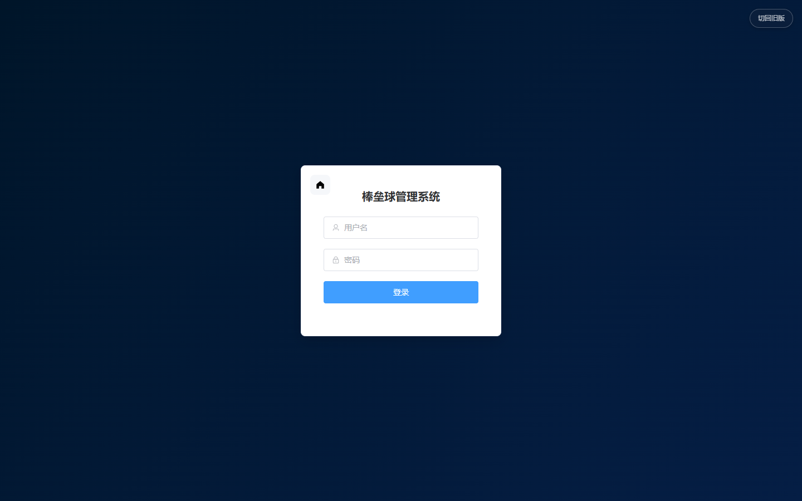

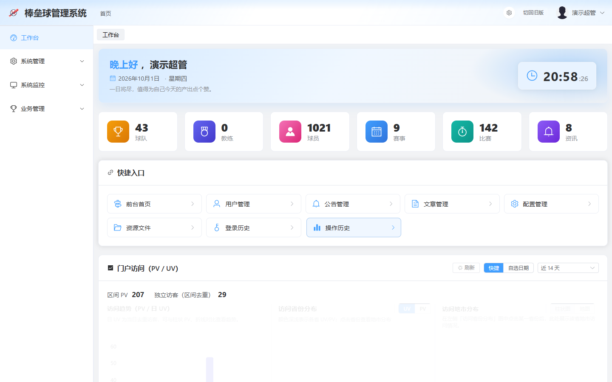

---

## 3. 创建与管理各级账号（管理员）

> 除"球员账号"（由用户自助注册）外，**所有后台账号都在「用户管理」中创建并勾选角色**，一步完成层级设定。

| 要创建的账号 | 勾选角色 | 之后绑定范围的方式 |
|---|---|---|
| 租户管理员 | 租户管理员 | 勾选"可访问租户" |
| 赛事主办方 | 赛事主办方 | 在联盟域内作业（建联盟/被指派后即生效） |
| 球队负责人 | 球队负责人 | 由本人登录后**创建球队自动成为负责人**（或由平台配置指定） |
| 球员 | （普通用户注册后） | 门户提交认领/接受球队邀请 |

### 3.1 用户管理入口

### 3.2 新增用户（以"租户管理员"为例）

1. 点击右上角「**新增**」→ 打开「新增用户」；
2. 填写：用户名（仅小写字母与数字）/ 昵称 / 密码；
3. 在「**角色**」中选择目标层级（如"租户管理员"）；
4. 选择「**租户**」（可访问租户，至少一项）；其余选填；
5. 「确定」保存，即创建成功。

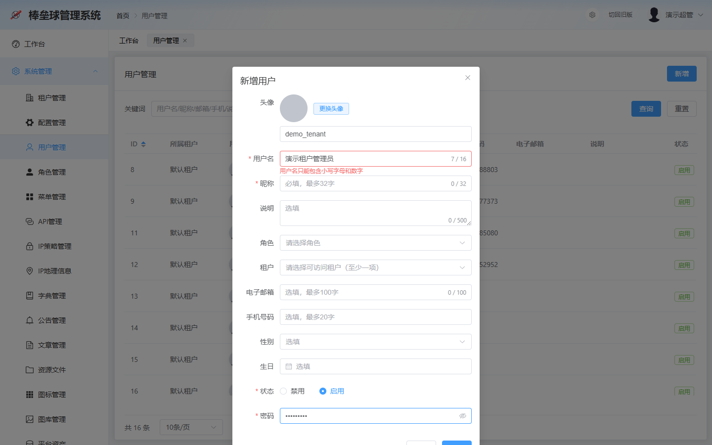

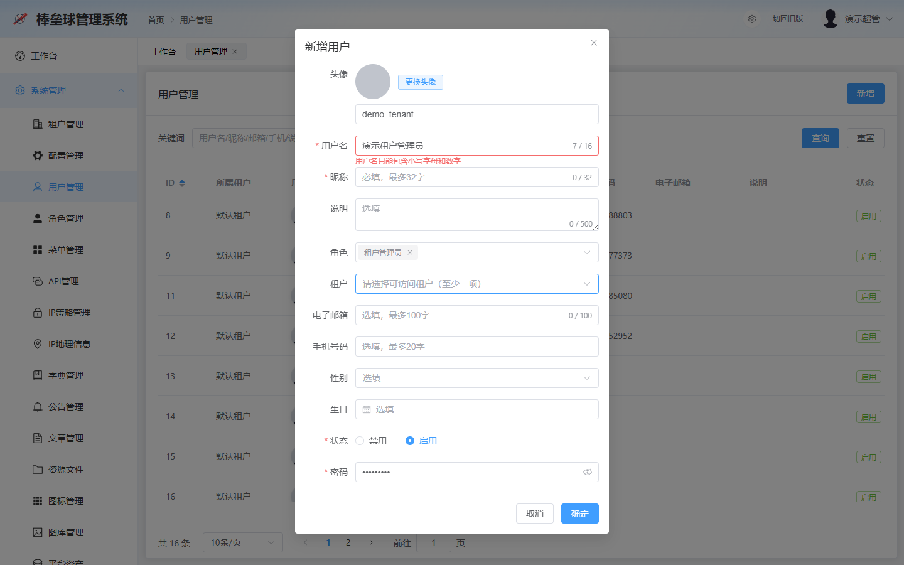

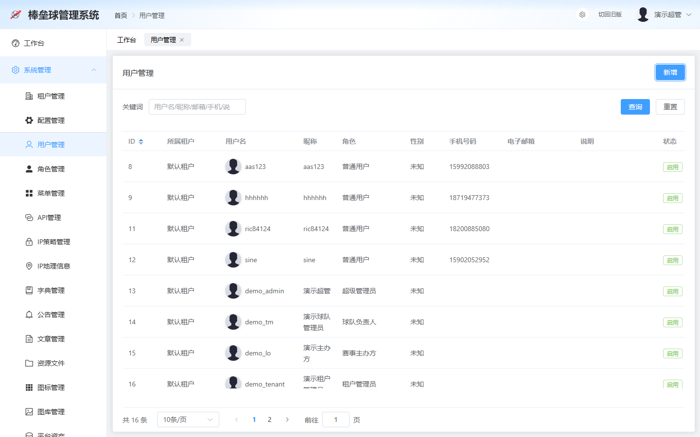

> 同理可创建「赛事主办方」「球队负责人」账号，只需在"角色"处选择对应项。

### 3.3 赛事主办方的联盟作业面

赛事主办方登录后进入 业务管理 → **联盟管理**，在自有联盟域内创建赛事与赛程。

**加入联盟的两种方式**：① 由超管/租管在联盟行「主办方」中**指派**；② 在管理台发起「**申请成立联盟**」→ 上级（超管/租管）在「建盟申请」中审核通过后**自动成为该联盟主办方**。注意：门户侧**没有**申请入口，申请统一在管理台发起。

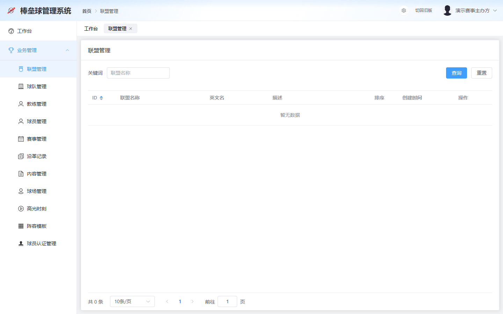

### 3.4 球队负责人绑定球队（自动授职）

球队负责人账号登录后，进入 业务管理 → **球队管理** → 「新增球队」，填写队名等并保存——**创建者自动成为该队负责人**。

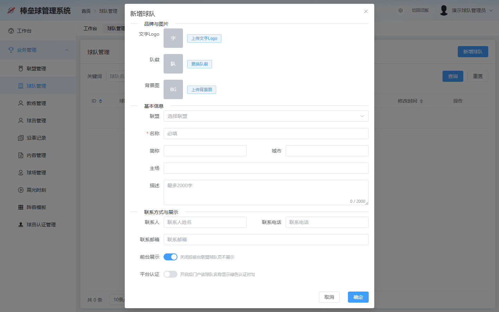

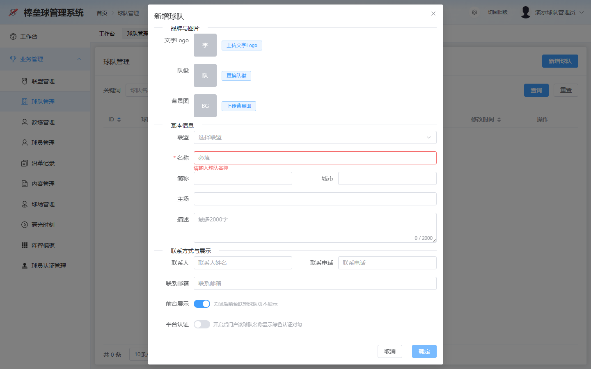

### 3.5 角色与目录权限

- **角色管理**：查看/配置角色（租户管理员可为"球队负责人/赛事主办方"配置**本租户专用**的菜单目录——「租户目录」入口，见下节）。
- **超级管理员**可配置全部角色（含平台角色的全局权限）。

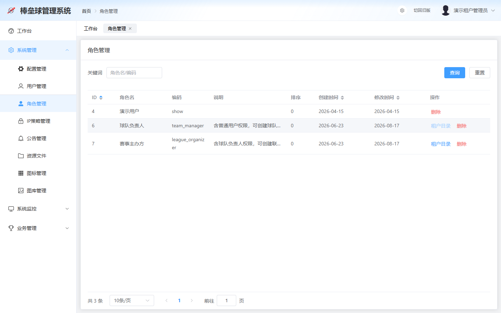

> 「租户目录」打开后：开启「启用租户级目录覆盖」→ 勾选该角色在本租户可见的菜单 → 保存即生效；「清除覆盖」恢复全局默认。覆盖仅调整菜单/按钮导航面，不改变数据范围。

---

## 4. 超级管理员

拥有全部租户与全部功能，另含平台级工具：

| 功能 | 入口（系统管理下） | 说明 |
|---|---|---|
| 租户管理 | 租户管理 | 新建/停用（退租）租户。**退租=该租户整体无法登录、门户"找不到"**，数据冻结保留 |
| 平台资产 | 平台资产 | 各租户"归还"来的历史数据汇总 |
| 角色/菜单/API/字典 等 | 系统管理、系统监控 | 全局配置 |

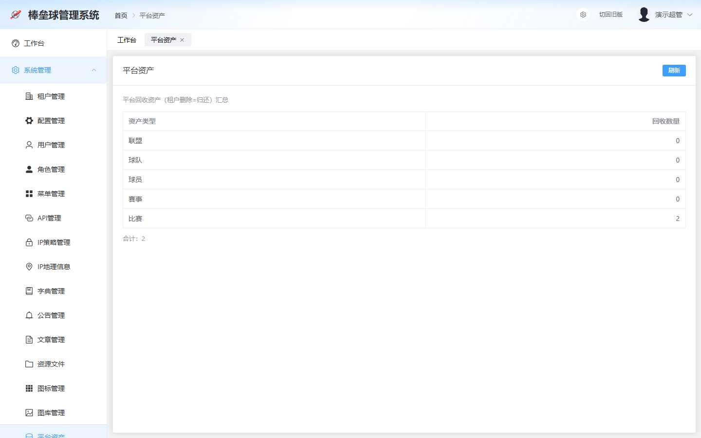

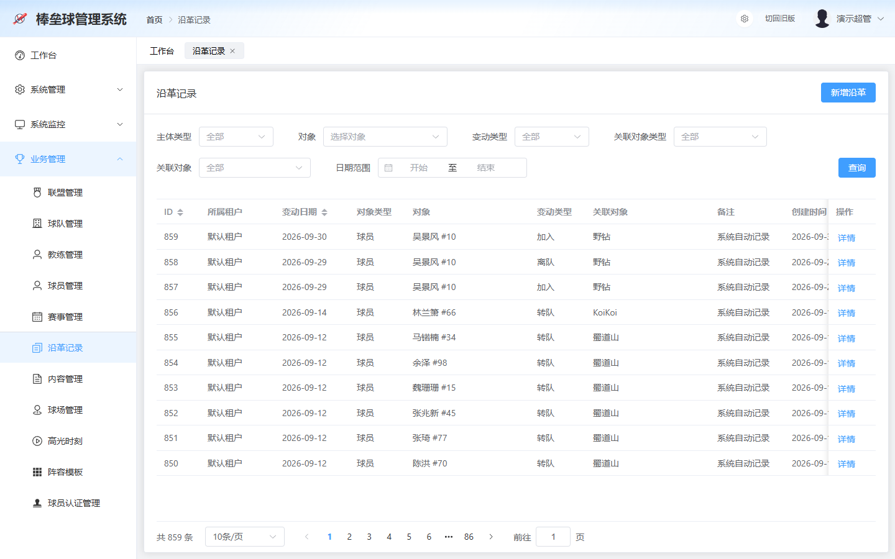

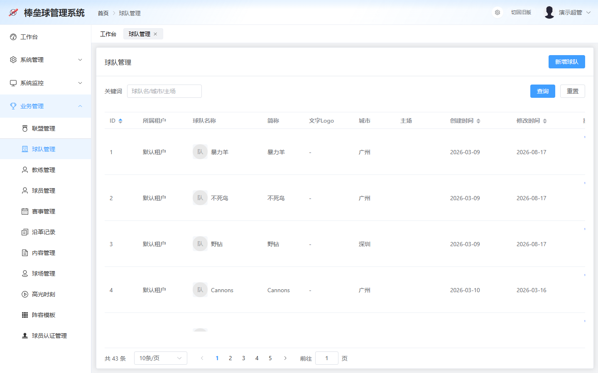

---

## 5. 租户管理员

本租户运营全权，但**不能销毁历史数据**——你的"删除"实际是**归还平台**：

| 功能 | 入口 | 说明 |
|---|---|---|
| 用户与角色 | 系统管理 → 用户管理 / 角色管理 | 创建本租户各级账号、配置目录 |
| 租户级目录配置 | 角色管理 → 平台角色行「租户目录」 | 为"球队负责人/赛事主办方"配置本租户专用菜单 |
| **归还/下架** | 球员/球队/赛事/比赛/联盟 → 行内「**归还**」 | 数据从本租户运营面移除、**由平台留存**（不销毁） |
| **解除认领** | 球员管理 → 已认领球员行「**解除认领**」 | 修正错误认领：档案回到未认领、可重新被邀请/认领；记录沿革审计 |
| 球员认领审核 | 球员认领审核 | **租管=租户内超管**：默认可见本租户**全部**待办（含“审核方=球队负责人”类），可看可审；「审核方」筛选可切换查看。审核人按归属分流：队有负责人→该队（域内主办方亦可见）；无负责人→平台/租管 |

> 租户管理员看不到"删除"（仅超管）；「归还」即原删除动作，语义为交还平台。

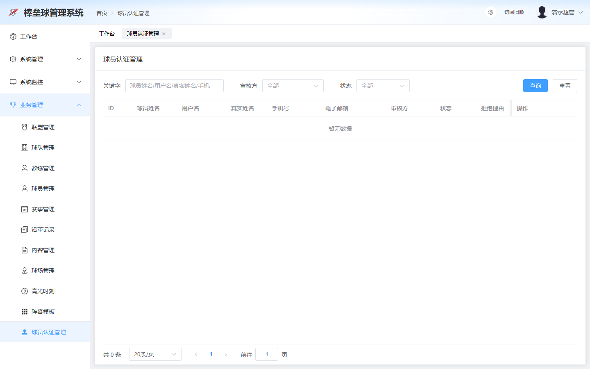

---

## 6. 赛事主办方（联盟管理员）

| 场景 | 入口 | 说明 |
|---|---|---|
| 加入/创建联盟 | 联盟管理 → 「**申请成立联盟**」（上级审核）/「新增联盟」 | 申请经超管/租管审核通过后自动成为主办方；管理员的「新增联盟」为直建 |
| 负责人管理 | 球队管理 → 行内「**负责人**」 | 仅限**无负责人**的球队（指派/解除）；有主球队只读 |
| 解散球队 | 球队管理 → 行内「**解散**」 | 队员离队、负责人失效（数据留存）；有未打完比赛则拒绝 |
| 批量建队 | 球队管理 → 「批量建队」 | 新队初始“无负责人”，由主办方管护 |
| 批量球员建档 | 球员管理 → 「导入数据」 | **仅限无负责人的球队**（详见 §10） |
| 创建赛事 | 赛事管理 → 「发布赛事」 | 含赛制、阶段 |
| 赛程与录分 | 赛事管理 → 「赛程与结果」/ 比赛行「录入」 | 见 §9 |

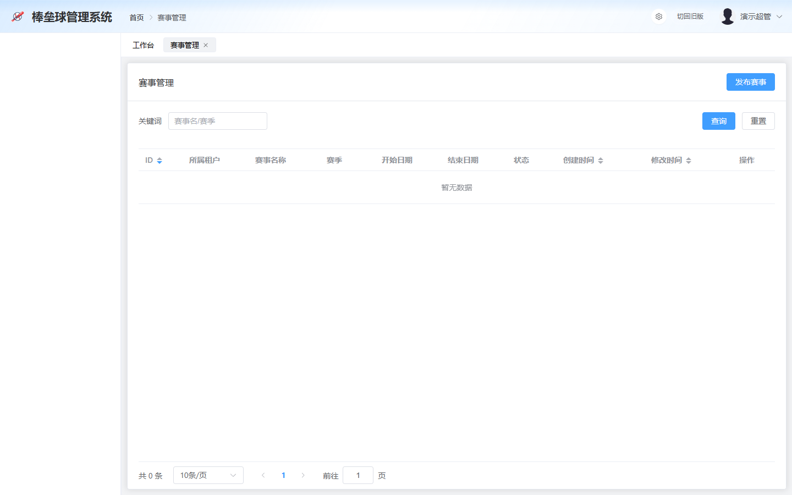

---

## 7. 球队负责人（球队管理员）

登录后落到「球队管理」。可用功能（左侧业务管理下）：

| 功能 | 入口 | 说明 |
|---|---|---|
| 球队资料 | 球队管理 | 维护本队信息、队徽、主场等 |
| 管理球员 | 球队管理 → 行内「管理球员」 | 查看队员、邀请入队 |
| 球员建档（单个/批量） | 球员管理 → 「新增球员」/「导入数据」 | **仅限本队**；须选定「当前球队」（从本队入口进入自动带出） |
| 球员认领审核 | 球员认领审核 | 本队球员的认领由你审核（通过/驳回）；租管/超管可兜底代审 |
| 负责人管理 | 球队管理 → 行内「负责人」 | 本队负责人列表与解除 |
| 解散球队 | 球队管理 → 行内「解散」 | 队员离队、数据留存（非“销毁”）；删除/归还仍属租管职责 |
| 阵容模板 | 阵容模板 | 复用比赛阵容 |
| 沿革记录 | 沿革记录 | 队员加入/离队等变动 |

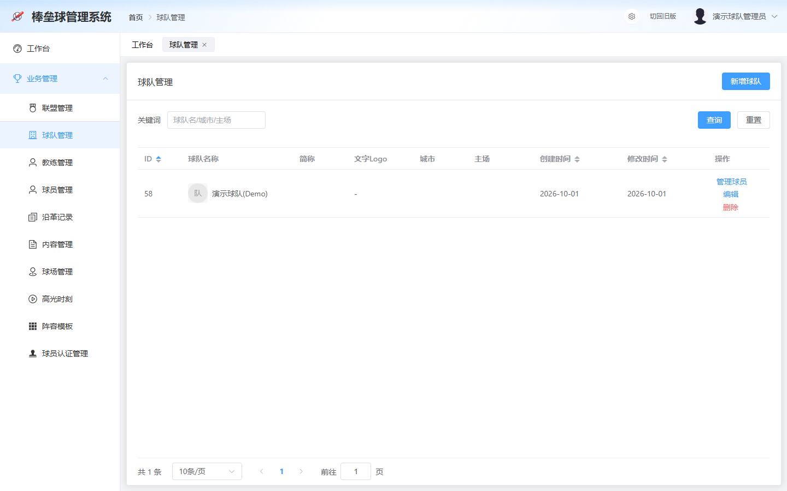

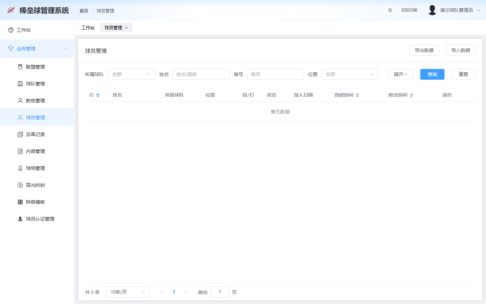

**两类变动走流程**：入队由球队**邀请**、球员**接受**；离队由**球员本人**在门户操作（取消“当前球队”）。有比赛记录的球队经历不可删除。

> 球队侧没有「删除/归还」按钮——删除/归还是租户管理员的职责（见 §5）；「**解散**」语义为数据留存式下架，与“销毁”不同。

---

## 8. 球员账号

球员是"身份"（对应一份球员档案），能力集中在**门户**：

| 功能 | 入口 | 说明 |
|---|---|---|
| 自助建档 | 注册后门户提交 | 未入库球员可自助建档（姓名必填） |
| 编辑本人档案 | 门户 → 个人资料 | 身高体重、惯用手、守位等 |
| 接受邀请入队 | 邀请链接 | 无档案者走「**建档入队**」表单，一次完成建档+入队 |
| 离队 | 个人资料 → 球队经历 | 取消勾选"当前球队"；有比赛记录的经历不可删除 |
| 解除认领 | 个人资料 → 我的认领（已通过）→ 「**解除认领**」 | 本人可解除错误认领；球队经历与比赛统计仍保留在档案中 |

入队只能"球队邀请→本人同意"；离队本人自助完成。

---

## 9. 实时录入（比赛录分）

**入口**：业务管理 → 赛事管理 → 「赛程与结果」→ 比赛行「**录入**」（或从比赛管理进入）。

- 逐打席记录（安打/出局/保送/失误等），自动联动比分与统计；
- 保存后进入积分榜与球员数据统计。

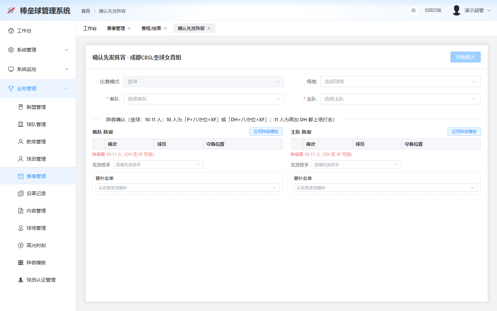

---

## 10. 批量球员建档（Excel 批量导入）

> 对应需求「球员批次建档」——已上线并完成权限接入。

**入口**：球员管理 → 工具栏「**导入数据**」。

**步骤**：① 按模板整理名册（姓名必填；出生日期 `YYYY-MM-DD` 选填）；② 上传 Excel；③ 系统逐行建档并挂到指定球队，**姓名+出生日期重复的行自动跳过**；④ 档案为"未认领"，球员之后凭邀请认领入队。

**权限口径**：

| 角色 | 可批量建档范围 |
|---|---|
| 超级管理员 / 租户管理员 | **任何时候全权**，不限球队 |
| 赛事主办方 | 仅**无负责人的球队**（本联盟域内） |
| 球队负责人 | 仅**本队** |

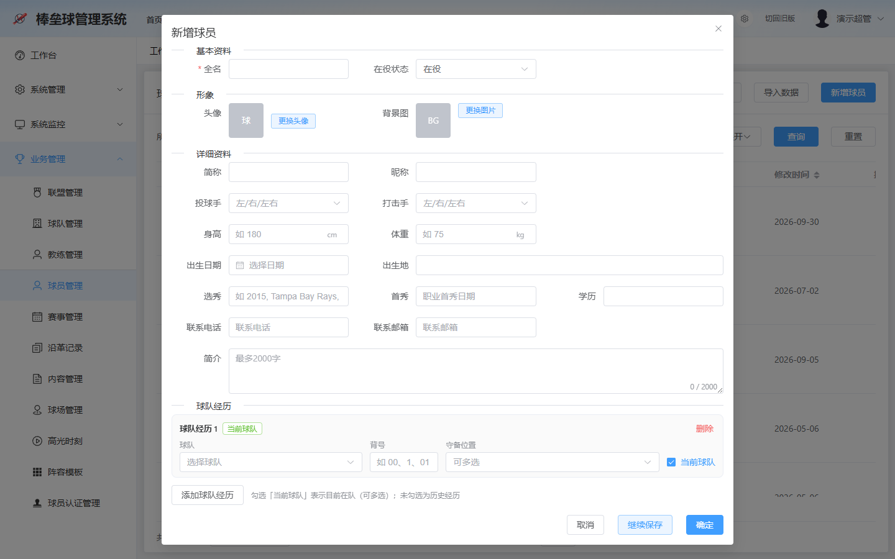

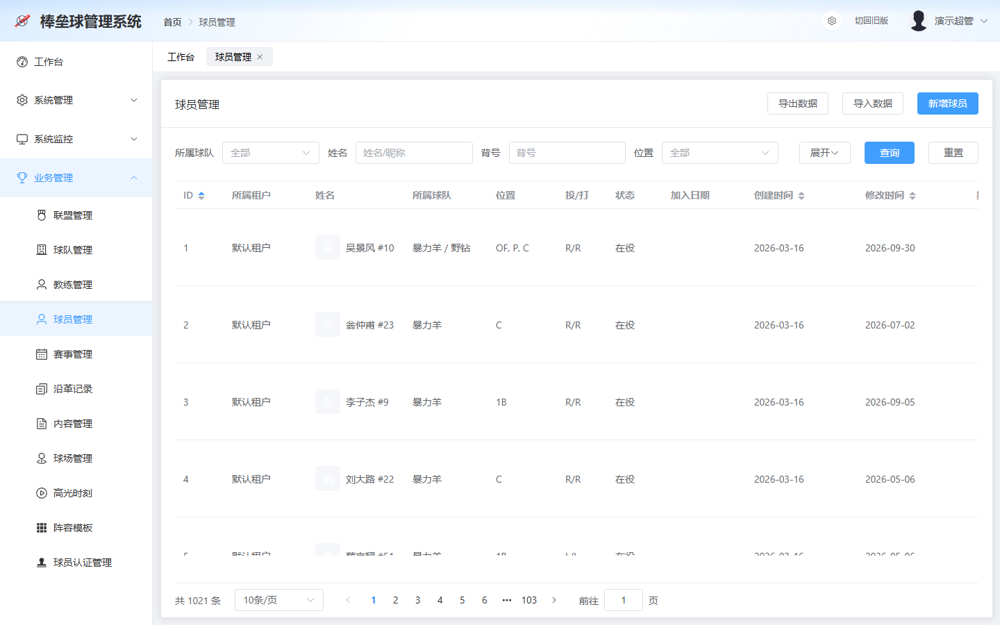

---

## 11. 安全与数据说明

1. **读宽写窄**：公开数据人人可看；管理动作严格限域，越权返回 403。
2. **删除=归还**（租户侧）：被移除的数据不消失，归还平台留存；仅平台超管有最终销毁权。
3. **退租=找不到**：租户退租后其门户路径直接 404（与"不存在"同待遇）。

---

## 12. 常见问题（FAQ）

| 问题 | 解答 |
|---|---|
| 登录后为何直接进“球队管理”而不是工作台？ | 系统自动进入你**第一个有权限**的菜单；受限角色通常不是工作台。 |
| 为什么我看不到“删除”按钮？ | “删除”仅超级管理员可见；租户管理员对应操作是「**归还**」。 |
| 提示“无权代建该球员”？ | 两种常见原因：① 该球队已有负责人（权属转移，主办方只读）——请由球队负责人建档或找租管/平台；② 主办方建档时未挂到域内无主球队。 |
| 主办方如何成立联盟？ | 管理台 → 联盟管理 → 「申请成立联盟」→ 超管/租管在「建盟申请」中审核通过后自动成为主办方；门户**无**申请入口。 |
| 球员认领由谁审核？ | 按归属分流：球员所在队**有负责人**→该队负责人审（域内主办方亦可见）；**无负责人**→平台/租管审。**租管=租户内超管**，可看到并代审本租户全部待办（含球队负责人类），“审核方”筛选可切换。 |
| 受限角色建档为什么必须先选“当前球队”？ | 未归属球队的球员不会出现在你的球员列表，也无法再编辑绑定（**建档即归属**）；从球队入口进入会自动带出该队。 |
| 批量导入有重复怎么办？ | 姓名+出生日期与既有档案相同者自动跳过，结果有汇总提示。 |
| 球员如何离队？ | 球员本人登录门户 → 个人资料 → 球队经历 → 取消“当前球队”。 |
| 主办方为何突然不能编辑某队了？ | 该队已有负责人（权属转移），主办方对“有主球队”只读。 |
| 球队负责人“解散”球队和租管“归还”有什么区别？ | 两者都**留存数据**：解散=球队下架、队员离队，可再由管理员处置；归还=从本租户运营面移除、交还平台留存。 |
| 如何为门户角色定制本租户菜单？ | 角色管理 → 「球队负责人/赛事主办方」行 → 「租户目录」：开启覆盖并勾选菜单后保存；「清除覆盖」回落全局预设（v1.2 起交互已修复）。 |
| 认领后发现认错人了，能“解除认领”吗？ | 可以。**球员本人**：个人资料 → 我的认领（已通过）→「解除认领」；**租户管理员**：球员管理 → 已认领球员行「解除认领」；**超级管理员**任何时候可解除。解除后档案回到未认领、可重新被邀请/认领（球队经历与统计保留，并写入沿革审计）。 |

---

## 附：截图索引（测试环境实拍）

01b 门户游客 / 02 门户登录 / 03 后台登录 / 04 工作台 / 05 球队列表 / 06 新增球队(管理员) / 07 球员列表 / 08 新增球员 / 10 赛事列表 / 11 实时录入 / 12 角色列表 / 13 租户目录覆盖抽屉 / 14 平台资产 / 15 沿革记录 / 16–18 球队负责人视角 / 19–22 用户管理与建号 / 23–24 球队负责人建队 / 25 主办方登录 / 25b 主办方联盟管理 / 27 认领审核
