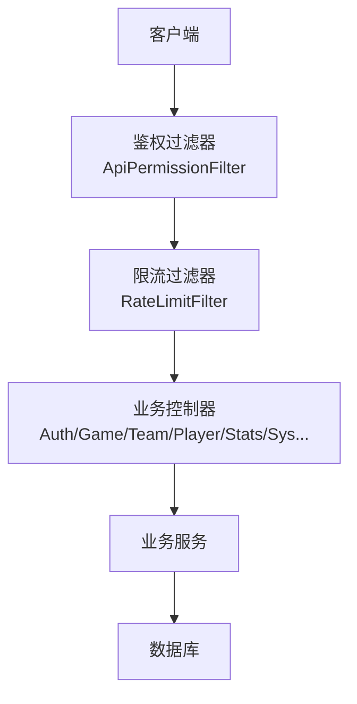
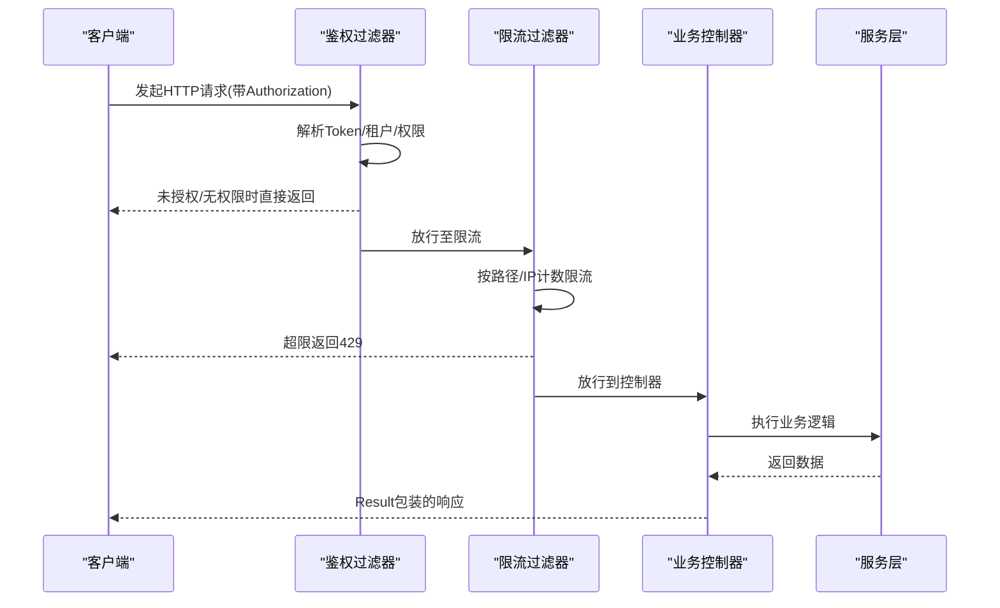
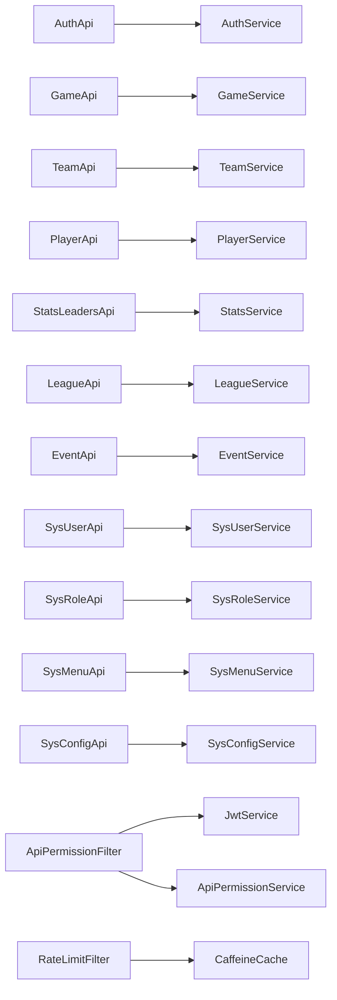

# API接口参考

## 目录
1. [简介](#简介)
2. [项目结构](#项目结构)
3. [核心组件](#核心组件)
4. [架构总览](#架构总览)
5. [详细组件分析](#详细组件分析)
6. [依赖关系分析](#依赖关系分析)
7. [性能与限流](#性能与限流)
8. [故障排查指南](#故障排查指南)
9. [结论](#结论)
10. [附录：统一响应与分页模型](#附录统一响应与分页模型)

## 简介
本API参考文档面向后端REST服务，覆盖认证授权、比赛管理、球队管理、球员管理、统计分析、系统管理等模块。文档按功能模块组织，逐条说明HTTP方法、URL模式、请求参数、响应格式与错误码；并提供通用安全机制（认证、权限、限流）与版本兼容说明。所有端点均返回统一的Result包装体，分页数据使用PageResult封装。

## 项目结构
- 控制器层：位于com.bsball.api包下，每个业务域一个Controller，如认证、赛事、球队、球员、统计、系统等。
- 公共模型：common包提供统一响应Result与分页PageResult。
- 安全与过滤：core包提供鉴权过滤器ApiPermissionFilter与限流过滤器RateLimitFilter。
- 配置：config包提供JWT等配置项。

## 核心组件
- 统一响应Result：包含code、msg、detail、data、timestamp字段，用于标准化返回。
- 分页结果PageResult：包含list、total、meta字段，用于列表分页。
- 认证与权限：通过Authorization头携带Bearer Token，由过滤器解析并校验租户上下文与访问权限。
- 限流：基于IP的窗口计数，针对登录、验证码、短信、公开接口、管理后台等路径分别限制。

## 架构总览
请求从客户端进入，先经过鉴权过滤器进行Token解析、租户解析与权限判定，再经限流过滤器进行速率控制，最后到达具体业务控制器处理并返回统一Result。

## 详细组件分析

### 认证授权模块
- 基础信息
  - 认证方式：Authorization: Bearer <token>
  - 租户上下文：支持X-Tenant-Id、X-Tenant-Code、Referer等解析策略
  - 登录日志：可选记录登录成功/失败
- 端点清单
  - POST /auth/login
    - 请求体：username, password, tenantId或tenantCode（二选一）
    - 响应：Result<Map>，包含token及用户信息
    - 错误：401（凭据无效）、429（登录频率限制）
  - GET /auth/me
    - 请求头：Authorization
    - 响应：Result<Map>，当前用户信息
  - GET /auth/captcha/options
    - 查询参数：tenantId, tenantCode
    - 响应：Result<Map>，验证码能力选项
  - GET /auth/captcha/image
    - 查询参数：tenantId, tenantCode
    - 响应：Result<Map>，验证码图片信息
  - POST /auth/captcha/verify-click
    - 请求体：captcha相关参数
    - 响应：Result<Map>，验证结果
  - POST /auth/captcha/verify-drag
    - 请求体：captcha相关参数
    - 响应：Result<Map>，验证结果
  - POST /auth/switch-tenant
    - 请求头：Authorization
    - 请求体：tenantId
    - 响应：Result<Map>，切换后的会话信息
  - PATCH /auth/change-password
    - 请求头：Authorization
    - 请求体：oldPassword, newPassword
    - 响应：Result<Object>
- 安全与限流
  - 登录路径受限流保护（默认60秒内最多N次）
  - 验证码生成与校验路径单独限流
- 示例
  - 登录请求体示例：{"username":"admin","password":"***","tenantCode":"demo"}
  - 登录响应示例：{"code":200,"msg":"success","data":{"token":"...","user":{...}}}

### 比赛管理模块
- 端点清单
  - GET /game/list
    - 查询参数：page, pageSize, sortProp, sortOrder, eventId, eventIds, years, teamId
    - 响应：Result<PageResult<GameResponseDTO>>
  - GET /game/{id}
    - 路径参数：id
    - 响应：Result<GameResponseDTO>
  - GET /game/{id}/live-snapshot
    - 路径参数：id
    - 响应：Result<Map<String,String>>，含snapshotJson
  - POST /game/{id}/live-snapshot
    - 路径参数：id
    - 请求体：LiveSnapshotSaveDTO
    - 响应：Result<Object>
  - GET /game/{gameId}/stats
    - 路径参数：gameId
    - 响应：Result<PageResult<GamePlayerStat>>
  - POST /game/create
    - 请求体：Game
    - 响应：Result<Map>，返回id
  - PUT /game/update/{id}
    - 路径参数：id
    - 请求体：Game
    - 响应：Result<Object>
  - POST /game/{id}/save-live
    - 路径参数：id
    - 请求体：GameSaveLiveDTO
    - 响应：Result<Object>
  - POST /game/{id}/save-result
    - 路径参数：id
    - 请求体：SaveGameResultDTO
    - 响应：Result<Object>
  - DELETE /game/delete/{id}
    - 路径参数：id
    - 响应：Result<Object>
  - POST /game/stats/create
    - 请求体：GamePlayerStat
    - 响应：Result<Map>，返回id
  - PUT /game/stats/update/{id}
    - 路径参数：id
    - 请求体：GamePlayerStat
    - 响应：Result<Object>
  - DELETE /game/stats/delete/{id}
    - 路径参数：id
    - 响应：Result<Object>
- 示例
  - 创建比赛请求体示例：{"eventId":1,"homeTeamId":10,"awayTeamId":11,...}
  - 列表响应示例：{"code":200,"data":{"list":[...],"total":100}}

### 球队管理模块
- 端点清单
  - GET /team/select-options
    - 响应：Result<List<TeamOptionDto>>
  - GET /team/list
    - 查询参数：page, pageSize, sortProp, sortOrder
    - 响应：Result<PageResult<Team>>
  - GET /team/{id}
    - 路径参数：id
    - 响应：Result<Team>
  - POST /team/create
    - 请求体：Team
    - 响应：Result<Map>，返回id
  - PUT /team/update/{id}
    - 路径参数：id
    - 请求体：Team
    - 响应：Result<Object>
  - DELETE /team/delete/{id}
    - 路径参数：id
    - 响应：Result<Object>
- 示例
  - 列表响应示例：{"code":200,"data":{"list":[{"id":1,"name":"..."}],"total":50}}

### 球员管理模块
- 端点清单
  - GET /player/select-options
    - 响应：Result<List<PlayerOptionDto>>
  - GET /player/list
    - 查询参数：page, pageSize, sortProp, sortOrder, teamId, ids, keyword, number, position, throwHand, batHand, status, joinDateFrom, joinDateTo
    - 响应：Result<PageResult<Player>>
  - GET /player/check-full-name
    - 查询参数：name, excludeId(可选)
    - 响应：Result<Map>，duplicate布尔值
  - GET /player/team-options
    - 查询参数：teamId
    - 响应：Result<List<TeamPlayerOptionDto>>
  - GET /player/{id}
    - 路径参数：id
    - 响应：Result<Player>
  - GET /player/{id}/stats
    - 查询参数：gameMode(可选)
    - 响应：Result<Map>
  - GET /player/{id}/stats/by-season
    - 查询参数：gameMode(可选)
    - 响应：Result<List<PlayerStatsByEventDTO>>
  - GET /player/{id}/stats/game-log
    - 查询参数：limit(默认30), gameMode(可选)
    - 响应：Result<List<PlayerGameLogEntryDTO>>
  - GET /player/{id}/stats/drill-down/batting
    - 查询参数：metric, page(默认1), pageSize(默认20), eventId(可选), season(可选), gameMode(可选)
    - 响应：Result<PageResult<Map>>
  - GET /player/{id}/stats/drill-down/pitching
    - 同上
  - GET /player/{id}/stats/drill-down/fielding
    - 同上
  - POST /player/create
    - 请求体：Player
    - 响应：Result<Map>，返回id
  - PUT /player/update/{id}
    - 路径参数：id
    - 请求体：Player
    - 响应：Result<Object>
  - DELETE /player/delete/{id}
    - 路径参数：id
    - 响应：Result<Object>
  - POST /player/delete-batch
    - 请求体：{"ids":[...]}
    - 响应：Result<Object>
  - POST /player/import
    - 请求体：PlayerImportRequest
    - 响应：Result<Map>，导入结果
- 示例
  - 批量删除请求体示例：{"ids":[1,2,3]}
  - 详情响应示例：{"code":200,"data":{"id":1,"name":"...","number":"10"}}

### 统计分析模块
- 端点清单
  - GET /stats/leaders/batting
    - 查询参数：eventId, eventIds, years, teamIds, teamId, playerName, position, homeAway, batterHand, pitcherHand, gameMode, page(默认1), pageSize(默认20), sortProp, sortOrder
    - 响应：Result<PageResult<Map>>
  - GET /stats/leaders/pitching
    - 同上
  - GET /stats/leaders/fielding
    - 同上
  - GET /stats/leaders/team-batting
    - 查询参数：eventId, eventIds, years, teamIds, teamId, homeAway, gameMode, page, pageSize, sortProp, sortOrder
    - 响应：Result<PageResult<Map>>
  - GET /stats/leaders/team-pitching
    - 同上
  - GET /stats/leaders/team-fielding
    - 同上
  - GET /stats/standings
    - 查询参数：eventId, eventIds, years, gameMode, page(默认1), pageSize(默认20)
    - 响应：Result<PageResult<Map>>
  - GET /stats/star/toplist
    - 查询参数：eventId, eventIds, years, gameMode, limit(可选), includeMetrics(逗号分隔)
    - 响应：Result<Map>
- 示例
  - 击球领先者请求示例：?eventIds=1,2&years=2023,2024&sortProp=avg&sortOrder=desc
  - 响应示例：{"code":200,"data":{"list":[...],"total":120}}

### 联赛与赛事管理模块
- 联赛
  - GET /league/list
    - 查询参数：page, pageSize, sortProp, sortOrder
    - 响应：Result<PageResult<League>>
  - GET /league/{id}
    - 路径参数：id
    - 响应：Result<League>
  - POST /league/create
    - 请求体：League
    - 响应：Result<Map>，返回id
  - PUT /league/update/{id}
    - 路径参数：id
    - 请求体：League
    - 响应：Result<Object>
  - DELETE /league/delete/{id}
    - 路径参数：id
    - 响应：Result<Object>
- 赛事
  - GET /event/list
    - 查询参数：page, pageSize, sortProp, sortOrder
    - 响应：Result<PageResult<Event>>
  - GET /event/{id}
    - 路径参数：id
    - 响应：Result<Event>，不存在返回404
  - POST /event/create
    - 请求体：Event
    - 响应：Result<Map>，返回id
  - POST /event/{eventId}/import-game-result
    - 路径参数：eventId
    - 请求体：SaveGameResultDTO
    - 响应：Result<Map>，返回gameId
  - PUT /event/update/{id}
    - 路径参数：id
    - 请求体：Event
    - 响应：Result<Object>
  - DELETE /event/delete/{id}
    - 路径参数：id
    - 响应：Result<Object>
- 示例
  - 导入比赛结果请求体示例：{"eventId":1,"results":[...] }

### 系统管理模块
- 用户
  - GET /sys/user/list
    - 查询参数：page, pageSize, keyword, allTenants(1表示全部租户)
    - 响应：Result<PageResult<SysUser>>
  - GET /sys/user/{id}
    - 路径参数：id
    - 响应：Result<SysUser>
  - POST /sys/user/create
    - 请求体：SysUser
    - 响应：Result<Map>，返回id
  - PUT /sys/user/update/{id}
    - 路径参数：id
    - 请求体：SysUser
    - 响应：Result<Object>
  - DELETE /sys/user/delete/{id}
    - 路径参数：id
    - 响应：Result<Object>，自动记录操作人
- 角色
  - GET /sys/role/list
    - 查询参数：page, pageSize, keyword
    - 响应：Result<PageResult<SysRole>>
  - GET /sys/role/assign-options
    - 查询参数：page, pageSize, keyword
    - 响应：Result<PageResult<SysRole>>
  - GET /sys/role/{id:\d+}
    - 路径参数：id
    - 响应：Result<SysRole>
  - POST /sys/role/create
    - 请求体：SysRole
    - 响应：Result<Map>，返回id
  - PUT /sys/role/update/{id}
    - 路径参数：id
    - 请求体：SysRole
    - 响应：Result<Object>
  - DELETE /sys/role/delete/{id}
    - 路径参数：id
    - 响应：Result<Object>
- 菜单
  - GET /sys/menu/list
    - 响应：Result<PageResult<SysMenu>>
  - POST /sys/menu/create
    - 请求体：SysMenu
    - 响应：Result<Map>，返回id
  - PUT /sys/menu/update/{id}
    - 路径参数：id
    - 请求体：SysMenu
    - 响应：Result<Object>
  - DELETE /sys/menu/delete/{id}
    - 路径参数：id
    - 响应：Result<Object>
- 配置
  - GET /sys/config
    - 查询参数：tenantId(可选)
    - 响应：Result<Map>，配置键值对
  - PUT /sys/config
    - 查询参数：tenantId(可选)
    - 请求体：Map<String,Object>
    - 响应：Result<Object>
- 健康检查
  - GET /health
    - 响应：Result<Map>，status与service名称
- 示例
  - 获取配置请求示例：GET /sys/config?tenantId=1
  - 更新配置请求体示例：{"key1":"value1","key2":"value2"}

## 依赖关系分析
- 控制器与服务：各Api仅负责参数绑定与调用Service，不承载复杂业务逻辑。
- 过滤器链：ApiPermissionFilter在RateLimitFilter之前执行，优先完成鉴权与租户解析；限流在后，保护后端资源。
- 外部依赖：
  - JWT：通过配置app.jwt.*注入，用于签发与校验令牌。
  - 缓存：限流使用本地缓存（Caffeine），按IP维度计数。
  - 权限：ApiPermissionService根据用户、路径、方法进行访问控制。

## 性能与限流
- 限流策略
  - 登录：默认60秒窗口内最多N次
  - 验证码图片/校验：独立窗口与限额
  - 短信发送：独立窗口与限额
  - 公开接口（league/team/event/game/stats/player/sys/article）：统一公共限额
  - 管理后台：统一管理员限额
  - 其他POST：按路径分组限制
- 实现要点
  - 基于IP维度的本地缓存计数，过期时间可配置
  - 超限返回HTTP 429与统一消息
- 建议
  - 生产环境合理调优窗口大小与阈值
  - 结合网关层做更细粒度限流与熔断

## 故障排查指南
- 常见错误码
  - 200：成功
  - 1000：空数据（部分列表为空时使用）
  - 401：未授权（Token无效或缺租户信息）
  - 403：禁止访问（无权限或租户已停用）
  - 404：资源不存在（如赛事不存在）
  - 429：请求过于频繁（触发限流）
  - 500：服务端异常
- 定位步骤
  - 检查Authorization头是否正确携带Bearer Token
  - 确认X-Tenant-Id或X-Tenant-Code是否有效且租户处于激活状态
  - 查看限流是否触发（关注429响应）
  - 核对请求参数是否符合约束（如必填字段、类型）
  - 查看日志中的异常堆栈与业务错误信息

## 结论
本API以统一的Result与PageResult规范输出，结合鉴权与限流过滤器保障安全性与稳定性。各业务模块接口清晰、职责单一，便于扩展与维护。建议在接入时严格遵循认证与租户上下文传递规范，并根据实际流量调整限流阈值。

## 附录：统一响应与分页模型
- 统一响应Result
  - code：整数状态码（200/1000/401/403/404/429/500）
  - msg：人类可读消息
  - detail：可选详细信息
  - data：业务数据
  - timestamp：服务器时间戳
- 分页结果PageResult
  - list：数据列表
  - total：总数
  - meta：附加元信息（可选）

---

> 本文整理自 Qoder RepoWiki（基于代码自动生成），仅供参考，以代码为准。
