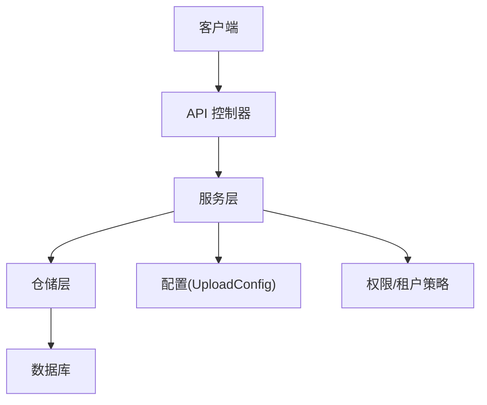
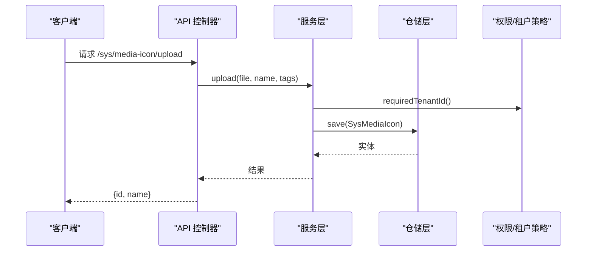
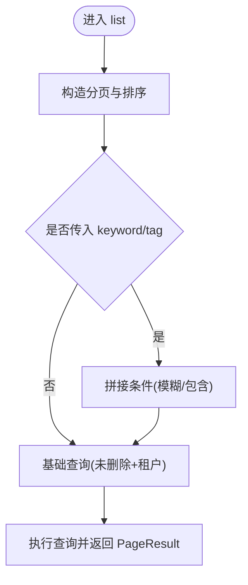
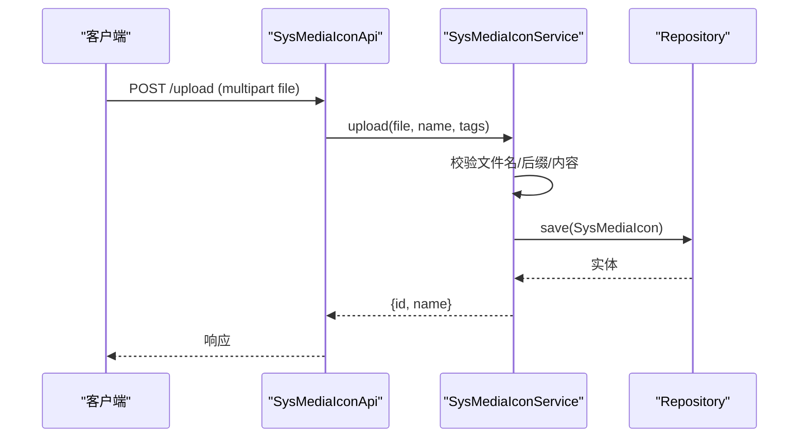
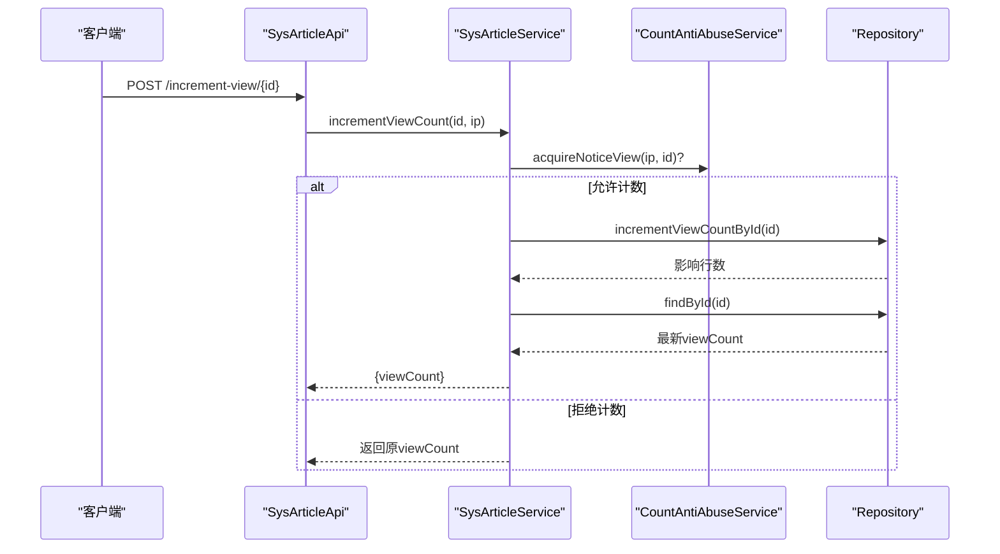
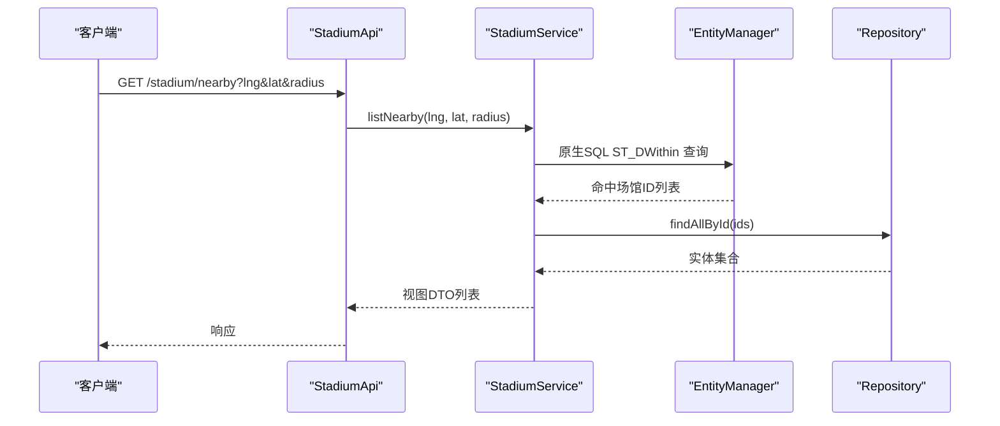
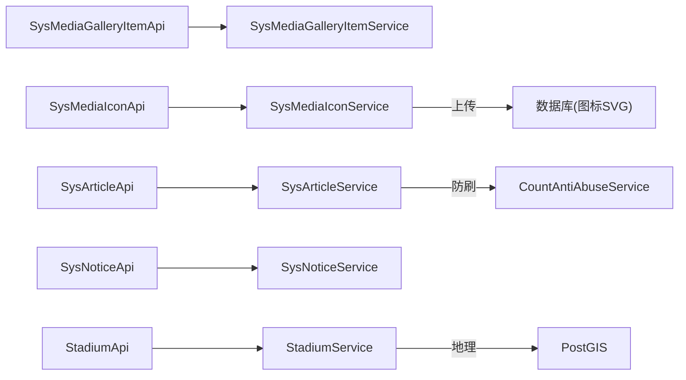

# 媒体内容API

## 目录
1. [简介](#简介)
2. [项目结构](#项目结构)
3. [核心组件](#核心组件)
4. [架构总览](#架构总览)
5. [详细组件分析](#详细组件分析)
6. [依赖关系分析](#依赖关系分析)
7. [性能考虑](#性能考虑)
8. [故障排查指南](#故障排查指南)
9. [结论](#结论)
10. [附录](#附录)

## 简介
本文件面向“媒体内容管理”相关API，覆盖图片画廊、图标管理、文章管理、公告发布、场馆信息等模块的CRUD接口。文档重点说明：
- 文件上传与下载策略（含SVG图标直存与通用资源存储）
- 富文本编辑支持（文章内容字段）
- 内容审核与可见性控制（发布目标、状态、轮播展示等）
- 体育特色功能：场馆信息管理、主场球队关联、地理信息（GeoJSON、附近查询）
- 多租户隔离、访问控制与权限校验
- 版本管理与批量操作现状与建议

## 项目结构
媒体内容相关的后端采用典型的分层结构：
- API层：REST控制器，定义路由与参数绑定
- Service层：业务逻辑、权限与租户策略、数据组装
- Repository层：JPA/SQL访问
- 配置层：上传路径、允许扩展名、最大文件大小等

## 核心组件
- 图片画廊：提供条目列表、详情、创建、更新、删除；支持关键词与标签过滤；软删除并记录操作人。
- 图标管理：提供SVG图标的增删改查与上传；名称与字体类名校验；支持样式片段JSON校验；软删除。
- 文章管理：提供平台/门户/租户三种视图列表；支持按发布目标、类型、关键词、是否轮播筛选；浏览量自增防刷；软删除。
- 公告发布：支持按目标（admin/portal/both）发布；超级管理员可指定租户范围批量发布；软删除。
- 场馆信息：支持分页、关键字、级别筛选；GeoJSON导出；基于地理位置的附近查询；主场球队关联；软删除。

## 架构总览
媒体内容API通过统一的Result/PageResult封装返回，结合租户策略与权限服务实现多租户隔离与访问控制。文件上传在图标模块直接保存SVG到数据库，通用资源通过SysResourceService落地到文件系统并以URL形式引用。

## 详细组件分析

### 图片画廊（SysMediaGalleryItem）
- 路由
  - GET /sys/media-gallery/list：分页列表，支持keyword、tag过滤
  - GET /sys/media-gallery/{id}：获取详情
  - POST /sys/media-gallery/create：创建条目（需imageUrl）
  - PUT /sys/media-gallery/update/{id}：更新条目
  - DELETE /sys/media-gallery/delete/{id}：软删除
- 关键逻辑
  - 列表构建Specification，包含租户隔离、未删除过滤、关键词模糊匹配、标签包含匹配
  - 创建时自动填充name/title/description/sortOrder，并设置tenantId
  - 更新时仅覆盖非空字段，并对空字符串进行清理
  - 删除为软删除，记录deletedAt与deletedBy
- 权限与租户
  - 读取时校验租户归属，超级管理员可跨租户访问

### 图标管理（SysMediaIcon）
- 路由
  - GET /sys/media-icon/list：分页列表，支持keyword、tag过滤
  - GET /sys/media-icon/{id}：获取详情
  - POST /sys/media-icon/create：创建SVG图标
  - PUT /sys/media-icon/update/{id}：更新图标
  - DELETE /sys/media-icon/delete/{id}：软删除
  - POST /sys/media-icon/upload：上传SVG文件
- 关键逻辑
  - 名称与字体类名校验（字母开头，仅字母数字下划线连字符）
  - SVG内容校验（必须包含<svg>）
  - 分段样式JSON校验（数组且每项含index）
  - 上传仅接受.svg文件，解析为字符串存入数据库
  - 软删除并记录操作人
- 权限与租户
  - 列表与详情均受租户隔离；超级管理员可跨租户

### 文章管理（SysArticle）
- 路由
  - GET /sys/article/list：综合列表（支持platformOnly/forPortal/adminScope等）
  - GET /sys/article/platform/list：平台级列表（无租户）
  - GET /sys/article/{id}：详情
  - POST /sys/article/increment-view/{id}：增加浏览量（防刷）
  - POST /sys/article/create：创建文章
  - PUT /sys/article/update/{id}：更新文章
  - DELETE /sys/article/delete/{id}：软删除
- 关键逻辑
  - 列表支持按publishTarget（portal/admin/both）、type、keyword、showInCarousel筛选
  - 浏览量自增使用防滥用服务限制同一IP对同一文章的频繁计数
  - 创建/更新时记录提交IP与地区（截断长度），非超级管理员强制写入当前租户ID
  - 软删除并记录操作人
- 权限与租户
  - adminScope=platform仅超级管理员可查平台级数据
  - 详情与更新均校验租户归属

### 公告发布（SysNotice）
- 路由
  - GET /sys/notice/list：分页列表，支持target、keyword
  - GET /sys/notice/{id}：详情
  - POST /sys/notice/create：创建公告（支持批量发布到多个租户）
  - PUT /sys/notice/update/{id}：更新公告
  - DELETE /sys/notice/delete/{id}：软删除
- 关键逻辑
  - target限定为admin/portal/both
  - 超级管理员可指定tenantIds批量创建；否则默认写入当前租户
  - 列表支持全局或租户内查询，关键字标题/内容模糊匹配
  - 软删除并记录操作人
- 权限与租户
  - 非超级管理员不可指定tenantIds；更新/删除需归属当前租户

### 场馆信息（Stadium）
- 路由
  - GET /stadium/list：分页列表，支持keyword、level
  - GET /stadium/geojson：导出GeoJSON FeatureCollection
  - GET /stadium/nearby?lng=&lat=&radiusMeters=：附近场馆查询
  - GET /stadium/{id}：详情
  - POST /stadium/create：创建场馆
  - PUT /stadium/update/{id}：更新场馆
  - DELETE /stadium/delete/{id}：软删除
- 关键逻辑
  - 列表构建Specification，支持关键字（名称/简称/城市/详细地址）与级别过滤
  - GeoJSON导出包含场馆属性与几何点（GCJ02坐标系标注）
  - 附近查询使用PostGIS地理函数ST_DWithin计算距离并按距离排序
  - 主场球队关联：创建/更新时可设置生效区间与排序，并校验球队属于当前租户
  - 地址区划代码校验与省市区回填
  - 软删除并级联标记主场球队为已删除
- 权限与租户
  - 所有读写均受租户隔离

## 依赖关系分析
- API层依赖对应Service，Service依赖Repository与权限/租户策略服务
- 图标上传不依赖外部对象存储，直接将SVG内容持久化至数据库
- 通用资源上传由SysResourceService负责，落盘到本地文件系统并通过URL访问
- 文章浏览量自增依赖防滥用服务，避免恶意刷量
- 场馆地理查询依赖PostGIS能力

## 性能考虑
- 列表查询使用Specification动态拼装条件，避免全表扫描；分页默认按id倒序或自定义排序
- 文章浏览量自增通过防滥用服务限制频率，降低写放大
- 场馆附近查询使用原生SQL与PostGIS空间索引，提升地理计算性能
- 图标SVG以字符串存储，适合小体积矢量图；大体积图片建议使用通用资源服务落盘
- 上传大小与扩展名可通过UploadConfig配置，建议生产环境合理限制

[本节为通用指导，不直接分析具体文件]

## 故障排查指南
- 404 不存在
  - 图片/图标/文章/公告/场馆被软删除或ID不存在
  - 参考：各Service中get方法对实体的存在性与删除标志检查
- 403 无权限
  - 非超级管理员访问跨租户资源
  - 修改/删除非本租户数据
  - 参考：各Service中的租户校验逻辑
- 400 参数错误
  - 图片地址为空、SVG无效、名称/字体类名校验失败、半径越界、区划代码无效等
  - 参考：各Service中的参数校验与异常抛出
- 浏览量未增加
  - 触发防滥用限制或文章不存在/非本租户
  - 参考：SysArticleService.incrementViewCount

## 结论
该媒体内容API围绕多租户与权限控制，提供了完善的图片画廊、图标管理、文章与公告、场馆信息的CRUD能力。图标模块支持SVG直存与严格校验，文章模块具备防刷浏览量与多维度筛选，公告模块支持批量发布，场馆模块提供地理信息与主场球队管理能力。文件存储方面，图标走数据库直存，通用资源走文件系统URL访问。建议在需要大规模媒体文件的场景引入对象存储，并结合CDN加速。

[本节为总结性内容，不直接分析具体文件]

## 附录

### 接口清单与要点
- 图片画廊
  - 列表：GET /sys/media-gallery/list?page=&pageSize=&keyword=&tag=
  - 详情：GET /sys/media-gallery/{id}
  - 创建：POST /sys/media-gallery/create（必填imageUrl）
  - 更新：PUT /sys/media-gallery/update/{id}
  - 删除：DELETE /sys/media-gallery/delete/{id}
- 图标管理
  - 列表：GET /sys/media-icon/list?page=&pageSize=&keyword=&tag=
  - 详情：GET /sys/media-icon/{id}
  - 创建：POST /sys/media-icon/create（SVG内容、名称、可选字体类名、样式JSON）
  - 更新：PUT /sys/media-icon/update/{id}
  - 删除：DELETE /sys/media-icon/delete/{id}
  - 上传：POST /sys/media-icon/upload（仅.svg）
- 文章管理
  - 列表：GET /sys/article/list（支持platformOnly/forPortal/adminScope/type/publishTarget/keyword/showInCarousel）
  - 平台列表：GET /sys/article/platform/list
  - 详情：GET /sys/article/{id}
  - 浏览量：POST /sys/article/increment-view/{id}
  - 创建：POST /sys/article/create
  - 更新：PUT /sys/article/update/{id}
  - 删除：DELETE /sys/article/delete/{id}
- 公告发布
  - 列表：GET /sys/notice/list?page=&pageSize=&sortProp=&sortOrder=&target=&keyword=
  - 详情：GET /sys/notice/{id}
  - 创建：POST /sys/notice/create（target=admin/portal/both；超级管理员可指定tenantIds）
  - 更新：PUT /sys/notice/update/{id}
  - 删除：DELETE /sys/notice/delete/{id}
- 场馆信息
  - 列表：GET /stadium/list?page=&pageSize=&sortProp=&sortOrder=&keyword=&level=
  - GeoJSON：GET /stadium/geojson
  - 附近：GET /stadium/nearby?lng=&lat=&radiusMeters=
  - 详情：GET /stadium/{id}
  - 创建：POST /stadium/create
  - 更新：PUT /stadium/update/{id}
  - 删除：DELETE /stadium/delete/{id}

### 文件存储策略与访问控制
- 图标SVG：直接入库，便于统一管理与复用；适合小体积矢量图
- 通用资源：SysResourceService将文件保存到工作区uploads目录，生成相对路径与URL（/files/...），支持按租户隔离与删除
- 上传配置：通过UploadConfig注入workspace、uploadDir、imageExtensions、maxFileSize，便于集中管控
- 访问控制：所有资源读取均受租户策略约束；超级管理员可跨租户访问；删除需权限校验

### 富文本编辑与内容审核
- 富文本：文章实体包含content字段，可用于富文本内容存储；前端编辑器可将HTML/Markdown等内容提交
- 内容审核：系统未内置审核流；可通过publishTarget与status等字段配合前端展示逻辑实现“草稿/待审/已发布”流程；也可在Service层扩展审核状态机

[本节为概念性说明，不直接分析具体文件]

### 版本管理与批量操作
- 版本管理：当前未实现显式版本历史；如需保留变更历史，可在Service层新增版本表或在更新前归档旧版本
- 批量操作：
  - 公告：超级管理员可批量发布到多个租户（create时指定tenantIds）
  - 其他模块暂无批量接口；可按需扩展批量创建/更新/删除

---

> 本文整理自 Qoder RepoWiki（基于代码自动生成），仅供参考，以代码为准。
