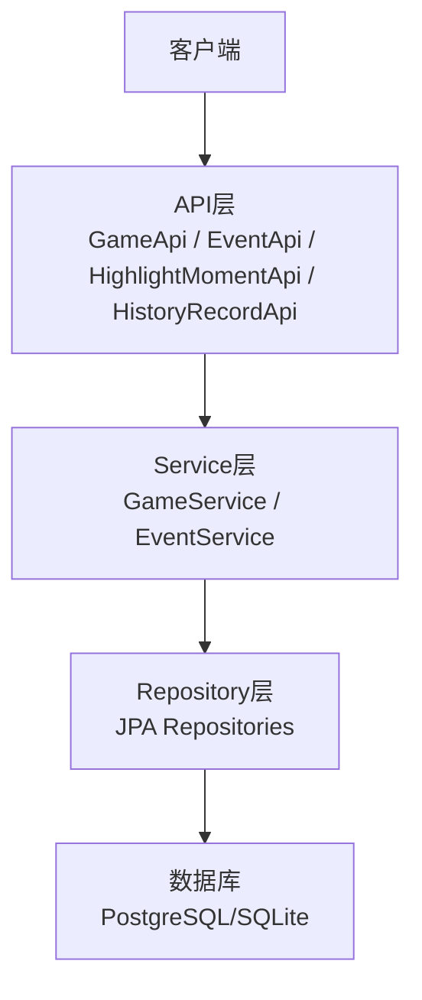
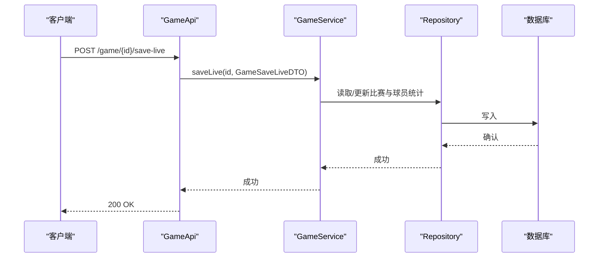
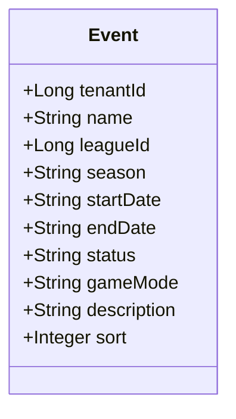
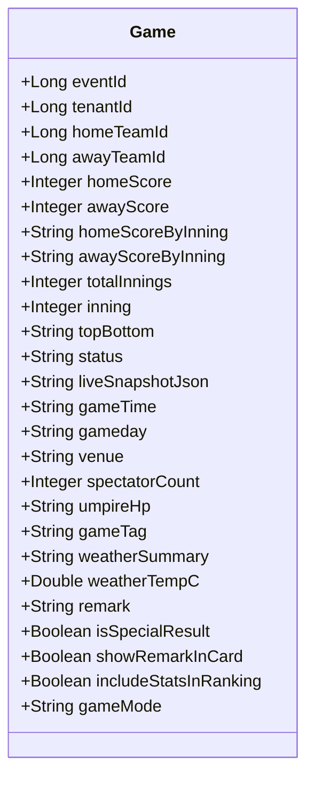
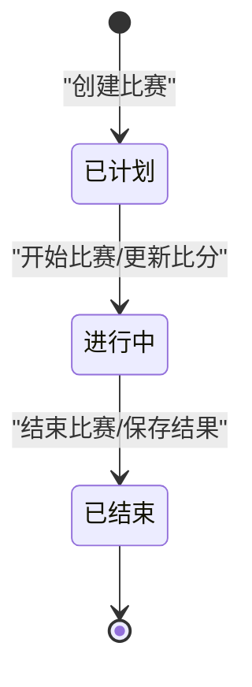
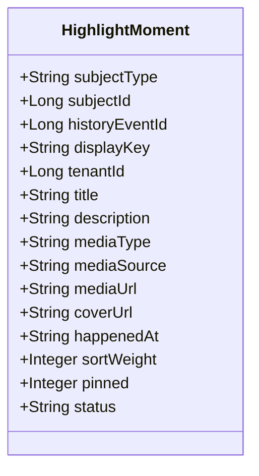
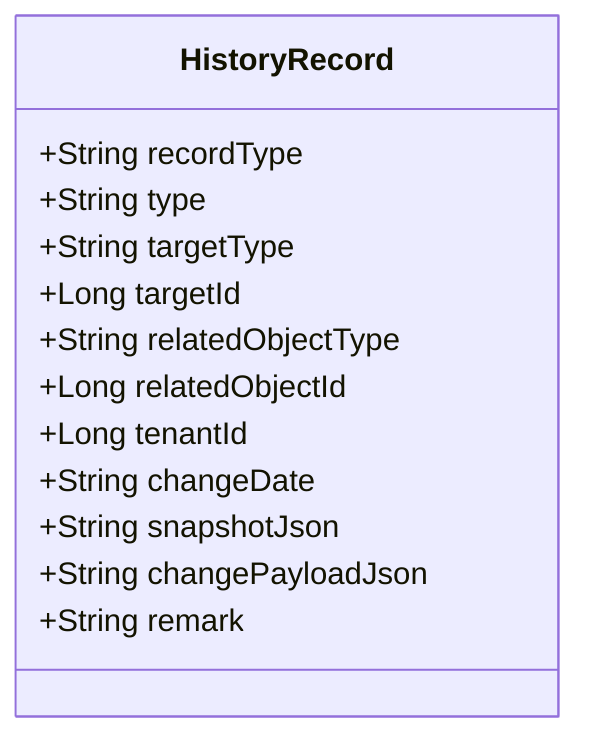
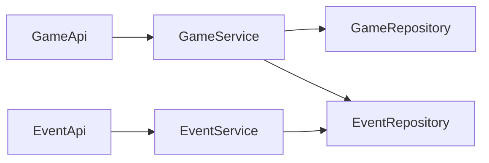

# 比赛管理API

## 目录
1. [简介](#简介)
2. [项目结构](#项目结构)
3. [核心组件](#核心组件)
4. [架构总览](#架构总览)
5. [详细组件分析](#详细组件分析)
6. [依赖关系分析](#依赖关系分析)
7. [性能与实时性](#性能与实时性)
8. [故障排查指南](#故障排查指南)
9. [结论](#结论)
10. [附录：接口清单与示例](#附录接口清单与示例)

## 简介
本文件面向“比赛管理”相关API，覆盖赛事创建、比赛安排、比分更新、比赛结果统计、历史比赛记录查询、精彩时刻标记等能力。文档从系统架构、数据模型、状态流转、CRUD操作、实时同步机制与性能优化等方面给出完整说明，并提供接口清单与调用示例路径，便于前后端对接与运维排障。

## 项目结构
- API层：提供REST接口，负责参数校验、路由分发与统一响应封装
- Service层：业务编排、权限与租户隔离、事务控制、数据一致性保障
- Repository层：数据访问（JPA）
- Model层：实体定义（如比赛、赛事、精彩时刻、历史记录）
- 公共组件：分页、统一返回体、异常处理等

## 核心组件
- 赛事管理：创建、查询、导入比赛结果
- 比赛管理：创建、更新、删除、列表查询、实时快照、比分更新、结果保存
- 精彩时刻：创建、查询、更新、删除
- 历史记录：按多维度查询人员/对象变更历史

## 架构总览
比赛管理采用分层架构：API接收请求并委托Service；Service进行权限校验、租户隔离、业务规则验证与事务控制；Repository完成持久化。关键特性包括：
- 多租户与数据范围控制：通过租户ID与联赛维度限制可访问范围
- 软删除：使用deletedAt字段实现逻辑删除
- 实时快照：比赛支持liveSnapshotJson存储实时比分与局况
- 批量结果导入：支持一次性导入比赛与球员统计数据

## 详细组件分析

### 赛事管理（Event）
- 功能：赛事的增删改查、按联赛与租户过滤、导入比赛结果
- 权限：基于租户与联赛的数据范围控制
- 状态：默认draft，可按需推进

### 比赛管理（Game）
- 功能：创建、更新、删除、列表查询、获取/保存实时快照、比分更新、结果保存、球员统计CRUD
- 状态：status默认scheduled，支持实时更新；inning/topBottom表示当前局与上下半局
- 实时：liveSnapshotJson用于前端轮询或推送展示实时比分
- 统计：每场比赛的球员统计数据独立维护

#### 比赛状态流转

### 精彩时刻（HighlightMoment）
- 功能：创建、查询、更新、删除
- 用途：标记比赛中的高光片段，支持媒体类型与排序权重

### 历史记录（HistoryRecord）
- 功能：按目标类型、关联对象、时间范围等多维度查询变更记录
- 用途：审计与回溯，支持快照与变更内容JSON

## 依赖关系分析
- API到Service：单向依赖，职责清晰
- Service到Repository：通过JPA进行数据访问
- 权限与租户：Service层集成DataScopeService与TenantQueryPolicyService，确保数据隔离
- 事件与比赛：比赛通过eventId关联赛事，保证上下文一致

## 性能与实时性
- 分页与排序：所有列表接口均支持page、pageSize、sortProp、sortOrder，避免全表扫描
- 条件查询：支持按赛事、年份、球队等多维过滤，减少不必要数据加载
- 实时快照：通过GET/POST /game/{id}/live-snapshot实现轻量级实时比分拉取与更新，适合前端轮询或WebSocket推送
- 批量更新：save-live与save-result支持增量更新比分与统计，降低写放大
- 软删除：使用deletedAt过滤，避免物理删除带来的索引与关联问题
- 建议优化：
  - 对高频查询字段建立复合索引（如tenantId、eventId、gameday）
  - 对liveSnapshotJson做合理分片或缓存策略，避免大对象频繁落库
  - 对统计写入采用批处理或异步队列，削峰填谷

[本节为通用性能建议，不直接引用具体代码行]

## 故障排查指南
- 常见错误码与场景
  - 400 非法参数或缺少必要字段：检查请求体结构与必填项
  - 403 无权限：确认租户与联赛数据范围，检查用户角色与授权
  - 404 资源不存在：核对ID有效性，注意软删除导致不可见
- 定位步骤
  - 查看API日志与Service异常堆栈
  - 检查Repository SQL执行计划与索引命中
  - 核对租户ID、联赛ID、赛事ID是否匹配
- 典型问题
  - 无法修改比赛：可能因非所属租户或已被删除
  - 导入结果失败：校验先发起守备位置唯一性与打序人数要求
  - 实时快照未生效：确认保存接口调用成功且JSON格式正确

## 结论
本套比赛管理API以清晰的层次划分、严格的权限与租户隔离、完善的实时比分与结果管理能力，支撑了从赛事规划到比赛执行与复盘的全流程。通过分页、条件查询与批量更新等手段，兼顾了易用性与性能。建议在部署时结合索引与缓存策略进一步优化高并发场景下的读写性能。

[本节为总结性内容，不直接引用具体代码行]

## 附录：接口清单与示例

### 赛事（Event）
- GET /event/list?page=&pageSize=&sortProp=&sortOrder=
  - 作用：分页查询赛事列表
  - 参考：`EventApi.java:51-55`
- GET /event/{id}
  - 作用：获取单个赛事详情
  - 参考：`EventApi.java:57-64`
- POST /event/create
  - 作用：创建赛事
  - 参考：`EventApi.java:66-70`
- PUT /event/update/{id}
  - 作用：更新赛事
  - 参考：`EventApi.java:78-82`
- DELETE /event/delete/{id}
  - 作用：删除赛事（软删除）
  - 参考：`EventApi.java:84-88`
- POST /event/{eventId}/import-game-result
  - 作用：导入比赛结果（含比赛与统计）
  - 参考：`EventApi.java:72-76`

### 比赛（Game）
- GET /game/list?page=&pageSize=&sortProp=&sortOrder=&eventId=&eventIds=&years=&teamId=
  - 作用：分页查询比赛列表，支持多维过滤
  - 参考：`GameApi.java:62-69`
- GET /game/{id}
  - 作用：获取比赛详情
  - 参考：`GameApi.java:71-75`
- GET /game/{id}/live-snapshot
  - 作用：获取实时快照（比分、局况等）
  - 参考：`GameApi.java:77-81`
- POST /game/{id}/live-snapshot
  - 作用：保存实时快照
  - 参考：`GameApi.java:83-87`
- POST /game/create
  - 作用：创建比赛
  - 参考：`GameApi.java:95-99`
- PUT /game/update/{id}
  - 作用：更新比赛
  - 参考：`GameApi.java:101-105`
- POST /game/{id}/save-live
  - 作用：更新比赛实时比分与部分统计
  - 参考：`GameApi.java:107-111`
- POST /game/{id}/save-result
  - 作用：保存比赛最终结果与统计
  - 注：`gameNumber`（场次）与 `venue`（场地）为整字段覆盖——请求体传 null 或省略即视为清空（用于前台不显示场次/场地，issue #28）；其余比分/统计字段仍为增量更新
  - 参考：`GameApi.java:113-117`
- DELETE /game/delete/{id}
  - 作用：删除比赛（软删除）
  - 参考：`GameApi.java:119-123`
- GET /game/{gameId}/stats
  - 作用：查询某场比赛的球员统计
  - 参考：`GameApi.java:89-93`
- POST /game/stats/create
- PUT /game/stats/update/{id}
- DELETE /game/stats/delete/{id}
  - 作用：球员统计CRUD
  - 参考：`GameApi.java:125-141`

### 精彩时刻（HighlightMoment）
- GET /highlight-moment/list?page=&pageSize=&sortProp=&sortOrder=&subjectType=&subjectId=&mediaType=&status=
  - 作用：分页查询精彩时刻
  - 参考：`HighlightMomentApi.java:46-49`
- POST /highlight-moment/create
  - 作用：创建精彩时刻
  - 参考：`HighlightMomentApi.java:51-55`
- PUT /highlight-moment/update/{id}
  - 作用：更新精彩时刻
  - 参考：`HighlightMomentApi.java:57-61`
- DELETE /highlight-moment/delete/{id}
  - 作用：删除精彩时刻
  - 参考：`HighlightMomentApi.java:63-67`

### 历史记录（HistoryRecord）
- GET /history-record/list?page=&pageSize=&sortProp=&sortOrder=&targetType=&targetId=&relatedObjectType=&relatedObjectId=&type=&recordType=&dateFrom=&dateTo=
  - 作用：分页查询历史记录
  - 参考：`HistoryRecordApi.java:40-44`
- POST /history-record/create
  - 作用：创建历史记录
  - 参考：`HistoryRecordApi.java:46-50`

---

> 本文整理自 Qoder RepoWiki（基于代码自动生成），仅供参考，以代码为准。
