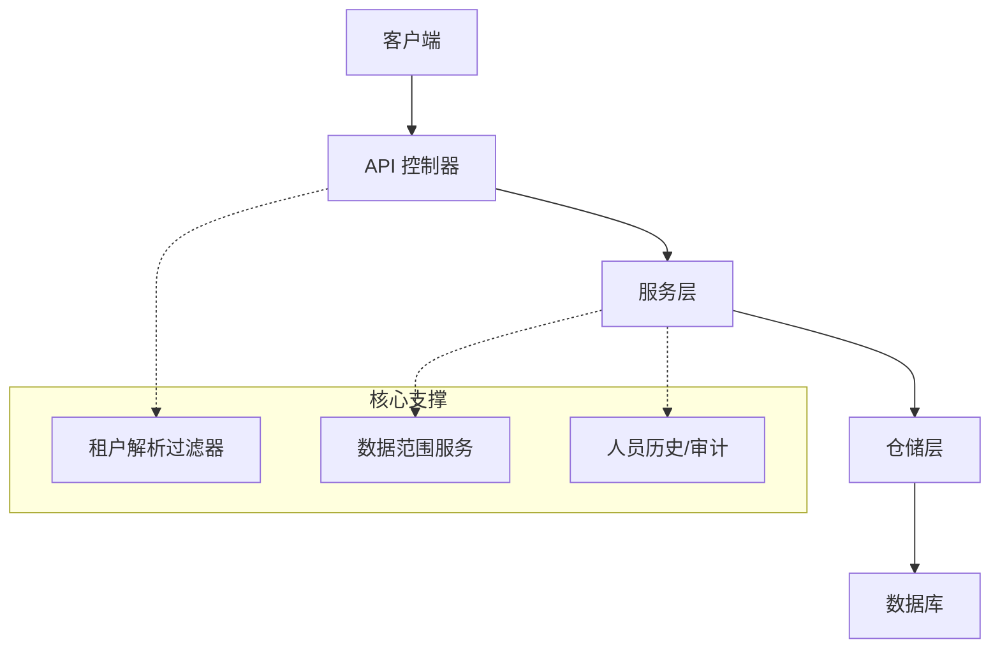
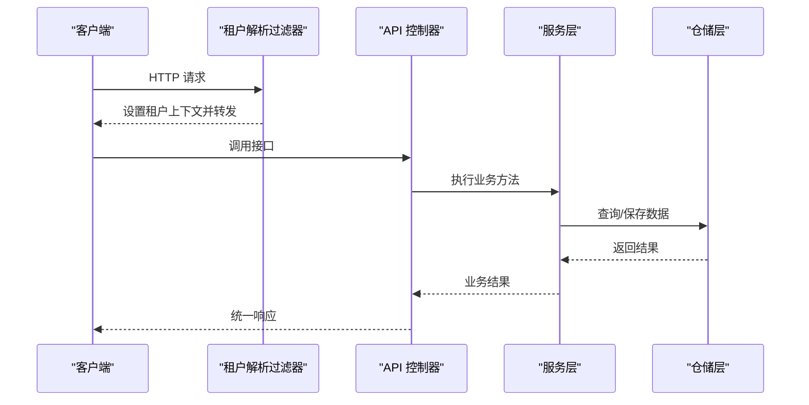
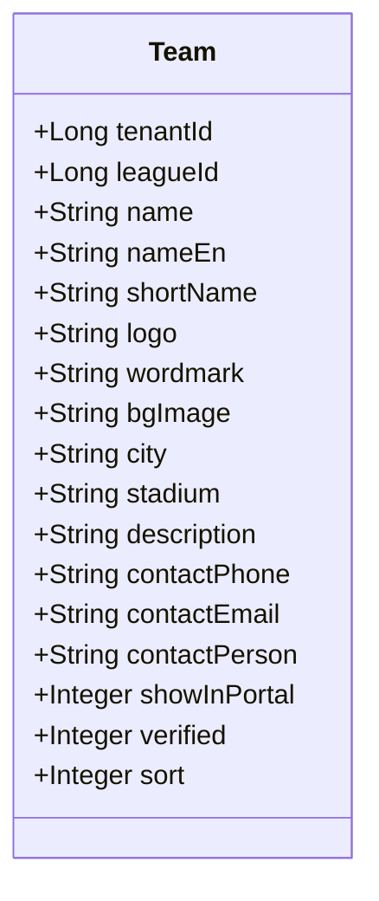
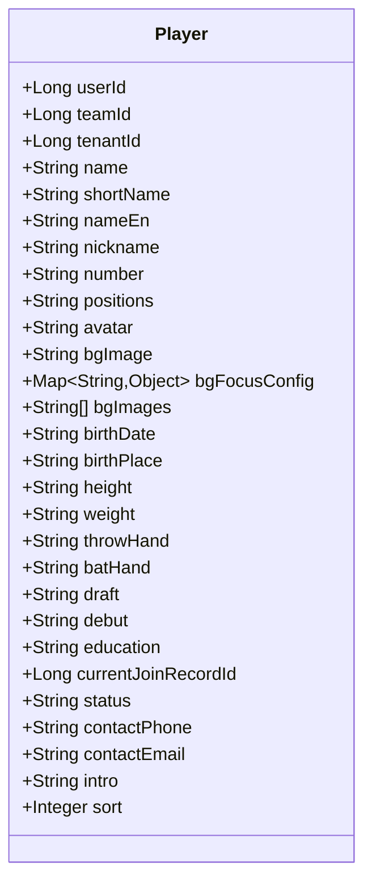
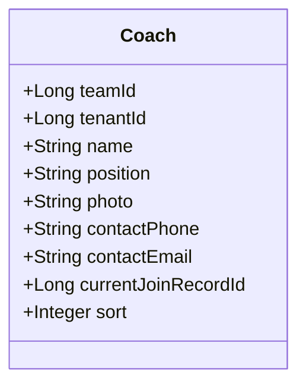
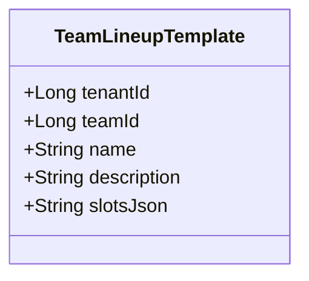
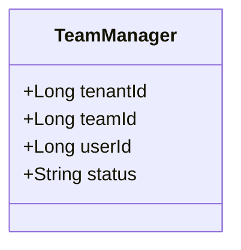
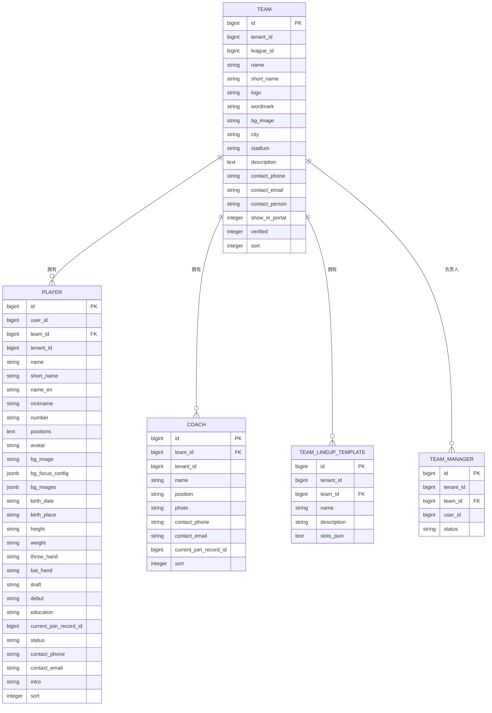
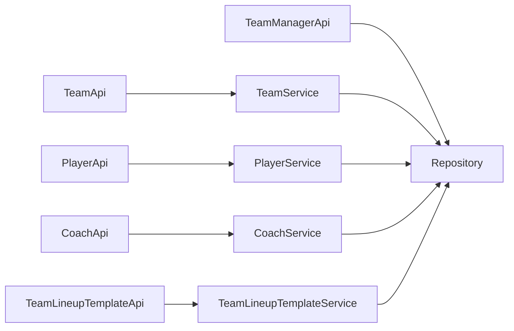
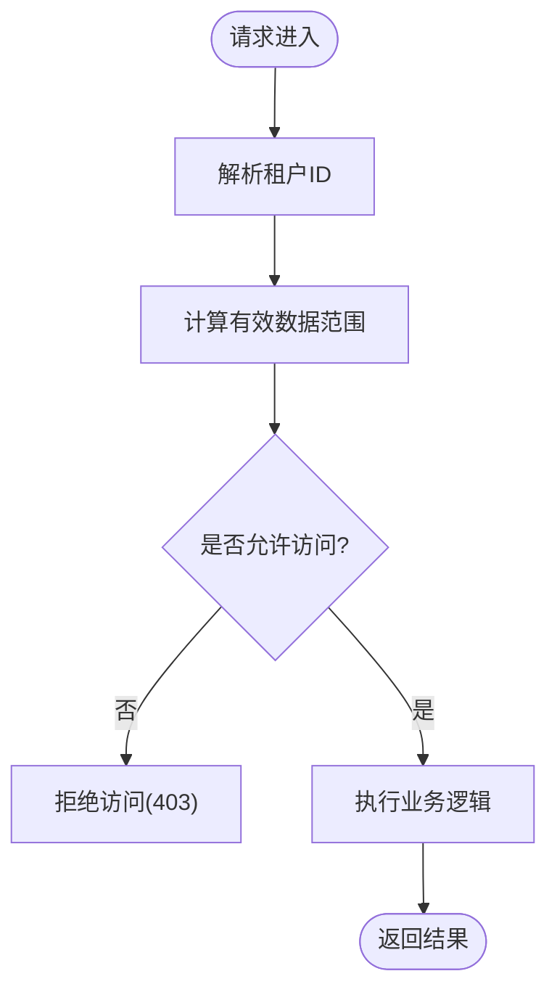

# 球队球员API

## 目录
1. [简介](#简介)
2. [项目结构](#项目结构)
3. [核心组件](#核心组件)
4. [架构总览](#架构总览)
5. [详细组件分析](#详细组件分析)
6. [依赖关系分析](#依赖关系分析)
7. [性能考虑](#性能考虑)
8. [故障排查指南](#故障排查指南)
9. [结论](#结论)
10. [附录](#附录)

## 简介
本文件面向球队与球员管理相关API的开发者与使用者，系统化说明以下能力：
- 球队信息CRUD（创建、查询、更新、删除）
- 球员档案管理（增删改查、导入、统计、明细钻取）
- 教练管理（增删改查、选择列表）
- 阵容模板（创建、复制自比赛、更新、删除、详情）
- 球队负责人管理（指派、移除）
- 多租户数据隔离机制与权限控制要点
- 实体关系图与数据结构定义

## 项目结构
围绕“球队-球员-教练-阵容模板”的业务域，系统采用分层架构：
- API层：暴露REST接口，负责参数校验与结果封装
- Service层：业务编排、权限与租户策略、事务边界
- Repository层：数据访问（JPA/MyBatis）
- Entity层：领域模型映射数据库表
- 核心支撑：租户解析、数据范围、审计与历史变更记录

## 核心组件
- 球队管理API：提供球队选项、分页列表、详情、创建、更新、删除等接口
- 球员管理API：提供选项、分页列表、详情、统计数据、赛季统计、比赛日志、击球/投球/防守钻取、批量删除、批量导入等接口
- 教练管理API：提供选项、分页列表、详情、创建、更新、删除等接口
- 阵容模板API：按球队维度提供模板列表、详情、创建、从比赛复制、更新、删除
- 球队负责人API：按球队维度列出、指派、移除负责人（需管理员权限）

## 架构总览
请求进入后，先由租户解析过滤器提取并设置当前租户上下文；随后路由到对应API控制器，控制器调用服务层完成业务逻辑。服务层在读写前进行租户与数据范围校验，必要时结合仓库执行持久化操作。

## 详细组件分析

### 球队管理（Team）
- 接口概览
  - GET /team/select-options：获取下拉选项
  - GET /team/list：分页列表（支持排序）
  - GET /team/{id}：获取详情
  - POST /team/create：创建球队
  - PUT /team/update/{id}：更新球队
  - DELETE /team/delete/{id}：软删除
- 关键行为
  - 列表与选项均受租户与数据范围限制
  - 创建/更新时校验联盟归属与租户一致性
  - 删除为软删除，记录删除时间与操作人
- 数据模型要点
  - 包含租户ID、联盟ID、名称、标识、城市、主场、描述、联系方式、展示开关、认证状态、排序等字段

### 球员管理（Player）
- 接口概览
  - GET /player/select-options：下拉选项
  - GET /player/list：分页列表（支持按球队、ID集合、关键字、号码、位置、投打惯用手、状态、加入日期区间筛选）
  - GET /player/check-full-name：全名重复性检查
  - GET /player/team-options?teamId=：某队可选项（含号码、位置、投打手、状态）
  - GET /player/{id}：详情
  - GET /player/{id}/stats：综合统计（可按比赛模式过滤）
  - GET /player/{id}/stats/by-season：按赛季统计
  - GET /player/{id}/stats/game-log：比赛日志（默认最近30条）
  - GET /player/{id}/stats/drill-down/batting|pitching|fielding：击球/投球/防守钻取（支持分页、赛事、赛季、比赛模式）
  - POST /player/create：创建
  - PUT /player/update/{id}：更新
  - DELETE /player/delete/{id}：删除
  - POST /player/delete-batch：批量删除
  - POST /player/import：批量导入（支持重复策略）
- 关键行为
  - 列表与选项均受租户与数据范围限制；支持自由球员与指定球队两种视图
  - 统计与钻取通过服务聚合计算并按模式过滤
  - 导入支持重复处理策略
- 数据模型要点
  - 关联用户ID、球队ID、租户ID；包含姓名、昵称、号码、位置（JSON）、头像、背景配置、出生信息、身高体重、投打手、选秀/首秀、学历、当前加入记录ID、状态、联系方式、简介、排序等

### 教练管理（Coach）
- 接口概览
  - GET /coach/select-options：下拉选项
  - GET /coach/list：分页列表（支持关键字、球队筛选）
  - GET /coach/{id}：详情
  - POST /coach/create：创建
  - PUT /coach/update/{id}：更新
  - DELETE /coach/delete/{id}：删除
- 关键行为
  - 列表与选项受租户与数据范围限制；支持自由教练与绑定球队教练
  - 创建/更新时自动应用所属租户并校验球队归属
  - 删除为软删除
- 数据模型要点
  - 关联球队ID、租户ID；包含姓名、职位、照片、联系方式、当前加入记录ID、排序等

### 阵容模板（TeamLineupTemplate）
- 接口概览（按球队维度）
  - GET /team/{teamId}/lineup-template/list：模板列表
  - GET /team/{teamId}/lineup-template/{id}：模板详情（含首发槽位、替补球员ID、先发投手ID）
  - POST /team/{teamId}/lineup-template/create：创建模板
  - POST /team/{teamId}/lineup-template/copy-from-game：从比赛复制生成模板
  - PUT /team/{teamId}/lineup-template/update/{id}：更新模板
  - DELETE /team/{teamId}/lineup-template/delete/{id}：删除模板
- 关键行为
  - 所有操作均需验证球队存在与访问权限
  - 创建/更新对槽位与替补进行合法性校验，确保必填位置完整且无冲突
  - 从比赛复制时校验比赛归属与队伍侧（主/客）
- 数据模型要点
  - 关联租户ID、球队ID；包含模板名称、描述、首发槽位JSON等

### 球队负责人（TeamManager）
- 接口概览（按球队维度）
  - GET /team/{teamId}/managers：列出活跃负责人
  - POST /team/{teamId}/managers：指派负责人（需管理员权限）
  - DELETE /team/{teamId}/managers/{userId}：移除负责人
- 关键行为
  - 仅超级管理员或租户管理员可指派/移除
  - 指派时需校验用户非空、球队存在、未重复指派
  - 移除时为软停用，记录删除时间
- 数据模型要点
  - 关联租户ID、球队ID、用户ID；状态active/inactive

### 实体关系图（ER）

## 依赖关系分析
- API 到 Service 的单向依赖，Service 组合多个仓储与支撑服务
- 数据访问通过 JPA Specification 构建动态查询条件，结合租户与数据范围实现细粒度隔离
- 阵容模板依赖比赛与比赛球员统计以支持“从比赛复制”
- 负责人管理直接操作仓储并校验管理员权限

## 性能考虑
- 列表与选项查询使用分页与排序，避免全量加载
- 复杂筛选通过Specification在数据库层完成，减少内存计算
- 阵容模板复制涉及跨表读取，建议按需传入必要参数并限制返回字段
- 批量导入应控制批次大小，避免长事务与锁竞争
- 统计与钻取接口可能涉及多表聚合，建议在高频场景引入缓存或预计算

[本节为通用指导，不直接分析具体文件]

## 故障排查指南
- 常见错误码与提示
  - 400：参数非法（如缺少必填项、值不合法）
  - 401：未登录或令牌无效
  - 403：无权限（越权访问、非管理员操作负责人等）
  - 404：资源不存在（球队、模板、比赛等）
- 定位思路
  - 确认请求是否携带正确的Authorization头（负责人相关接口）
  - 检查租户上下文是否正确解析（过滤器设置）
  - 核对数据范围是否允许访问目标对象
  - 查看服务层抛出的业务异常与日志堆栈

## 结论
本套API围绕球队、球员、教练与阵容模板构建了完整的生命周期管理能力，并通过统一的租户解析与数据范围机制保障多租户环境下的数据安全与隔离。建议在实际使用中：
- 严格遵循接口参数规范与权限要求
- 合理使用分页与筛选条件提升性能
- 对敏感操作（负责人指派/移除）做好审计与告警
- 对高并发统计与钻取场景评估缓存与预计算方案

[本节为总结性内容，不直接分析具体文件]

## 附录

### 多租户数据隔离机制说明
- 请求进入时由租户解析过滤器提取并设置当前租户ID
- 服务层在查询/写入前强制注入tenantId并校验数据范围
- 列表与选项查询根据有效数据范围进一步缩小结果集
- 创建/更新时校验关联资源的租户一致性，防止跨租户污染

---

> 本文整理自 Qoder RepoWiki（基于代码自动生成），仅供参考，以代码为准。
