# 球队球员API

## 目录
1. [简介](#简介)
2. [项目结构](#项目结构)
3. [核心组件](#核心组件)
4. [架构总览](#架构总览)
5. [详细组件分析](#详细组件分析)
6. [依赖关系分析](#依赖关系分析)
7. [性能考虑](#性能考虑)
8. [故障排查指南](#故障排查指南)
9. [结论](#结论)
10. [附录](#附录)

## 简介
本文件面向球队与球员管理相关API的开发者与使用者，系统化说明以下能力：
- 球队信息CRUD（创建、查询、更新、删除）
- 球员档案管理（增删改查、导入、统计、明细钻取）
- 教练管理（增删改查、选择列表）
- 阵容模板（创建、复制自比赛、更新、删除、详情）
- 球队负责人管理（指派、移除）
- 多租户数据隔离机制与权限控制要点
- 实体关系图与数据结构定义

## 项目结构
围绕“球队-球员-教练-阵容模板”的业务域，系统采用分层架构：
- API层：暴露REST接口，负责参数校验与结果封装
- Service层：业务编排、权限与租户策略、事务边界
- Repository层：数据访问（JPA/MyBatis）
- Entity层：领域模型映射数据库表
- 核心支撑：租户解析、数据范围、审计与历史变更记录

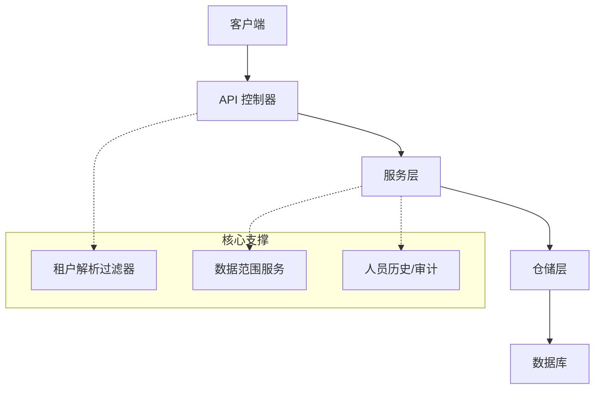
```mermaid
graph TB
Client["客户端"] --> API["API 控制器"]
API --> Svc["服务层"]
Svc --> Repo["仓储层"]
Repo --> DB["数据库"]
subgraph "核心支撑"
TRF["租户解析过滤器"]
DSC["数据范围服务"]
AUD["人员历史/审计"]
end
API -.-> TRF
Svc -.-> DSC
Svc -.-> AUD
```

## 核心组件
- 球队管理API：提供球队选项、分页列表、详情、创建、更新、删除等接口
- 球员管理API：提供选项、分页列表、详情、统计数据、赛季统计、比赛日志、击球/投球/防守钻取、批量删除、批量导入等接口；球员档案支持“球员-球队经历”多队注册（teamEntries）
- 教练管理API：提供选项、分页列表、详情、创建、更新、删除等接口
- 阵容模板API：按球队维度提供模板列表、详情、创建、从比赛复制、更新、删除
- 球队负责人API：按球队维度列出、指派、移除负责人（需管理员权限）

## 架构总览
请求进入后，先由租户解析过滤器提取并设置当前租户上下文；随后路由到对应API控制器，控制器调用服务层完成业务逻辑。服务层在读写前进行租户与数据范围校验，必要时结合仓库执行持久化操作。

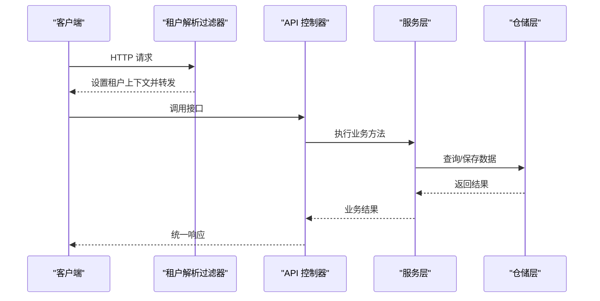
```mermaid
sequenceDiagram
participant C as "客户端"
participant F as "租户解析过滤器"
participant A as "API 控制器"
participant S as "服务层"
participant R as "仓储层"
C->>F : HTTP 请求
F-->>C : 设置租户上下文并转发
C->>A : 调用接口
A->>S : 执行业务方法
S->>R : 查询/保存数据
R-->>S : 返回结果
S-->>A : 业务结果
A-->>C : 统一响应
```

## 详细组件分析

### 球队管理（Team）
- 接口概览
  - GET /team/select-options：获取下拉选项
  - GET /team/list：分页列表（支持排序）
  - GET /team/{id}：获取详情
  - POST /team/create：创建球队
  - PUT /team/update/{id}：更新球队
  - DELETE /team/delete/{id}：软删除
- 关键行为
  - 列表与选项均受租户与数据范围限制
  - 创建/更新时校验联盟归属与租户一致性
  - 删除为软删除，记录删除时间与操作人
- 数据模型要点
  - 包含租户ID、联盟ID、名称、标识、城市、主场、描述、联系方式、展示开关、认证状态、排序等字段

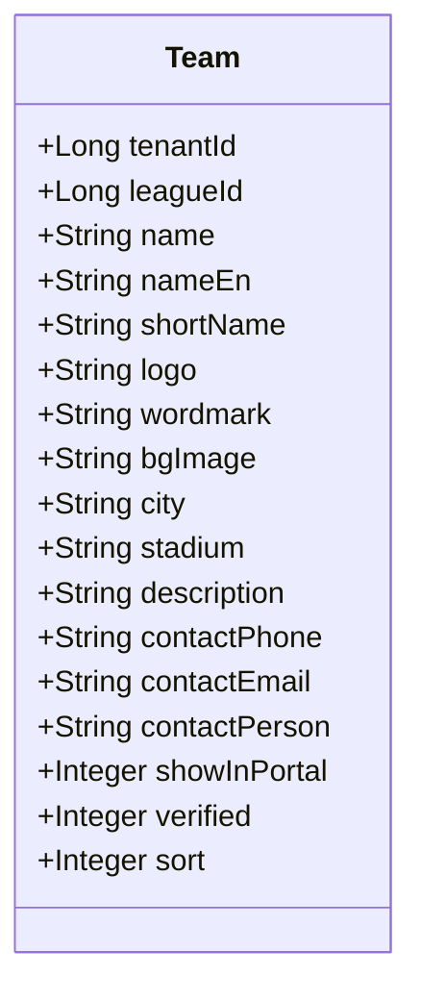
```mermaid
classDiagram
class Team {
+Long tenantId
+Long leagueId
+String name
+String nameEn
+String shortName
+String logo
+String wordmark
+String bgImage
+String city
+String stadium
+String description
+String contactPhone
+String contactEmail
+String contactPerson
+Integer showInPortal
+Integer verified
+Integer sort
}
```

### 球员管理（Player）
- 接口概览
  - GET /player/select-options：下拉选项
  - GET /player/list：分页列表（支持按球队、ID集合、关键字、号码、位置、投打惯用手、状态、加入日期区间筛选）；球队筛选=存在该队“当前”经历，号码/位置筛选按经历段匹配；返回项含 teamEntries
  - GET /player/check-full-name：全名重复性检查
  - GET /player/team-options?teamId=：某队“当前注册”球员可选项（号码/位置取自该队注册段，含投打手、状态，供阵容编辑选择）
  - GET /player/{id}：详情（含 teamEntries 球队经历）
  - GET /player/{id}/stats：综合统计（可按比赛模式过滤）
  - GET /player/{id}/stats/by-season：按赛季统计
  - GET /player/{id}/stats/game-log：比赛日志（默认最近30条）
  - GET /player/{id}/stats/drill-down/batting|pitching|fielding：击球/投球/防守钻取（支持分页、赛事、赛季、比赛模式）
  - POST /player/create：创建（请求体可携带 teamEntries）
  - PUT /player/update/{id}：更新（请求体可携带 teamEntries）
  - DELETE /player/delete/{id}：删除
  - POST /player/delete-batch：批量删除
  - POST /player/import：批量导入（支持重复策略）
- 关键行为
  - 列表与选项均受租户与数据范围限制；支持自由球员（无“当前”经历）与指定球队（存在该队“当前”经历）两种视图
  - 数据范围判定：受限用户按“当前经历是否落在授权球队”判定可见性（列表、ID集合查询、详情一致）
  - 统计与钻取通过服务聚合计算并按模式过滤；统计按 playerId 聚合，不受多队注册影响
  - 导入与旧页面更新会按旧字段确保/更新一条“当前球队”经历
- 数据模型要点
  - 关联用户ID、租户ID；包含姓名、昵称、号码镜像、位置镜像、头像、背景配置、出生信息、身高体重、投打手、选秀/首秀、学历、当前加入记录ID、状态、联系方式、简介、排序等
  - 多队注册：teamId/number/positions 为“主注册”镜像字段；完整球队经历见 bs_player_team（下表）

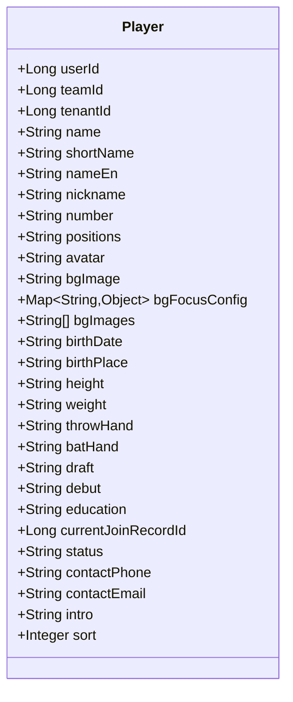
```mermaid
classDiagram
class Player {
+Long userId
+Long teamId
+Long tenantId
+String name
+String shortName
+String nameEn
+String nickname
+String number
+String positions
+String avatar
+String bgImage
+Map~String,Object~ bgFocusConfig
+String[] bgImages
+String birthDate
+String birthPlace
+String height
+String weight
+String throwHand
+String batHand
+String draft
+String debut
+String education
+Long currentJoinRecordId
+String status
+String contactPhone
+String contactEmail
+String intro
+Integer sort
}
```

#### 球员-球队经历（PlayerTeam / bs_player_team）
一位球员可注册多支球队（简历式多段），每段包含：球队、该队背号、该队守备位置、是否“当前球队”（可多选）。

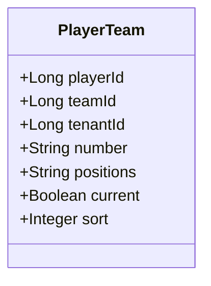
```mermaid
classDiagram
class PlayerTeam {
+Long playerId
+Long teamId
+Long tenantId
+String number
+String positions
+Boolean current
+Integer sort
}
```

- 接口约定（随球员档案嵌套，无独立路由）：
  - 详情/列表输出：GET /player/{id}、GET /player/list 返回项均含 `teamEntries: [{id, teamId, teamName, number, positions[], current, sort}]`
  - 创建/更新：POST /player/create、PUT /player/update/{id} 请求体可携带 `teamEntries`
    - 提供 teamEntries：全量替换语义——缺失段被移除（软删）；`current=false` 表示保留经历但不再“当前”
    - 未提供 teamEntries（旧页面兼容）：teamId>0 时确保该队一段“当前”经历并按请求体号码/守备位置更新该段（其他段不动）；teamId 为空时取消全部“当前”标记（自由球员）
  - 镜像回写：保存后 teamId/number/positions 取“主注册”（“当前”段按 sort,id 排序取第一段）；无“当前”段时三者置空
  - 校验：段内球队重复 → 400；球队不存在或跨租户 → 400
- 演进记录联动：“当前”集合变化时写 join/leave/transfer 事件，并回写 currentJoinRecordId
- 阵容选择：GET /player/team-options?teamId= 返回该队“当前注册”球员，号码/守备位置取该队注册段（旧版阵容/模板页无需前端改动即受益）
- 过渡期说明：旧编译版页面（球员列表/详情等）按镜像字段展示，仅显示主队/主背号；新工程（前端重建 B4 批次）将按 teamEntries 完整展示与编辑

### 教练管理（Coach）
- 接口概览
  - GET /coach/select-options：下拉选项
  - GET /coach/list：分页列表（支持关键字、球队筛选）
  - GET /coach/{id}：详情
  - POST /coach/create：创建
  - PUT /coach/update/{id}：更新
  - DELETE /coach/delete/{id}：删除
- 关键行为
  - 列表与选项受租户与数据范围限制；支持自由教练与绑定球队教练
  - 创建/更新时自动应用所属租户并校验球队归属
  - 删除为软删除
- 数据模型要点
  - 关联球队ID、租户ID；包含姓名、职位、照片、联系方式、当前加入记录ID、排序等

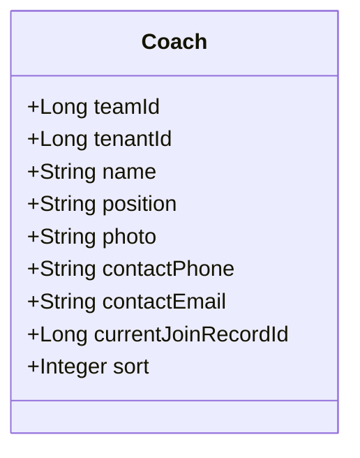
```mermaid
classDiagram
class Coach {
+Long teamId
+Long tenantId
+String name
+String position
+String photo
+String contactPhone
+String contactEmail
+Long currentJoinRecordId
+Integer sort
}
```

### 阵容模板（TeamLineupTemplate）
- 接口概览（按球队维度）
  - GET /team/{teamId}/lineup-template/list：模板列表
  - GET /team/{teamId}/lineup-template/{id}：模板详情（含首发槽位、替补球员ID、先发投手ID）
  - POST /team/{teamId}/lineup-template/create：创建模板
  - POST /team/{teamId}/lineup-template/copy-from-game：从比赛复制生成模板
  - PUT /team/{teamId}/lineup-template/update/{id}：更新模板
  - DELETE /team/{teamId}/lineup-template/delete/{id}：删除模板
- 关键行为
  - 所有操作均需验证球队存在与访问权限
  - 创建/更新对槽位与替补进行合法性校验，确保必填位置完整且无冲突
  - 从比赛复制时校验比赛归属与队伍侧（主/客）
- 数据模型要点
  - 关联租户ID、球队ID；包含模板名称、描述、首发槽位JSON等

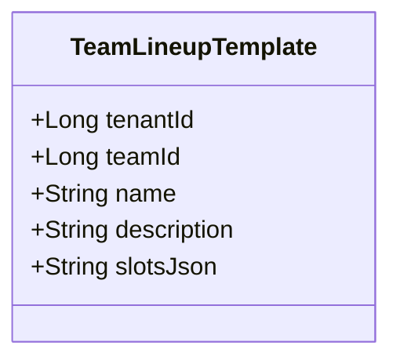
```mermaid
classDiagram
class TeamLineupTemplate {
+Long tenantId
+Long teamId
+String name
+String description
+String slotsJson
}
```

### 球队负责人（TeamManager）
- 接口概览（按球队维度）
  - GET /team/{teamId}/managers：列出活跃负责人
  - POST /team/{teamId}/managers：指派负责人（需管理员权限）
  - DELETE /team/{teamId}/managers/{userId}：移除负责人
- 关键行为
  - 仅超级管理员或租户管理员可指派/移除
  - 指派时需校验用户非空、球队存在、未重复指派
  - 移除时为软停用，记录删除时间
- 数据模型要点
  - 关联租户ID、球队ID、用户ID；状态active/inactive

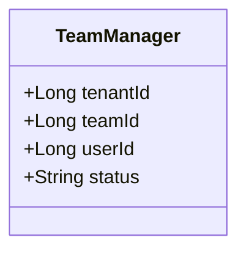
```mermaid
classDiagram
class TeamManager {
+Long tenantId
+Long teamId
+Long userId
+String status
}
```

### 实体关系图（ER）
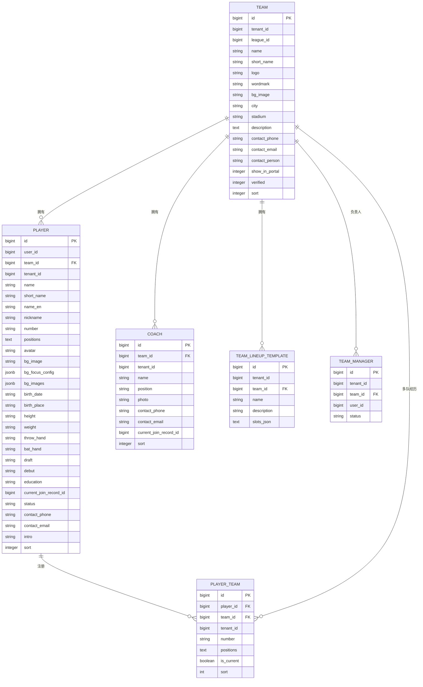
```mermaid
erDiagram
TEAM {
bigint id PK
bigint tenant_id
bigint league_id
string name
string short_name
string logo
string wordmark
string bg_image
string city
string stadium
text description
string contact_phone
string contact_email
string contact_person
integer show_in_portal
integer verified
integer sort
}
PLAYER {
bigint id PK
bigint user_id
bigint team_id FK
bigint tenant_id
string name
string short_name
string name_en
string nickname
string number
text positions
string avatar
string bg_image
jsonb bg_focus_config
jsonb bg_images
string birth_date
string birth_place
string height
string weight
string throw_hand
string bat_hand
string draft
string debut
string education
bigint current_join_record_id
string status
string contact_phone
string contact_email
string intro
integer sort
}
COACH {
bigint id PK
bigint team_id FK
bigint tenant_id
string name
string position
string photo
string contact_phone
string contact_email
bigint current_join_record_id
integer sort
}
TEAM_LINEUP_TEMPLATE {
bigint id PK
bigint tenant_id
bigint team_id FK
string name
string description
text slots_json
}
TEAM_MANAGER {
bigint id PK
bigint tenant_id
bigint team_id FK
bigint user_id
string status
}
PLAYER_TEAM {
bigint id PK
bigint player_id FK
bigint team_id FK
bigint tenant_id
string number
text positions
boolean is_current
int sort
}
TEAM ||--o{ PLAYER : "拥有"
TEAM ||--o{ COACH : "拥有"
TEAM ||--o{ TEAM_LINEUP_TEMPLATE : "拥有"
TEAM ||--o{ TEAM_MANAGER : "负责人"
PLAYER ||--o{ PLAYER_TEAM : "注册"
TEAM ||--o{ PLAYER_TEAM : "多队经历"
```

## 依赖关系分析
- API 到 Service 的单向依赖，Service 组合多个仓储与支撑服务
- 数据访问通过 JPA Specification 构建动态查询条件，结合租户与数据范围实现细粒度隔离
- 阵容模板依赖比赛与比赛球员统计以支持“从比赛复制”
- 负责人管理直接操作仓储并校验管理员权限

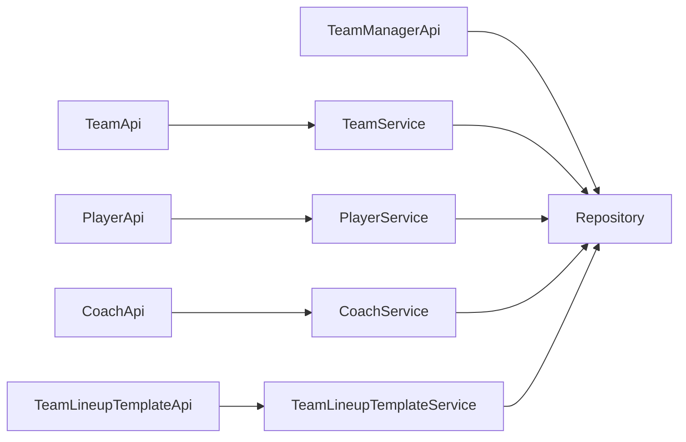
```mermaid
graph LR
TAPI["TeamApi"] --> TSvc["TeamService"]
PAPI["PlayerApi"] --> PSvc["PlayerService"]
CAPI["CoachApi"] --> CSvc["CoachService"]
LTA["TeamLineupTemplateApi"] --> LTSvc["TeamLineupTemplateService"]
MAPI["TeamManagerApi"] --> Repo["Repository"]
TSvc --> Repo
PSvc --> Repo
CSvc --> Repo
LTSvc --> Repo
```

## 性能考虑
- 列表与选项查询使用分页与排序，避免全量加载
- 复杂筛选通过Specification在数据库层完成，减少内存计算
- 阵容模板复制涉及跨表读取，建议按需传入必要参数并限制返回字段
- 批量导入应控制批次大小，避免长事务与锁竞争
- 统计与钻取接口可能涉及多表聚合，建议在高频场景引入缓存或预计算

[本节为通用指导，不直接分析具体文件]

## 故障排查指南
- 常见错误码与提示
  - 400：参数非法（如缺少必填项、值不合法）
  - 401：未登录或令牌无效
  - 403：无权限（越权访问、非管理员操作负责人等）
  - 404：资源不存在（球队、模板、比赛等）
- 定位思路
  - 确认请求是否携带正确的Authorization头（负责人相关接口）
  - 检查租户上下文是否正确解析（过滤器设置）
  - 核对数据范围是否允许访问目标对象（受限用户按“当前经历球队”判定球员可见性）
  - 查看服务层抛出的业务异常与日志堆栈
  - 球队经历相关 400：重复球队/球队不存在/跨租户不匹配（核对 teamEntries 内容与球队归属）

## 结论
本套API围绕球队、球员、教练与阵容模板构建了完整的生命周期管理能力，并通过统一的租户解析与数据范围机制保障多租户环境下的数据安全与隔离。建议在实际使用中：
- 严格遵循接口参数规范与权限要求
- 合理使用分页与筛选条件提升性能
- 对敏感操作（负责人指派/移除）做好审计与告警
- 对高并发统计与钻取场景评估缓存与预计算方案

[本节为总结性内容，不直接分析具体文件]

## 附录

### 多租户数据隔离机制说明
- 请求进入时由租户解析过滤器提取并设置当前租户ID
- 服务层在查询/写入前强制注入tenantId并校验数据范围
- 列表与选项查询根据有效数据范围进一步缩小结果集
- 创建/更新时校验关联资源的租户一致性，防止跨租户污染

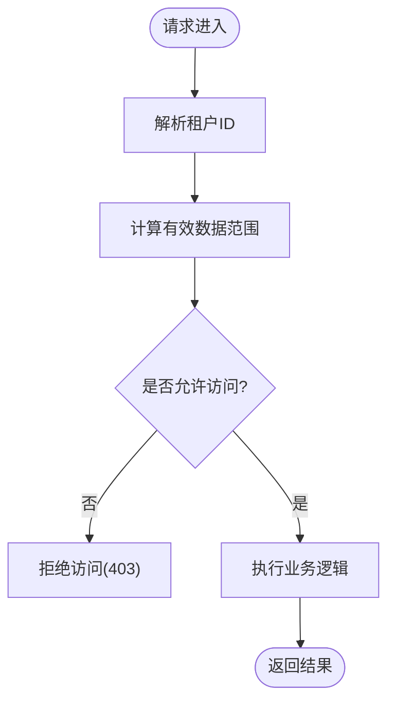
```mermaid
flowchart TD
Start(["请求进入"]) --> Resolve["解析租户ID"]
Resolve --> Scope["计算有效数据范围"]
Scope --> Query{"是否允许访问?"}
Query -- 否 --> Deny["拒绝访问(403)"]
Query -- 是 --> Exec["执行业务逻辑"]
Exec --> End(["返回结果"])
```

---

> 本文整理自 Qoder RepoWiki（基于代码自动生成），仅供参考，以代码为准。
