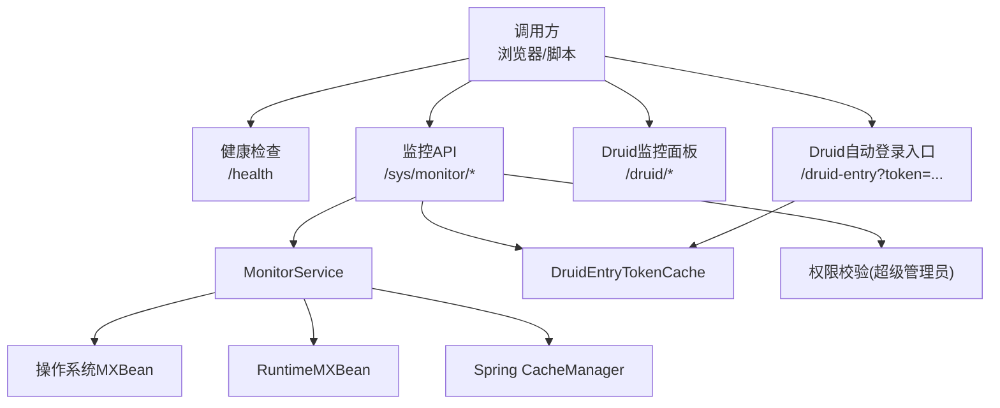
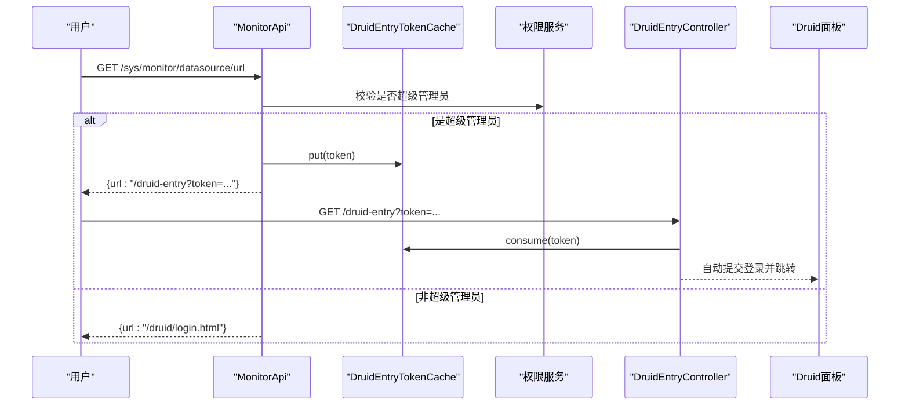
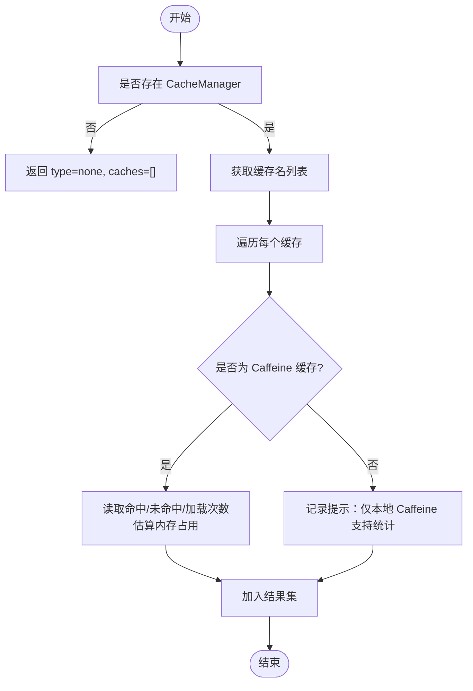
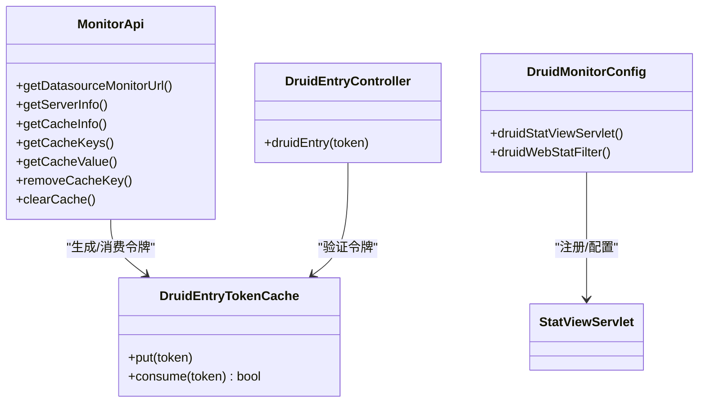
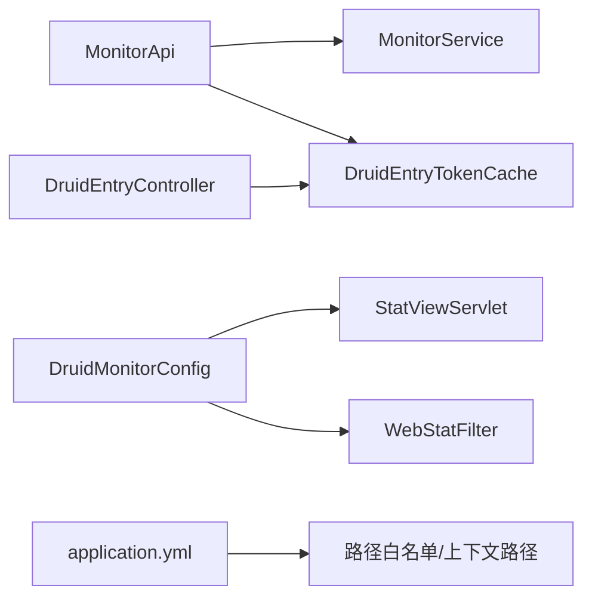

# 监控诊断API

## 目录
1. [简介](#简介)
2. [项目结构](#项目结构)
3. [核心组件](#核心组件)
4. [架构总览](#架构总览)
5. [详细组件分析](#详细组件分析)
6. [依赖关系分析](#依赖关系分析)
7. [性能考量](#性能考量)
8. [故障排查指南](#故障排查指南)
9. [结论](#结论)
10. [附录：接口清单与告警建议](#附录接口清单与告警建议)

## 简介
本文件面向运维与开发，系统化说明本项目的监控诊断能力，包括：
- 系统健康检查接口
- 数据库连接池（Druid）监控面板接入与安全访问
- 服务器、JVM、磁盘等运行指标采集
- 缓存（本地 Caffeine / Redis）监控、键值查询与管理
- 监控数据查询格式、展示与分析方法
- 性能瓶颈定位与常见故障排查流程
- 告警配置建议（基于可观测性指标）

## 项目结构
监控相关代码主要分布在以下模块：
- API 层：暴露健康检查、监控数据查询、Druid 入口跳转等 HTTP 接口
- 服务层：封装系统信息、缓存统计、内存估算等逻辑
- 配置层：注册 Druid 监控 Servlet/Filter、WebStat 过滤、限流与白名单等
- 安全与鉴权：超级管理员令牌缓存、登录态判断、路径白名单

## 核心组件
- 健康检查接口：提供应用存活与健康状态
- 监控API：聚合服务器、JVM、磁盘、缓存等指标
- Druid 监控面板：可视化数据库连接池、SQL 执行、慢查询等
- 自动登录入口：为超级管理员提供一次性令牌免密进入 Druid 面板
- 缓存管理：查看缓存类型、命中率、键列表、键值读取与清理

## 架构总览
监控诊断由“API + Service + 外部组件”构成：
- API 层负责路由、鉴权、参数校验与统一响应封装
- Service 层通过 JDK Management API 与 Spring CacheManager 获取运行时与缓存指标
- Druid 作为数据库连接池与 SQL 统计组件，提供 Web 监控面板
- 安全控制通过超级管理员令牌缓存与路径白名单实现

## 详细组件分析

### 健康检查接口
- 功能：返回服务名称与健康状态，用于探针或负载均衡健康检测
- 请求：GET /health
- 响应：包含 status 与 service 字段
- 适用场景：K8s liveness/readiness、Nginx 健康检查

### 监控API（服务器与缓存）
- 服务器信息：CPU、内存、网络、磁盘、JVM 运行时间等
- 缓存信息：缓存类型（local/redis）、命中率、近似内存占用、键列表与键值读取、删除与清空
- 关键接口
  - GET /sys/monitor/server
  - GET /sys/monitor/cache
  - GET /sys/monitor/cache/keys?cacheName=&pattern=&limit=
  - GET /sys/monitor/cache/value?cacheName=&key=
  - DELETE /sys/monitor/cache/key?cacheName=&key=
  - DELETE /sys/monitor/cache/clear?cacheName=

### Druid 监控面板与自动登录
- 面板地址：{context-path}/druid/index.html
- 启用条件：spring.datasource.druid.stat-view-servlet.enabled=true
- 访问控制：可通过 allow 限制 IP；生产建议配合反向代理与强密码
- 自动登录：超级管理员通过 /sys/monitor/datasource/url 获取一次性 token，再访问 /druid-entry?token=... 完成自动登录

### 缓存管理与键操作
- 支持本地 Caffeine 缓存的键列表查询、键值读取、单键删除与全量清空
- Redis 模式仅返回类型与名称，不暴露键列表与统计
- 键列表支持 pattern 过滤与 limit 限制，避免大表扫描

## 依赖关系分析
- MonitorApi 依赖 MonitorService 获取运行时与缓存指标
- MonitorService 依赖 JDK Management API 与 Spring CacheManager
- DruidEntryController 依赖 DruidEntryTokenCache 进行一次性令牌校验
- DruidMonitorConfig 注册 Druid 的 StatViewServlet 与 WebStatFilter
- 全局路径白名单将 /druid、/druid-entry 等纳入访客放行范围

## 性能考量
- CPU/内存/磁盘指标通过 ManagementFactory 采集，开销低，适合高频轮询
- 缓存统计仅在本地 Caffeine 下可用；Redis 模式下无命中统计
- 键列表查询默认限制返回数量，避免全量扫描造成抖动
- 预估内存采用采样估算，适用于趋势观察而非精确计量
- Druid WebStat 会统计 URI 与耗时，注意在超高吞吐场景下评估额外开销

## 故障排查指南
- 无法访问 Druid 面板
  - 检查 spring.datasource.druid.stat-view-servlet.enabled 是否开启
  - 核对 allow 白名单与 context-path
  - 确认 /druid、/druid-entry 是否在访客白名单中
- 自动登录失败
  - 确认当前用户为超级管理员
  - 确认 /sys/monitor/datasource/url 返回的 token 有效且未被消费
  - 检查 DruidEntryTokenCache 的过期策略
- 缓存键列表为空或受限
  - 确认 cacheName 存在且为本地 Caffeine
  - 使用 pattern 缩小范围，调整 limit
- 指标异常
  - 关注 CPU 使用率、JVM 内存使用率、物理内存使用率、磁盘使用率
  - 结合 Druid SQL 统计与慢查询定位热点语句

## 结论
本项目提供了完善的健康检查与监控诊断能力：
- 健康检查满足基础设施探针需求
- 服务器与缓存指标便于快速定位资源瓶颈
- Druid 面板结合自动登录机制，既安全又便捷
- 统一的 Result 响应体简化了前端与自动化集成
建议在生产环境结合日志与外部监控系统，对关键指标设置阈值告警，形成闭环。

## 附录：接口清单与告警建议

### 接口清单
- 健康检查
  - GET /health
  - 响应示例字段：status、service
- 监控数据
  - GET /sys/monitor/server
  - GET /sys/monitor/cache
  - GET /sys/monitor/cache/keys?cacheName=&pattern=&limit=
  - GET /sys/monitor/cache/value?cacheName=&key=
  - DELETE /sys/monitor/cache/key?cacheName=&key=
  - DELETE /sys/monitor/cache/clear?cacheName=
- 数据库监控入口
  - GET /sys/monitor/datasource/url
  - GET /druid-entry?token=...
  - GET /druid/index.html（需登录）

### 监控指标说明
- 服务器信息：CPU 核心数、使用率、空闲率；JVM 内存使用率；物理内存使用率；磁盘总量/已用/百分比；JVM 版本与启动时长
- 缓存信息：缓存类型、命中率、加载成功/失败次数、近似内存占用、键列表与键值

### 告警配置建议
- 健康检查失败：立即告警
- CPU 使用率持续高于阈值（如 80%）：警告
- JVM 内存使用率持续高于阈值（如 85%）：警告
- 物理内存使用率持续高于阈值（如 90%）：严重
- 磁盘使用率超过阈值（如 85%）：严重
- 缓存命中率低于阈值（如 80%）：警告
- Druid 慢查询数量突增：警告
- 连接池活跃连接接近上限：警告

---

> 本文整理自 Qoder RepoWiki（基于代码自动生成），仅供参考，以代码为准。
