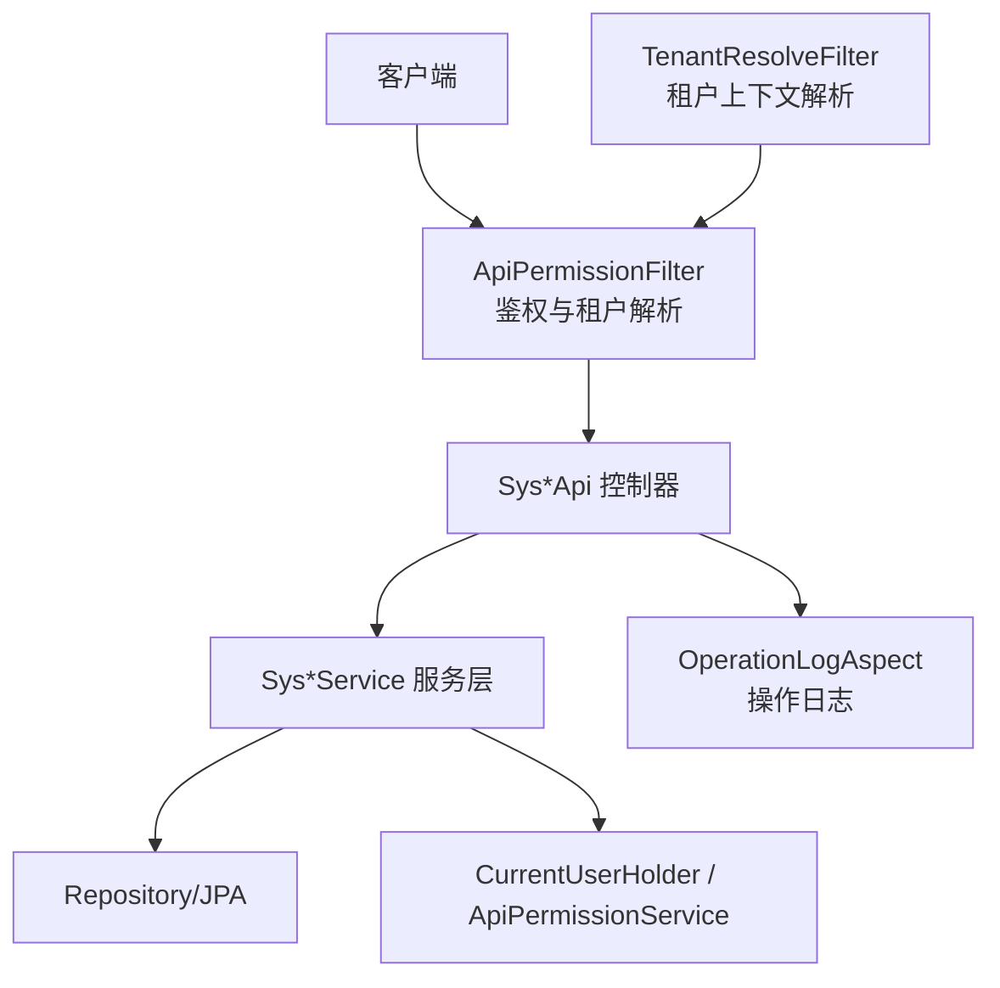
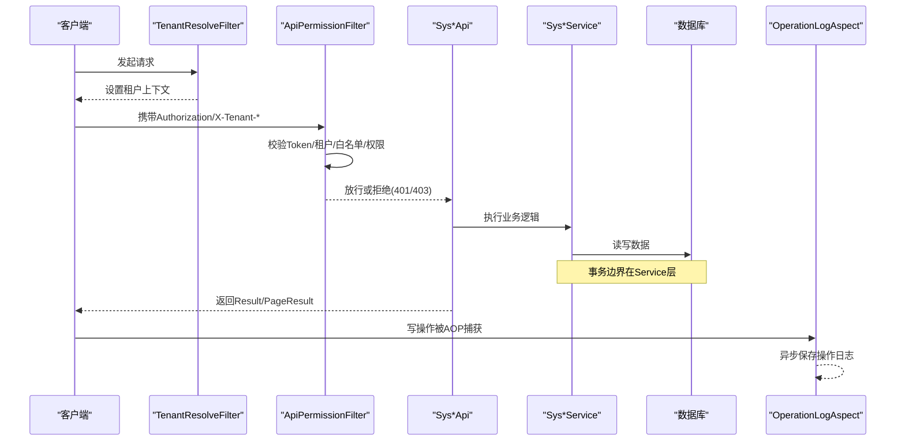
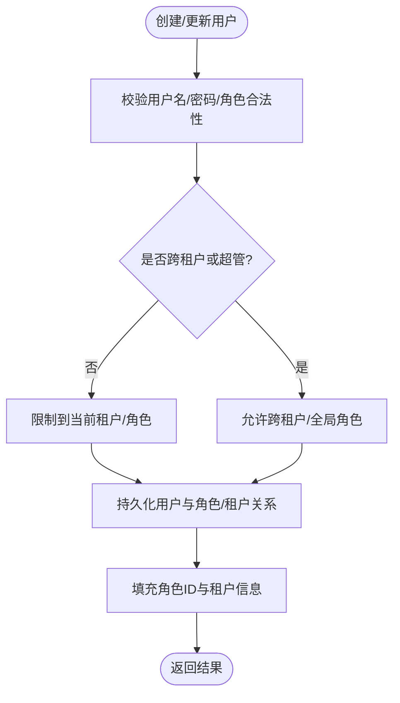
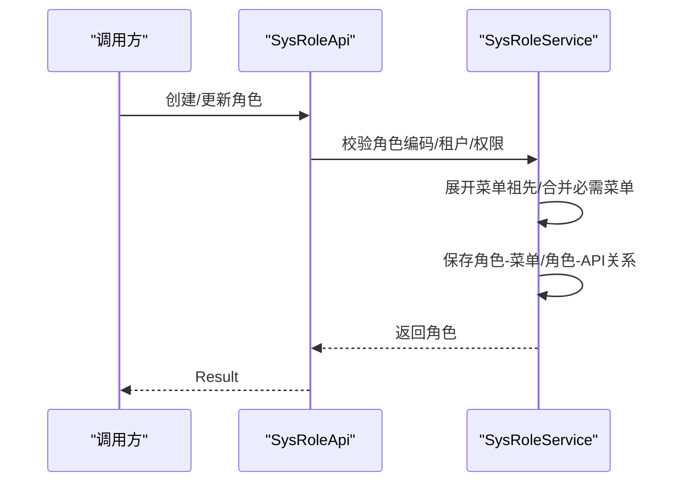
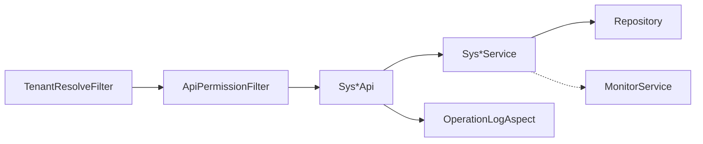

# 系统管理API

## 目录
1. [简介](#简介)
2. [项目结构](#项目结构)
3. [核心组件](#核心组件)
4. [架构总览](#架构总览)
5. [详细组件分析](#详细组件分析)
6. [依赖关系分析](#依赖关系分析)
7. [性能考虑](#性能考虑)
8. [故障排查指南](#故障排查指南)
9. [结论](#结论)
10. [附录](#附录)

## 简介
本文件面向系统管理员与后端开发者，系统化梳理并说明系统管理相关API，覆盖用户管理、角色权限、菜单配置、系统配置、租户管理、字典管理、操作日志审计、系统监控等能力。重点解释RBAC权限模型、数据范围控制、多租户隔离与安全机制，并提供权限配置示例与系统配置参数说明，帮助快速集成与运维排障。

## 项目结构
系统管理API采用分层设计：
- API层：以Spring MVC控制器暴露REST接口，统一返回Result/PageResult封装。
- 服务层：实现业务规则、权限校验、数据范围控制、事务处理。
- 核心过滤与切面：请求级鉴权、租户解析、操作日志记录。
- 配置与属性：租户默认值、严格数据范围开关等。

## 核心组件
- 用户管理：提供分页查询、新增、更新、删除，支持按当前租户限制与超级管理员跨租户模式。
- 角色权限：基于RBAC的角色-菜单-API授权，支持系统级与租户级角色隔离，内置保留角色保护。
- 菜单配置：树形菜单构建，菜单与API绑定，支持排序与层级组织。
- 系统配置：键值对配置读取与更新，支持超级管理员租户覆盖。
- 租户管理：租户CRUD、数据范围选项（联赛/球队）获取、当前用户可访问租户列表。
- 字典管理：字典类型与数据的增删改查。
- 操作日志：通过AOP拦截写操作，异步落库，支持模块/动作/IP等检索。
- 系统监控：服务器信息、缓存查看/清理、Druid入口链接生成（仅超级管理员）。

## 架构总览
请求进入后，先由租户解析过滤器设置租户上下文，再由鉴权过滤器完成JWT校验、租户有效性检查、白名单放行、接口权限判定，最后进入控制器与服务层。写操作会被操作日志切面捕获并异步记录。

## 详细组件分析

### 用户管理（SysUserApi + SysUserService）
- 能力
  - 分页查询用户，支持关键字搜索与“是否跨租户”开关；若当前为租户管理员且未开启全租户，则仅展示当前租户成员。
  - 创建/更新用户时进行用户名唯一性校验、密码加密、角色与租户成员关系的维护；超级管理员账号不绑定租户。
  - 软删除用户并清理其租户成员关系。
- 权限与数据范围
  - 租户管理员只能操作当前租户用户；超级管理员可跨租户。
  - 写入时对角色ID进行“租户管理员不可分配系统级admin角色”的清洗。
- 关键流程

### 角色权限（SysRoleApi + SysRoleService）
- RBAC模型
  - 角色关联菜单与API，支持菜单祖先节点自动展开，确保父子菜单一致性。
  - 系统内置保留角色（如admin/guest/tenant_admin）受保护，禁止修改/删除。
  - 超级管理员可管理所有角色；租户管理员仅能管理当前租户角色。
- 权限控制
  - 列表/详情/创建/更新/删除均进行角色访问与修改权限校验。
  - 菜单权限合并时，超级管理员角色强制包含必要菜单集合。
- 关键流程

### 菜单配置（SysMenuApi + SysMenuService）
- 能力
  - 构建菜单树（按sort与id排序），附加菜单绑定的API ID列表。
  - 创建/更新菜单时替换菜单-API关联；删除菜单同时清理关联。
- 关键点
  - 菜单类型默认值为页面型；支持多级嵌套。
  - 菜单树构建使用递归组装children。

### 系统配置（SysConfigApi）
- 能力
  - 根据租户ID读取或更新键值对配置；支持超级管理员通过参数覆盖目标租户。
- 安全
  - 实际租户ID由“超级管理员租户覆盖服务”解析，避免越权修改其他租户配置。

### 租户管理（SysTenantApi + SysTenantManageService）
- 能力
  - 租户CRUD（仅超级管理员），支持状态、排序、描述、租期等字段。
  - 获取当前用户可切换的租户列表（已登录用户与其租户成员关系）。
  - 数据范围选项：返回当前租户下的联赛与球队列表，用于后续数据范围配置。
- 安全
  - 所有管理操作要求超级管理员；删除默认租户禁止。

### 字典管理（SysDictApi）
- 能力
  - 字典类型分页查询、创建、更新、删除。
- 扩展
  - 通常配合字典数据API（不在本节详述）共同使用，形成“类型-数据”的键值映射。

### 操作日志审计（SysOperationLogApi + OperationLogAspect）
- 能力
  - AOP拦截写操作，推断模块与动作，记录IP、租户、用户等信息，异步落库。
  - 提供日志分页查询接口，支持关键字、模块、动作、IP、地区等筛选。
- 策略
  - GET请求不记录；特定路径排除；模块/动作从路径与方法推断。

### 系统监控（MonitorApi）
- 能力
  - 获取服务器信息、缓存信息与键值；支持按缓存名清理缓存。
  - 生成Druid监控入口URL，仅超级管理员可获得带临时令牌的安全链接。
- 安全
  - 仅超级管理员可访问敏感监控能力（如Druid入口）。

## 依赖关系分析
- 鉴权与租户解析
  - TenantResolveFilter优先解析租户ID并放入上下文。
  - ApiPermissionFilter负责JWT校验、租户有效性、白名单、接口权限判定，并在失败时返回401/403。
- 权限模型
  - 基于角色的菜单/API授权，结合租户维度隔离；超级管理员拥有全局能力。
- 数据范围
  - 租户管理员默认受限在当前租户；可通过数据范围选项（联赛/球队）进一步细化。
- 日志与监控
  - OperationLogAspect对写操作进行非侵入式记录；MonitorApi提供运行时观测能力。

## 性能考虑
- 分页与排序：用户、角色、租户等列表接口均采用分页，减少一次性加载数据量。
- 批量填充：在服务层对角色ID、租户信息进行批量填充，降低N+1查询。
- 异步日志：操作日志通过异步服务保存，避免阻塞主流程。
- 缓存与监控：提供缓存查看与清理能力，便于定位热点与异常。

[本节为通用指导，无需具体文件引用]

## 故障排查指南
- 401 未认证
  - 检查Authorization头是否为Bearer Token；确认Token有效且包含租户信息。
  - 参考鉴权过滤器对未认证与缺少租户信息的处理逻辑。
- 403 无权限
  - 检查当前租户与接口路径是否匹配；租户管理员无法访问系统级资源。
  - 确认角色是否已正确授予对应菜单/API。
- 租户停用
  - 当X-Tenant-Code指向停用的租户时，请求将被拒绝。
- 操作日志缺失
  - 确认是否为写操作；GET请求不会被记录；部分路径被排除。

## 结论
本系统管理API围绕RBAC与多租户构建了完整的权限与数据隔离体系，提供用户、角色、菜单、配置、租户、字典、日志与监控等核心能力。通过过滤器与切面的解耦设计，实现了高内聚低耦合的可维护架构。建议在生产环境启用严格的数据范围与操作日志，并结合监控能力持续优化。

[本节为总结，无需具体文件引用]

## 附录

### RBAC权限模型与数据范围
- 角色-菜单-API
  - 角色可绑定菜单与API；菜单支持祖先节点自动展开，保证父子一致。
  - 系统内置保留角色受保护，防止误改。
- 数据范围
  - 租户管理员默认仅可见当前租户数据；可通过联赛/球队维度进一步限定。
  - 超级管理员可跨租户操作。

### 权限配置示例（概念性）
- 创建角色并绑定菜单/API
  - 为新角色分配所需菜单与API，系统会自动展开父级菜单。
- 为用户分配角色
  - 将用户与角色关联，使其获得相应菜单与API访问能力。
- 租户管理员权限边界
  - 租户管理员仅能管理当前租户内的角色与用户，不能触碰系统级admin角色。

[本节为概念性说明，无需具体文件引用]

### 系统配置参数说明（租户相关）
- app.tenant.default-id
  - 默认租户ID，用于未指定租户时的回退。
- app.tenant.strict-data-scope
  - 是否启用严格数据范围控制，影响数据可见性与过滤强度。
- app.tenant.host-mapping
  - 主机映射配置，用于按域名解析租户。

---

> 本文整理自 Qoder RepoWiki（基于代码自动生成），仅供参考，以代码为准。
