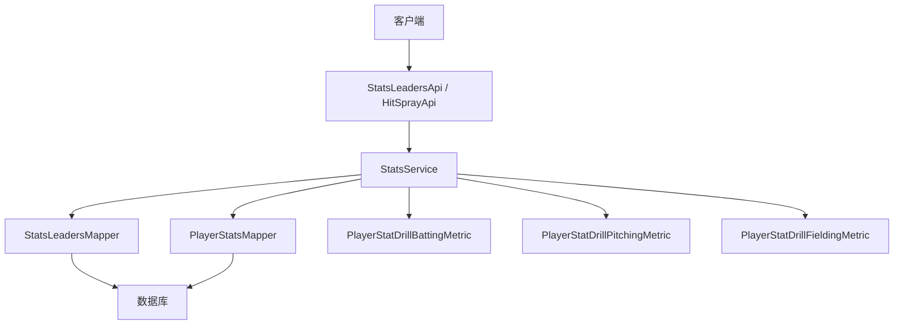
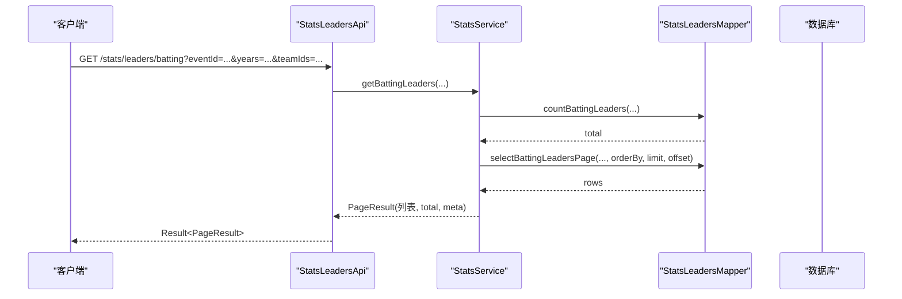
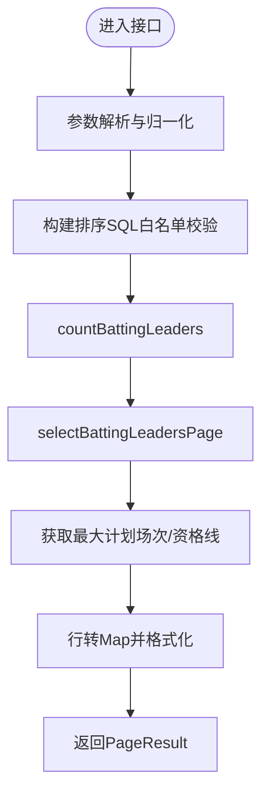
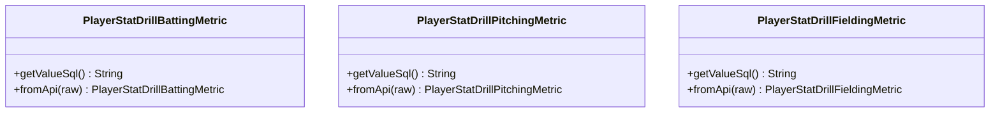
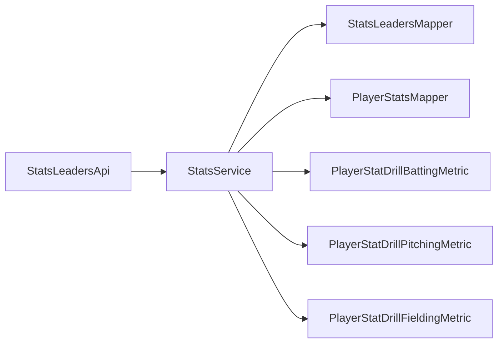

# 统计分析API

## 目录
1. [简介](#简介)
2. [项目结构](#项目结构)
3. [核心组件](#核心组件)
4. [架构总览](#架构总览)
5. [详细组件分析](#详细组件分析)
6. [依赖关系分析](#依赖关系分析)
7. [性能考虑](#性能考虑)
8. [故障排查指南](#故障排查指南)
9. [结论](#结论)
10. [附录](#附录)

## 简介
本文件面向“统计分析API”，覆盖击球排行榜、投球排行榜、防守数据统计、击球热区（Hit Spray）等统计接口。文档重点说明：
- 各统计指标的计算方法与数据聚合逻辑
- 查询条件与分页排序能力
- 多维度分析与数据钻取（按事件/赛季/位置/主客场/左右打者/左右投手/比赛模式等）
- 复杂统计查询的性能优化策略与缓存机制
- 统计数据的JSON结构定义与查询示例

## 项目结构
统计分析相关代码主要分布在以下层次：
- API层：对外暴露REST接口，负责参数解析与结果封装
- 服务层：业务编排、指标计算、排序与分页、元数据组装
- 数据访问层：MyBatis Mapper接口，对应SQL实现（XML未在本仓库中展示）
- 统计维度枚举：用于数据钻取的指标映射与SQL片段生成
- 配置与监控：缓存配置与缓存监控能力

## 核心组件
- StatsLeadersApi：提供排行榜、积分榜、明星榜单、团队统计等REST接口
- StatsService：实现统计口径、排序规则、分页、元数据（如资格线）与钻取指标
- StatsLeadersMapper / PlayerStatsMapper：数据访问抽象，承载具体SQL
- 钻取指标枚举：将API传入的指标名映射为SQL片段，支持安全可控的动态列
- 缓存与监控：Redis缓存配置与缓存监控能力

## 架构总览
统计类请求的典型调用链如下：

## 详细组件分析

### 击球排行榜接口
- 路径与方法：GET /stats/leaders/batting
- 关键参数
  - eventId/eventIds：单场或多场比赛ID
  - years：赛季年份集合
  - teamIds/teamId：队伍过滤
  - playerName：选手关键词
  - position：位置过滤
  - homeAway：主客场
  - batterHand/pitcherHand：左右打者/左右投手
  - gameMode：BASEBALL/SOFTBALL
  - page/pageSize：分页
  - sortProp/sortOrder：排序字段与方向
- 返回结构：Result<PageResult<Map<String,Object>>>，包含数据列表、总数与元信息（如资格线）
- 处理流程
  - 参数归一化（空值、大小写、范围限制）
  - 动态排序构建（白名单校验）
  - 计数与分页查询
  - 组装元数据（最大计划场次、资格线）
  - 行转Map并返回

### 投球排行榜接口
- 路径与方法：GET /stats/leaders/pitching
- 参数与返回结构与击球排行榜一致
- 特殊点
  - 支持ERA、WHIP等衍生指标的排序
  - 资格线与最大计划场次同样参与元数据

### 防守数据统计接口
- 路径与方法：GET /stats/leaders/fielding
- 支持防守基本项与捕手专项（PB、CS）
- 防守成功率TC_PCT由PO+A除以TC计算

### 团队统计接口
- 路径与方法
  - GET /stats/leaders/team-batting
  - GET /stats/leaders/team-pitching
  - GET /stats/leaders/team-fielding
- 支持按OPS/ERA/TC_PCT等默认指标排序，允许在白名单内自定义排序字段
- 返回结构与个人排行榜一致

### 积分榜接口
- 路径与方法：GET /stats/standings
- 逻辑要点
  - 基于赛事/年份/比赛模式筛选比赛
  - 聚合队伍胜负、得分、失分等形成排名
  - 内存中完成排序与分页

### 明星榜单接口
- 路径与方法：GET /stats/star/toplist
- 支持指定limit与includeMetrics，从内置指标集选择输出
- 内置指标涵盖ERA、AVG、W、H、SV、HR、HLD、RBI、SO、SB等

### 击球热区（Hit Spray）接口
- 路径与方法
  - POST /hit-spray：保存单条热区数据
  - POST /hit-spray/batch：批量保存
  - GET /hit-spray/game/{gameId}：按比赛查询
  - GET /hit-spray/player/{playerId}/game/{gameId}：按选手+比赛查询
  - GET /hit-spray/team/{teamId}/game/{gameId}：按队伍+比赛查询
- 用途：记录每次击球的落点坐标，用于可视化与分析

### 数据钻取与多维分析
- 钻取能力通过PlayerStatsMapper提供的分页接口实现，支持按事件/赛季/位置/主客场/左右打者/左右投手/比赛模式等多维切分
- 指标通过枚举映射为SQL片段，避免任意SQL注入风险
  - 击球：AVG/OBP/SLG/OPS/TB/SB%等
  - 投球：ERA/WHIP/PITCH_AB等
  - 防守：TC_PCT/捕手PB/CS等

## 依赖关系分析
- API层仅做参数解析与结果包装，不直接操作数据
- 服务层集中实现统计口径、排序与分页、元数据组装
- Mapper层屏蔽SQL细节，统一以参数化方式传递条件
- 钻取指标枚举确保动态列的安全性与可维护性

## 性能考虑
- 分页与限流
  - 页码最小为1，pageSize上限为500，防止过大分页导致DB压力
- 排序白名单
  - 所有排序字段均经过白名单校验，避免全表扫描或危险排序
- 动态列安全
  - 钻取指标通过枚举映射为固定SQL片段，杜绝任意SQL拼接
- 统计口径前置
  - 大量衍生指标（如ERA、WHIP、OPS、TC_PCT）在服务层或SQL层计算，减少应用层开销
- 缓存机制
  - 启用Spring Cache，支持Redis后端；默认TTL为10分钟，禁止缓存null值
  - 可通过缓存监控查看命中率、近似内存占用等指标
- 建议
  - 对热点排行榜（如赛季初）结合缓存预热
  - 对大分页场景限制最大pageSize，必要时采用游标式分页
  - 针对高频查询增加索引（如event_id、year、team_id、position、batter_hand、pitcher_hand、home_away、game_mode）

## 故障排查指南
- 排行榜为空
  - 检查eventId/eventIds/years/teamIds是否有效
  - 确认游戏模式gameMode是否为BASEBALL或SOFTBALL
  - 检查选手关键词、位置、主客场、左右打/投者过滤是否过严
- 排序异常
  - 确认sortProp在白名单内，否则将回退到默认排序
- 钻取指标无效
  - 使用枚举支持的别名（如sb%、tcpct、era、whip等），避免非法字段
- 缓存问题
  - 通过缓存监控查看缓存类型、命中率、近似内存占用
  - 若使用Redis，确认连接与TTL配置正确

## 结论
该统计分析API提供了完整的击球、投球、防守及团队统计能力，具备灵活的多维过滤、安全的动态列钻取、合理的分页与排序控制，以及可选的Redis缓存与监控能力。建议在数据量增长时配合索引优化与缓存预热，以获得更稳定的响应性能。

## 附录

### 接口清单与查询示例
- 击球排行榜
  - GET /stats/leaders/batting?eventId=123&years=2024&teamIds=10,11&page=1&pageSize=20&sortProp=avg&sortOrder=desc
- 投球排行榜
  - GET /stats/leaders/pitching?eventId=123&years=2024&teamIds=10&page=1&pageSize=20&sortProp=era&sortOrder=asc
- 防守排行榜
  - GET /stats/leaders/fielding?eventId=123&years=2024&teamIds=10&page=1&pageSize=20&sortProp=tcPct&sortOrder=desc
- 团队击球/投球/防守
  - GET /stats/leaders/team-batting?years=2024&gameMode=BASEBALL
  - GET /stats/leaders/team-pitching?years=2024&gameMode=BASEBALL
  - GET /stats/leaders/team-fielding?years=2024&gameMode=BASEBALL
- 积分榜
  - GET /stats/standings?eventId=123&years=2024&gameMode=BASEBALL
- 明星榜单
  - GET /stats/star/toplist?eventId=123&years=2024&limit=10&includeMetrics=era,avg,hr,rbi,so
- 击球热区
  - POST /hit-spray（提交HitSprayDTO）
  - POST /hit-spray/batch（提交数组）
  - GET /hit-spray/game/{gameId}
  - GET /hit-spray/player/{playerId}/game/{gameId}
  - GET /hit-spray/team/{teamId}/game/{gameId}

### JSON结构定义（摘要）
- 排行榜通用返回
  - Result<PageResult<Map<String,Object>>>
  - PageResult包含：data（List<Map>）、total（Long）、meta（Map，可能包含qualification等）
- 击球/投球/防守行字段
  - 击球：gp、pa、ab、r、h、rbi、hr、insideParkHr、sb、bbHp、so、doubles、triples、e、gdp、sh、sf、bb、ibb、hbp、cs、singles、tb、avg、obp、slg、ops、sbPct
  - 投球：gp、ip、er、pitchH、pitchBbHp、pitchSo、pitchHr、pitchInsideParkHr、gs、svo、cg、pg、w、l、sv、hld、pitchPa、pitchBf、np、pitchBb、pitchIbb、pitchHbp、wp、bk、pitchR、go、fo、whip、era、goFo、pitchAb
  - 防守：gp、inn、tc、po、a、e、pb、catcherCs、tcPct
- 团队统计行字段
  - 击球：teamId、teamName、gp、pa、ab、r、h、rbi、doubles、triples、hr、insideParkHr、sb、cs、so、bb、hbp、tb、avg、obp、slg、ops
  - 投球：teamId、teamName、gp、gs、w、l、sv、hld、ip、whip、era、pitchBf、np、pitchH、pitchHr、pitchInsideParkHr、pitchBb、pitchHbp、pitchSo、wp、bk、pitchR、er
  - 防守：teamId、teamName、gp、gs、inn、tc、po、a、e、dp、pb、catcherCs、tcPct

### 指标计算方法（摘要）
- 击球
  - AVG = H / AB（AB>0）
  - OBP = (H + BB/HBP/BBSF) / PA（PA>0）
  - SLG = TB / AB（AB>0）
  - OPS = OBP + SLG（AB>0且PA>0）
  - SB% = SB / (SB + CS) * 100（SB+CS>0）
- 投球
  - ERA = ER * 27 / IP_outs（IP_outs>0）
  - WHIP = (H + BB/HBP) / IP_outs（IP_outs>0）
  - GO/FO比率 = GO / FO（FO>0）
- 防守
  - TC_PCT = (PO + A) / TC * 100（TC>0）

---

> 本文整理自 Qoder RepoWiki（基于代码自动生成），仅供参考，以代码为准。
