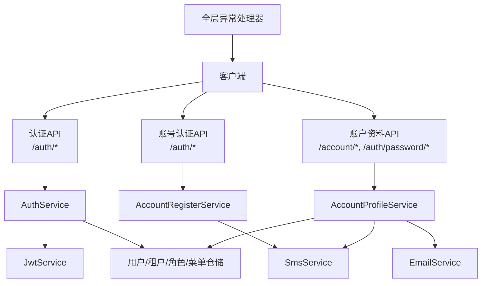
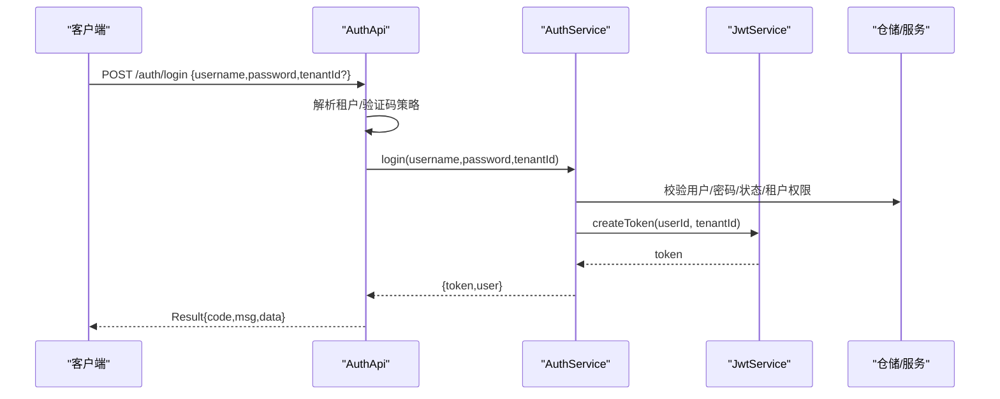
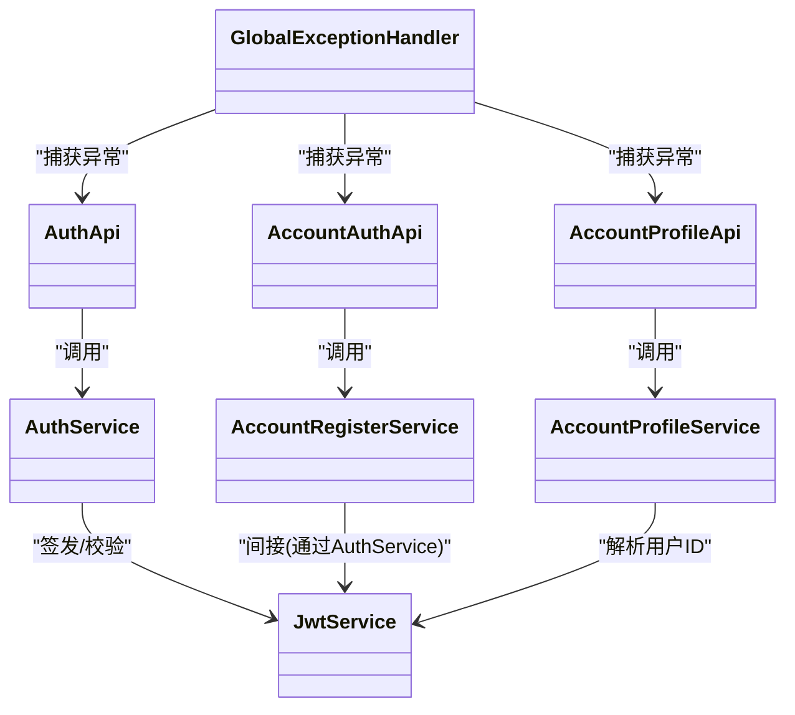

# 认证授权API

## 目录
1. [简介](#简介)
2. [项目结构](#项目结构)
3. [核心组件](#核心组件)
4. [架构总览](#架构总览)
5. [接口详细文档](#接口详细文档)
6. [依赖关系分析](#依赖关系分析)
7. [性能与安全考虑](#性能与安全考虑)
8. [故障排查指南](#故障排查指南)
9. [结论](#结论)
10. [附录：错误码与响应格式](#附录错误码与响应格式)

## 简介
本文件面向调用方，系统化说明认证授权相关API的HTTP方法、URL模式、请求参数、响应格式、JWT令牌机制（生成、验证、刷新）、账户管理接口（个人资料查询与修改、密码重置等），以及安全机制（验证码、防暴力破解）和错误处理方式。所有说明均基于代码实现进行归纳总结，便于前后端对接与集成。

## 项目结构
认证授权能力由以下层次组成：
- API层：暴露HTTP接口，负责参数解析、鉴权头处理、租户上下文解析、统一结果封装。
- 服务层：业务逻辑编排，包括登录注册、个人信息管理、短信/邮件验证码校验、权限与菜单计算等。
- 基础设施：JWT签发与校验、全局异常处理、配置项（JWT过期时间、是否开放自助注册等）。

## 核心组件
- 认证API（AuthApi）：提供登录、获取当前用户信息、验证码选项与图片、点击/拖拽验证码校验、切换租户、修改密码等。
- 账号认证API（AccountAuthApi）：提供法律条款获取、发送短信验证码、手机号注册、手机号验证码登录。
- 账户资料API（AccountProfileApi）：提供个人资料查询与更新、绑定邮箱、更换手机、忘记密码发码、重置密码。
- 认证服务（AuthService）：用户名/手机号+密码登录、无密登录、切换租户、获取当前用户信息、修改密码、构建用户权限与菜单信息。
- JWT服务（JwtService）：根据配置签发JWT、校验Bearer Token、提取用户ID与租户ID。
- 注册服务（AccountRegisterService）：注册流程（含短信验证码校验、默认角色分配）、手机号验证码登录。
- 资料服务（AccountProfileService）：个人资料读写、邮箱绑定、手机号变更、密码找回与重置。
- 统一响应（Result）：标准返回体结构，包含code/msg/detail/data/timestamp。
- 全局异常处理（GlobalExceptionHandler）：将业务异常与系统异常映射为HTTP状态码与统一响应。

## 架构总览
认证流程关键路径如下：
- 登录：客户端提交用户名/手机号与密码，服务端校验验证码策略、校验凭据、检查租户权限、签发JWT并返回用户信息。
- 获取当前用户：携带Authorization: Bearer <token>，服务端解析JWT得到userId与tenantId，返回用户信息。
- 切换租户：在已登录状态下，传入新租户ID，校验权限后重新签发JWT。
- 修改密码：在已登录状态下，校验旧密码并设置新密码。
- 注册/手机号登录：通过短信验证码完成注册或免密登录，成功后直接返回JWT。
- 密码找回：通过短信或邮箱通道发送验证码，再使用验证码重置密码。

## 接口详细文档

### 通用约定
- 基础路径
  - 认证相关：/auth
  - 账号认证（短信/注册）：/auth
  - 账户资料：/account 与 /auth/password
- 认证方式
  - 需要登录的接口通过请求头 Authorization: Bearer <jwt> 传递令牌。
- 租户上下文
  - 可通过请求体中的 tenantId 或 tenantCode，或请求头 X-Tenant-Code 指定目标租户；未指定时按默认策略解析。
- 统一响应体
  - code：业务状态码（如200成功，400/401/403/404/429等）
  - msg：提示信息
  - detail：可选的详细信息
  - data：业务数据
  - timestamp：响应时间戳

### 认证接口（/auth）

#### 1) 登录
- 方法：POST
- URL：/auth/login
- 请求体字段
  - username：用户名或手机号（支持手机号正则匹配）
  - password：密码
  - tenantId：可选，目标租户ID
  - tenantCode：可选，目标租户编码
  - 其他验证码相关字段：由验证码策略动态决定（见“验证码”章节）
- 响应data
  - token：JWT字符串
  - user：用户信息对象（包含id、username、nickname、roleIds、menuPaths、perms、tenantId、tenantCode、tenants、strictDataScope、superAdmin、tenantAdmin等）
- 行为要点
  - 登录前可能触发验证码校验；成功后消费验证码。
  - 记录登录日志（可配置）。
  - 非超级管理员需具备目标租户访问权限。

#### 2) 获取当前用户信息
- 方法：GET
- URL：/auth/me
- 请求头：Authorization: Bearer <jwt>
- 响应data
  - user：当前用户信息（同登录返回的用户信息）

#### 3) 验证码选项
- 方法：GET
- URL：/auth/captcha/options
- 查询参数
  - tenantId：可选
  - tenantCode：可选
  - 或通过请求头 X-Tenant-Code 指定
- 响应data
  - 返回当前租户下验证码启用策略与类型等信息（由验证码服务提供）

#### 4) 获取验证码图片
- 方法：GET
- URL：/auth/captcha/image
- 查询参数：同上（tenantId/tenantCode/X-Tenant-Code）
- 响应data
  - 返回验证码图片相关信息（如base64或图片地址，具体由验证码服务定义）

#### 5) 校验点击验证码
- 方法：POST
- URL：/auth/captcha/verify-click
- 请求体：包含验证码交互数据及租户标识（tenantId/tenantCode/X-Tenant-Code）
- 响应data：校验结果

#### 6) 校验拖拽验证码
- 方法：POST
- URL：/auth/captcha/verify-drag
- 请求体：包含验证码交互数据及租户标识
- 响应data：校验结果

#### 7) 切换租户
- 方法：POST
- URL：/auth/switch-tenant
- 请求头：Authorization: Bearer <jwt>
- 请求体
  - tenantId：必填，目标租户ID
- 响应data
  - token：新的JWT（对应新租户）
  - user：在新租户下的用户信息

#### 8) 修改密码
- 方法：PATCH
- URL：/auth/change-password
- 请求头：Authorization: Bearer <jwt>
- 请求体
  - oldPassword：旧密码
  - newPassword：新密码（至少6位）
- 响应data：空对象

### 账号认证接口（/auth）

#### 9) 获取法律条款
- 方法：GET
- URL：/auth/legal-docs
- 响应data
  - privacyPolicy：隐私政策条目（id/title/summary/type）
  - termsOfService：服务条款条目（id/title/summary/type）

#### 10) 发送短信验证码
- 方法：POST
- URL：/auth/sms/send
- 请求体
  - phone：手机号
  - scene：场景（如 register、login、reset_password、bind_email、bind_phone 等）
  - tenantId/tenantCode/X-Tenant-Code：可选，用于确定租户
- 行为
  - 可能触发验证码校验（防刷）
  - 发送验证码到指定手机号
- 响应data
  - sent：true

#### 11) 手机号注册
- 方法：POST
- URL：/auth/register
- 请求体
  - phone：手机号
  - smsCode：短信验证码
  - username：用户名（小写字母+数字，4-16位，不能纯数字）
  - password：密码（至少6位）
  - acceptTerms：是否同意服务条款
  - acceptPrivacy：是否同意隐私政策
  - tenantId/tenantCode/X-Tenant-Code：可选
- 行为
  - 校验验证码、用户名唯一性、手机号唯一性
  - 自动分配默认角色并加入租户
  - 注册成功后直接返回登录态（token + user）
- 响应data
  - token：JWT
  - user：用户信息

#### 12) 手机号验证码登录
- 方法：POST
- URL：/auth/login-by-phone
- 请求体
  - phone：手机号
  - smsCode：短信验证码
  - tenantId/tenantCode/X-Tenant-Code：可选
- 响应data
  - token：JWT
  - user：用户信息

### 账户管理接口（/account 与 /auth/password）

#### 13) 获取个人资料
- 方法：GET
- URL：/account/profile
- 请求头：Authorization: Bearer <jwt>
- 响应data
  - id、username、nickname、realName、avatar、email、emailVerified、phone、phoneVerified、gender、birthDate

#### 14) 更新个人资料
- 方法：PUT
- URL：/account/profile
- 请求头：Authorization: Bearer <jwt>
- 请求体（可选字段）
  - nickname：昵称（非空，不超过30字）
  - realName：真实姓名（不超过20字）
  - birthDate：出生日期
  - gender：性别（0/1/2）
- 响应data：更新后的个人资料

#### 15) 发送邮箱验证码
- 方法：POST
- URL：/account/email/send-code
- 请求头：Authorization: Bearer <jwt>
- 请求体
  - email：邮箱地址
- 行为：发送绑定邮箱验证码
- 响应data：sent=true

#### 16) 绑定邮箱
- 方法：POST
- URL：/account/email/bind
- 请求头：Authorization: Bearer <jwt>
- 请求体
  - email：邮箱地址
  - code：邮箱验证码
- 响应data：更新后的个人资料

#### 17) 更换手机号
- 方法：POST
- URL：/account/phone/change
- 请求头：Authorization: Bearer <jwt>
- 请求体
  - phone：新手机号
  - smsCode：短信验证码
- 响应data：更新后的个人资料

#### 18) 忘记密码发送验证码
- 方法：POST
- URL：/auth/password/forgot
- 请求体
  - channel：channel=phone 或 channel=email
  - account：手机号或邮箱
- 行为：校验渠道与账号存在性，发送验证码
- 响应data：sent=true

#### 19) 重置密码
- 方法：POST
- URL：/auth/password/reset
- 请求体
  - channel：channel=phone 或 channel=email
  - account：手机号或邮箱
  - code：验证码
  - newPassword：新密码（至少6位）
- 行为：校验验证码并重置密码
- 响应data：reset=true

## 依赖关系分析
- API层依赖服务层进行业务编排，服务层依赖仓储与外部服务（短信、邮件）。
- JWT服务独立于业务，提供统一的令牌签发与校验。
- 全局异常处理器集中处理业务异常与系统异常，保证响应一致性。

## 性能与安全考虑

### JWT令牌机制
- 签发
  - 使用HS256签名，密钥长度至少32字节，过期时间可配置（默认7天）。
  - 载荷包含用户ID与租户ID，支持可选issuer与audience。
- 校验
  - 通过Authorization: Bearer <token> 传入，服务端解析出userId与tenantId。
  - 过期或签名错误会返回明确的错误提示。
- 刷新
  - 当前实现未提供独立的“刷新令牌”接口。通常做法是：前端在令牌即将过期时引导用户重新登录或使用切换租户接口重新签发新令牌。

### 验证码与防暴力破解
- 验证码策略
  - 登录前可获取验证码选项与图片；支持点击与拖拽两种校验方式。
  - 登录成功后会消费验证码，避免重复使用。
- 防刷措施
  - 发送短信验证码前可能触发验证码校验。
  - 全局异常处理中包含429（Too Many Requests）状态码映射，表明系统具备限流能力（结合RateLimitFilter等组件）。
- 建议
  - 对敏感操作（登录、注册、改密）开启验证码。
  - 合理配置短信/邮箱验证码频率限制。

### 密码安全
- 密码存储采用加密存储，支持从明文到加密的平滑迁移。
- 修改密码与重置密码均要求新密码至少6位。

## 故障排查指南
- 常见错误
  - 401 未授权：令牌缺失、过期或无效；请先登录或刷新令牌。
  - 403 禁止访问：账号禁用、无租户权限、无权切换租户。
  - 400 参数错误：用户名/密码/手机号/邮箱格式不合法或不符合规则。
  - 404 资源不存在：用户不存在或渠道无效。
  - 429 请求过多：触发限流或验证码风控，请稍后再试。
- 定位步骤
  - 检查请求头Authorization是否正确携带Bearer令牌。
  - 检查租户上下文是否通过tenantId/tenantCode/X-Tenant-Code正确传递。
  - 查看响应体中的code/msg/detail以快速定位问题。
  - 若涉及验证码，先调用验证码选项接口确认策略，再按流程获取并校验验证码。

## 结论
本认证授权体系通过清晰的API分层、统一的响应格式、完善的JWT机制与验证码防护，提供了健壮的登录注册、账户管理与密码找回能力。调用方应遵循租户上下文与认证头规范，合理使用验证码与限流策略，确保安全性与稳定性。

## 附录：错误码与响应格式

### 统一响应体结构
- code：业务状态码
- msg：提示信息
- detail：可选详情
- data：业务数据
- timestamp：响应时间戳

### 常用错误码
- 200：成功
- 400：参数错误
- 401：未授权（令牌无效/过期）
- 403：禁止访问（账号禁用/无权限）
- 404：资源不存在
- 429：请求过多（限流/风控）

---

> 本文整理自 Qoder RepoWiki（基于代码自动生成），仅供参考，以代码为准。
