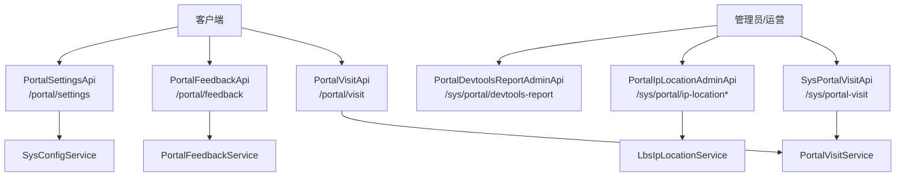
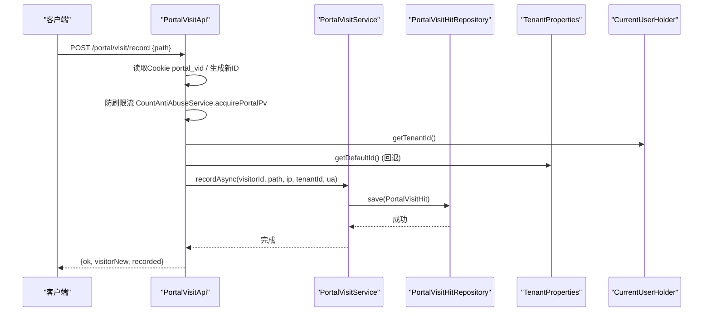
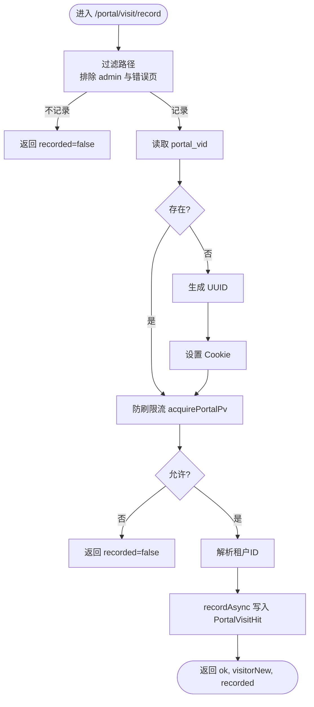
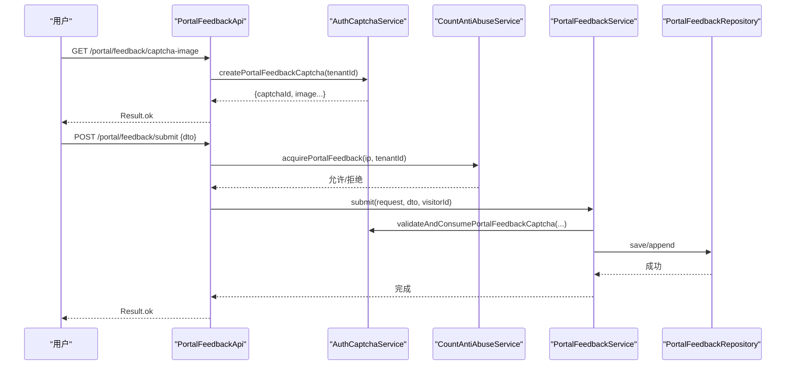
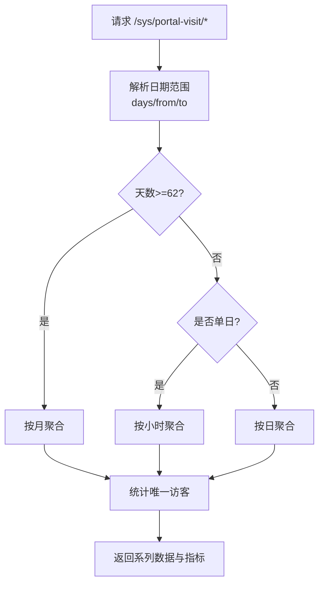
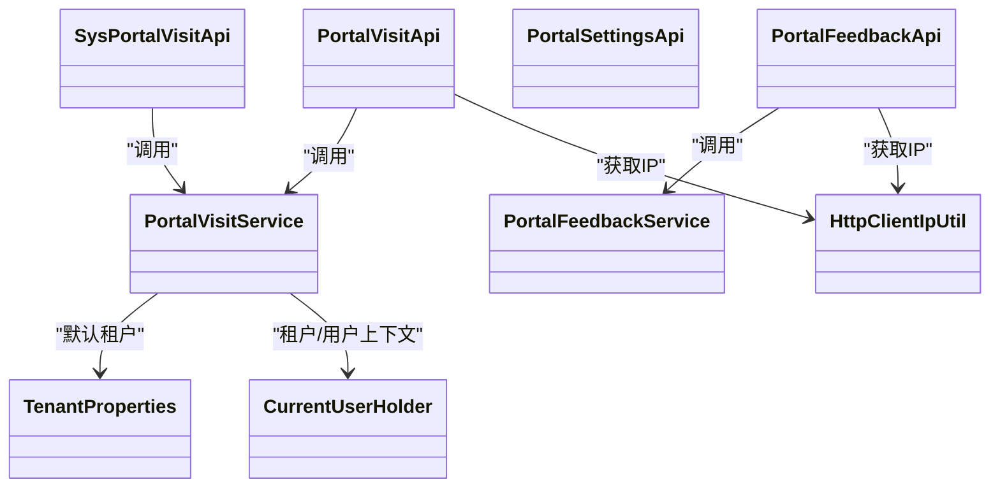

# 门户系统API

## 目录
1. [简介](#简介)
2. [项目结构](#项目结构)
3. [核心组件](#核心组件)
4. [架构总览](#架构总览)
5. [详细组件分析](#详细组件分析)
6. [依赖关系分析](#依赖关系分析)
7. [性能考虑](#性能考虑)
8. [故障排查指南](#故障排查指南)
9. [结论](#结论)
10. [附录](#附录)

## 简介
本文件面向门户系统的访客访问追踪、反馈收集、门户设置与租户配置等接口，提供完整的API说明、数据模型、处理流程、多租户隔离机制与权限控制要点。文档覆盖：
- 访客行为分析与访问统计（PV/UV、按小时/日/月聚合、按省份/城市）
- IP地理位置解析与预热
- 门户内容管理与前端可见配置
- 多租户门户的隔离机制与数据权限控制

## 项目结构
- API层：以 /portal 开头的对外接口（访客侧），/sys 开头的管理接口（运营/管理员侧）
- 服务层：PortalVisitService、PortalFeedbackService 等封装业务逻辑
- 实体与DTO：PortalVisitHit、PortalFeedback、PortalFeedbackSubmitDto 等
- 配置与工具：TenantProperties、PortalPublicConfigKeys、HttpClientIpUtil、CurrentUserHolder

## 核心组件
- 访客访问记录：通过 Cookie portal_vid 识别访客，异步写入访问日志，支持防刷限流
- 反馈提交：验证码校验、反垃圾限流、联系人校验、追加补充与运营回复
- 门户设置：读取公开配置键集合，合并页脚版权信息，暴露开关项
- 租户检查：根据 code 查询租户是否存在并返回基本信息
- 访问统计：按天/小时/月聚合，按省份/城市维度汇总，支持日期范围与租户范围
- IP定位：单条与批量查询，客户端IP预热

## 架构总览
门户API采用分层设计：
- 控制器层负责参数校验、上下文获取、调用服务
- 服务层实现业务规则、聚合计算、权限与租户范围控制
- 仓储层负责持久化与复杂查询
- 工具与配置支撑IP提取、租户默认值、公开配置键白名单

## 详细组件分析

### 访客访问追踪接口
- 端点：POST /portal/visit/record
- 功能：记录页面访问，生成或复用访客ID（Cookie portal_vid），异步落库，防刷限制
- 关键逻辑：
  - 路径过滤：排除 /admin/login 及包含 /admin 的路径；忽略 /404、/service-unavailable
  - 访客标识：无Cookie则生成UUID，设置HttpOnly与SameSite=Lax
  - 租户范围：优先使用当前租户ID，否则回退到默认租户
  - 异步写入：recordAsync 保存 PortalVisitHit（截断path/ua/ip）
- 响应字段：ok、visitorNew、recorded

### 反馈收集接口
- 端点：
  - GET /portal/feedback/captcha-image：获取验证码图片
  - POST /portal/feedback/submit：提交反馈或追加补充
  - GET /portal/feedback/my-list：查看我的反馈列表
- 功能：
  - 验证码：基于租户与IP的频控，创建验证码
  - 提交：类型校验、内容长度限制、联系人格式校验、验证码消费、用户追加次数限制
  - 列表：登录用户按userId+tenantId查询；未登录用户按visitorId+tenantId查询
- 数据结构：PortalFeedbackSubmitDto（含验证码、联系方式、版本、页面路径等）

### 门户设置接口
- 端点：GET /portal/settings
- 功能：
  - 读取公开配置键集合（PortalPublicConfigKeys.ALL）
  - 合并页脚HTML（footerTextPortal + copyrightPortal）
  - 输出布尔开关（publicViewCount、portalDevtoolsGuard 及其子项）
- 租户范围：基于有效租户ID读取配置

### 租户配置接口
- 端点：GET /portal/tenant/check?code=xxx
- 功能：根据code查询租户是否存在且激活，返回id与name

### 访问统计接口
- 端点：
  - GET /sys/portal-visit/summary：总体统计（按天/小时/月）
  - GET /sys/portal-visit/by-province：按省份统计
  - GET /sys/portal-visit/by-province/cities：按省份下的城市统计
- 功能：
  - 日期范围解析与上限保护（最大366天）
  - 超长时间段按月聚合，单日按小时聚合
  - 唯一访客数统计
  - 管理员可跨租户查询（超级管理员）

### IP地理位置解析与预热
- 管理接口：
  - GET /sys/portal/ip-location?ip=xxx：单条定位
  - POST /sys/portal/ip-location/batch：批量定位
- 预热接口：
  - POST /portal/ip-location/warm：从客户端IP触发异步预热

### 开发者工具报告（管理）
- 端点：GET /sys/portal/devtools-report/list
- 功能：分页查询开发者工具上报记录，支持关键词、IP、地区过滤

## 依赖关系分析
- 控制器依赖服务：PortalVisitApi -> PortalVisitService；PortalFeedbackApi -> PortalFeedbackService；SysPortalVisitApi -> PortalVisitService
- 服务依赖仓储与工具：PortalVisitService -> PortalVisitHitRepository、IpLocationCacheService；PortalFeedbackService -> PortalFeedbackRepository、SysUserRepository
- 租户与权限：CurrentUserHolder 提供当前用户与租户上下文；TenantProperties 提供默认租户与严格数据域策略
- IP工具：HttpClientIpUtil 统一提取与截断客户端IP

## 性能考虑
- 异步写入：访问记录使用 @Async 异步落库，降低请求延迟
- 数据截断：path、userAgent、ip 等字段进行长度截断，避免过大负载
- 聚合优化：超过62天的统计按月聚合，单日按小时聚合，减少大数据量扫描
- 缓存与预热：IP地理位置支持批量查询与客户端预热，提升热点IP解析效率
- 防刷限流：访问与反馈均有限流保护，防止滥用

[本节为通用指导，无需特定文件引用]

## 故障排查指南
- 访问未记录：
  - 检查路径是否被过滤（/admin 或错误页）
  - 确认防刷限流是否拒绝
  - 确认Cookie portal_vid 是否正确设置与携带
- 反馈提交失败：
  - 验证码是否过期或被消费
  - 联系人格式是否符合校验规则
  - 内容长度与保留标记是否合规
- 统计异常：
  - 检查日期范围是否越界（最大366天）
  - 确认租户范围是否正确（超级管理员可跨租户）
- IP定位问题：
  - 确认X-Forwarded-For是否可信
  - 批量接口是否传入合法IP列表

## 结论
门户系统API围绕访客追踪、反馈收集、门户设置与租户配置构建了完整能力。通过异步写入、聚合优化、防刷限流与IP预热等手段保障性能与稳定性；借助租户上下文与权限服务实现多租户数据隔离与访问控制。建议在生产环境结合监控与告警，持续优化限流阈值与聚合粒度。

[本节为总结性内容，无需特定文件引用]

## 附录

### 访客数据结构（访问日志）
- 表名：portal_visit_hit
- 字段说明：
  - id：主键
  - tenant_id：租户ID
  - hit_date：统计日（服务器时区）
  - visitor_id：访客匿名ID（Cookie）
  - path：前端路由路径（不含query/hash；超长截断）
  - user_agent：客户端UA
  - ip：客户端IP（脱敏/截断）
  - ip_region：附加字段（非持久化，用于展示）
  - created_at：记录时间

### 反馈数据结构
- 表名：portal_feedback
- 关键字段：
  - tenant_id、user_id、visitor_id
  - feedback_type、title、content
  - contact_type、contact_value
  - user_agent、client_version、server_version
  - client_ip、page_path
  - status（pending/replied/closed）、pending_append_count
  - replied_by、replied_at、reply_content
  - created_at

### 反馈提交DTO
- 字段：feedbackType、feedbackId、title、content、contactType、contactValue、captchaId、captchaCode、captchaVerifyToken、clientVersion、pagePath

### 多租户隔离与数据权限
- 租户上下文：CurrentUserHolder 提供当前用户与租户ID
- 默认租户：TenantProperties.defaultId 作为回退
- 权限控制：
  - 访客统计：非超级管理员仅能查看当前租户数据
  - 反馈管理：管理员可按租户过滤；超级管理员可全局查询
- 数据域策略：可通过 strictDataScope 控制严格数据域

---

> 本文整理自 Qoder RepoWiki（基于代码自动生成），仅供参考，以代码为准。
