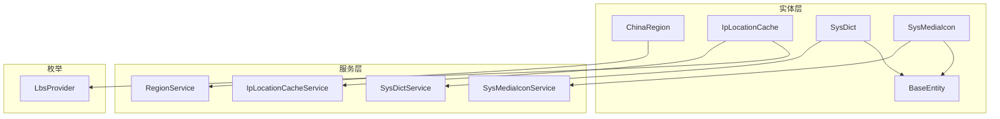
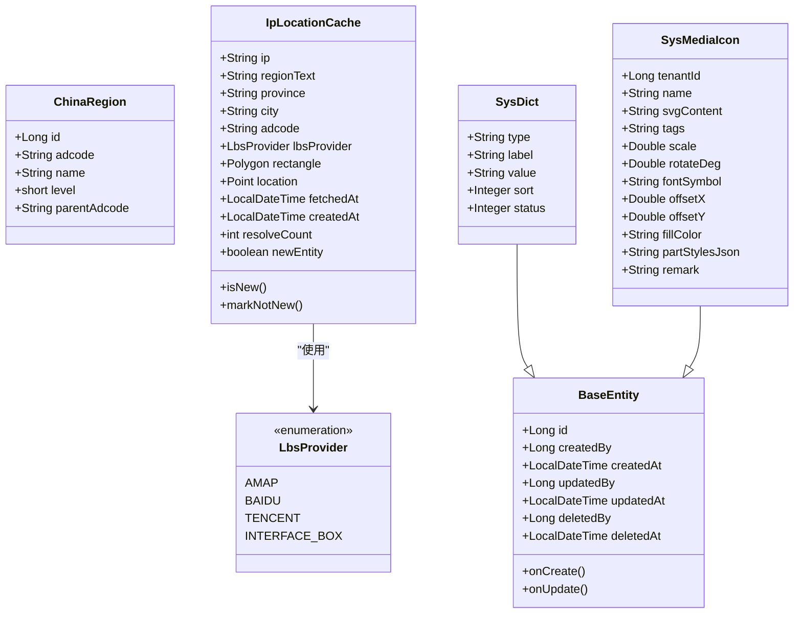
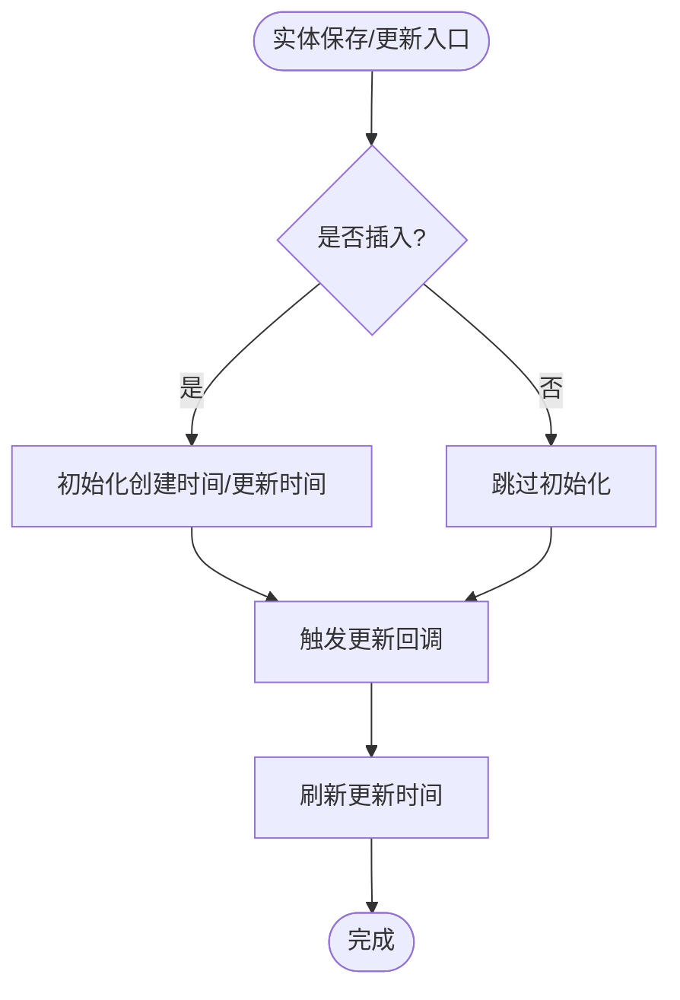
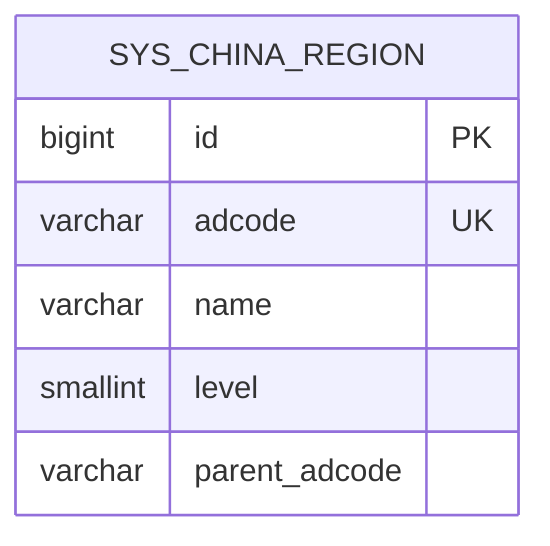
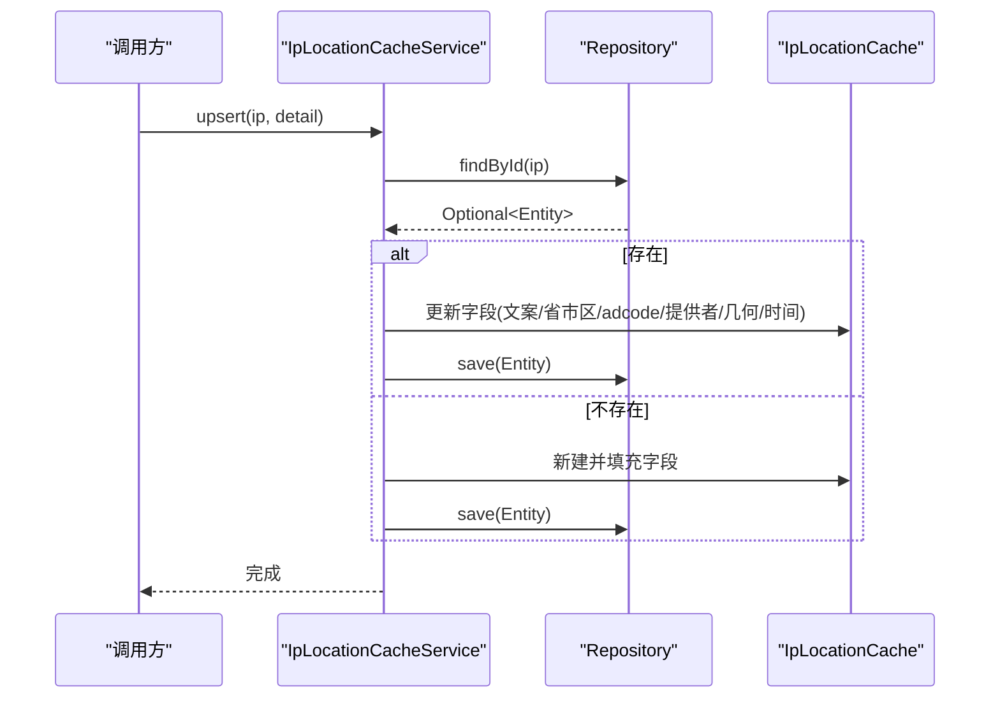
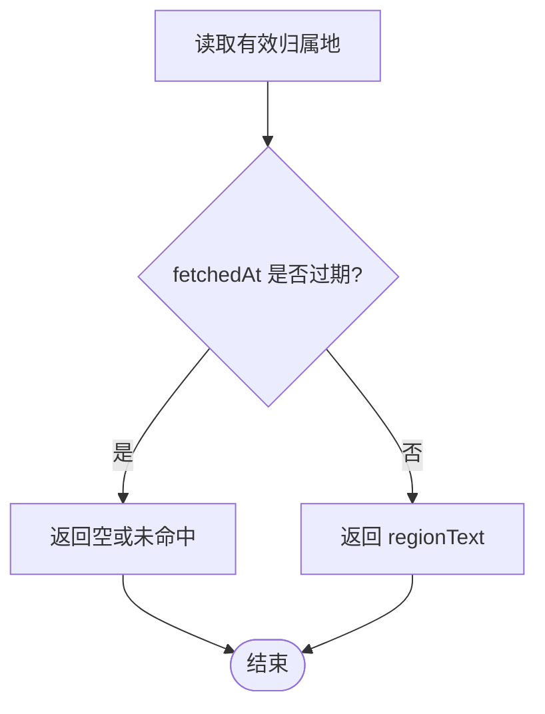
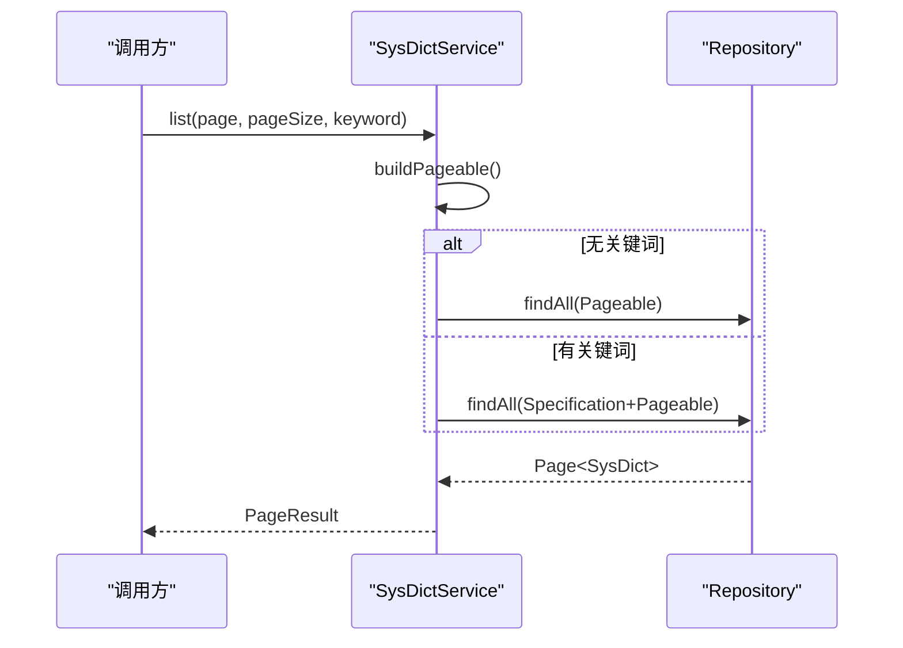
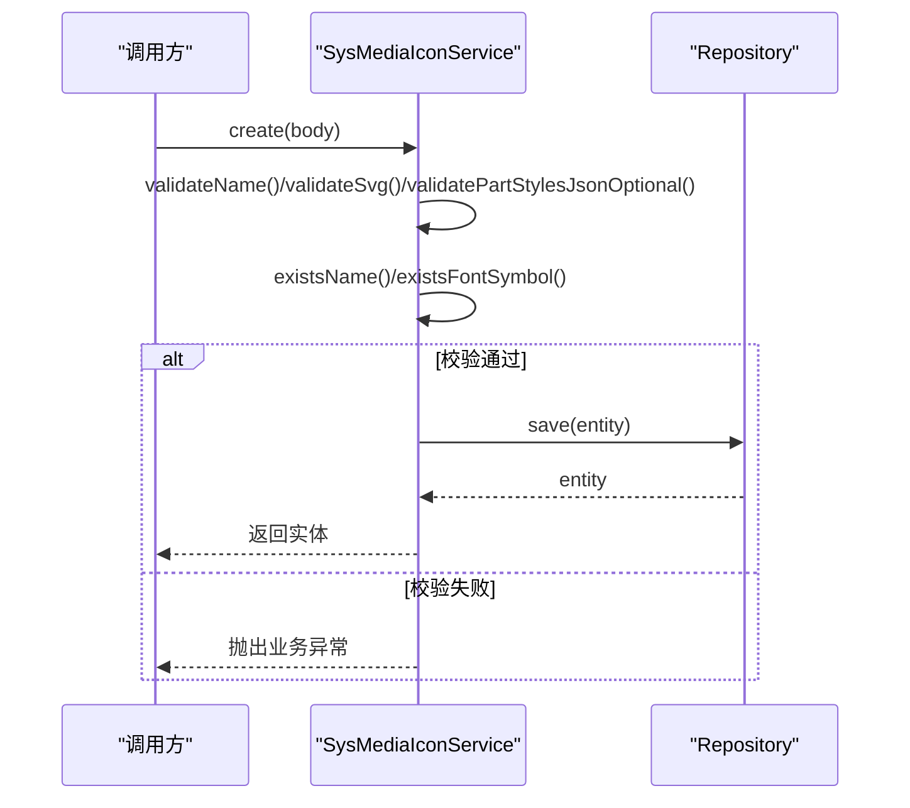
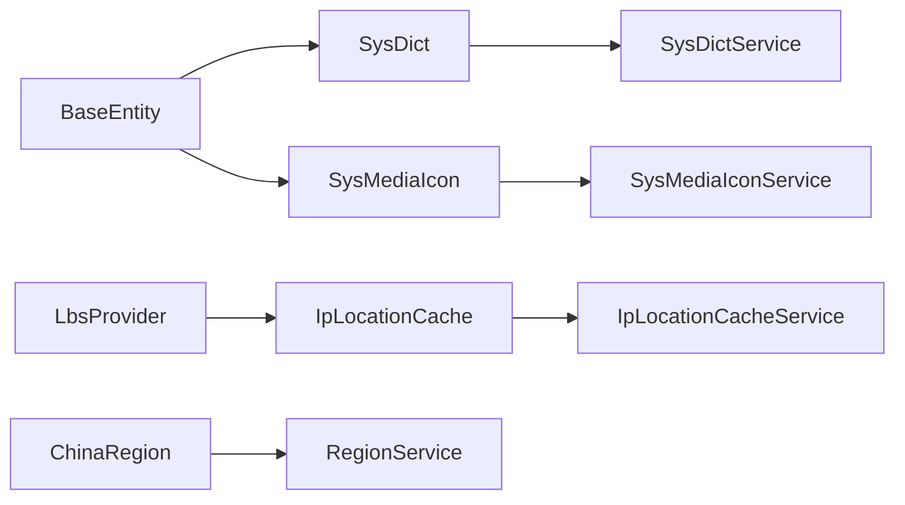

# 支撑实体

## 目录
1. [简介](#简介)
2. [项目结构](#项目结构)
3. [核心组件](#核心组件)
4. [架构总览](#架构总览)
5. [详细组件分析](#详细组件分析)
6. [依赖关系分析](#依赖关系分析)
7. [性能考量](#性能考量)
8. [故障排查指南](#故障排查指南)
9. [结论](#结论)
10. [附录](#附录)

## 简介
本文件聚焦于系统中的“支撑实体”数据模型，围绕基础实体 BaseEntity、中国地区 ChinaRegion、IP 位置缓存 IpLocationCache、字典 SysDict、媒体图标 SysMediaIcon 等关键实体进行系统化说明。重点阐述：
- BaseEntity 提供的通用字段与审计机制（创建时间、更新时间、状态等）的设计模式
- 地区数据、字典数据、缓存数据的结构化管理方式
- 数据字典的动态配置能力
- 媒体资源的分类管理与可视化参数控制
- 地理位置信息的缓存策略与时效性管理
- 支撑实体的扩展机制与自定义数据类型实现方案

## 项目结构
支撑实体位于 model/entity 包下，配套服务在 service 包中提供查询、写入、校验与权限控制等能力；枚举 LbsProvider 用于标识不同地理信息服务提供商。整体采用 JPA 实体 + Repository + Service 的分层组织方式，便于统一维护与扩展。

## 核心组件
- BaseEntity：所有业务实体的公共基类，提供主键、审计字段与生命周期回调，确保统一的元数据记录。
- ChinaRegion：中国行政区划基础数据，支持层级化树形结构与上级关联。
- IpLocationCache：IP 归属地解析结果缓存，包含展示文案、省市区、行政区代码、坐标几何、来源与时效信息。
- SysDict：系统字典项，支持类型、标签、值、排序与状态，配合服务实现动态配置。
- SysMediaIcon：SVG 图标库实体，支持租户隔离、名称唯一性、标签分类、缩放旋转、偏移、填充色与分段样式 JSON。

## 架构总览
下图展示了支撑实体与服务层的交互关系，以及关键的数据流向与约束。

## 详细组件分析

### 基础实体 BaseEntity：通用字段与审计设计
- 主键与自增：id 作为主键并采用自增策略。
- 审计字段：
  - 创建人/创建时间：通过注解自动填充，并在持久化前初始化默认时间。
  - 更新人/更新时间：每次更新时自动刷新更新时间。
  - 删除人/删除时间：用于软删除场景的审计追踪。
- 生命周期回调：
  - 插入前：若未设置则初始化创建时间与更新时间。
  - 更新前：刷新更新时间。
- 设计要点：
  - 将通用元数据下沉到基类，减少重复定义，保证一致性。
  - 结合框架的审计监听器，避免业务代码侵入式处理时间戳。

### 中国地区 ChinaRegion：层级化地区数据
- 字段说明：
  - adcode：行政区划代码，唯一且长度受限，适配省市区多级编码。
  - name：地区名称。
  - level：层级（省/市/区县），使用 short 类型以兼容数据库 smallint。
  - parentAdcode：上级行政区代码，形成树状结构。
- 数据结构特点：
  - 通过 adcode 与 parentAdcode 建立父子关系，支持按层级或父级查询。
  - 适合构建下拉选择、地图联动等场景。

### IP 位置缓存 IpLocationCache：地理位置信息与时效策略
- 字段说明：
  - ip：主键，用于定位缓存条目。
  - regionText：归属地展示文案。
  - province/city/adcode：省市区及行政区代码。
  - lbsProvider：数据来源（高德、百度、腾讯、接口盒）。
  - rectangle/location：几何区域与近似点（GCJ-02 坐标系）。
  - fetchedAt/createdAt：最近解析成功时间与首次写入时间。
  - resolveCount：管理端“重新解析”累计次数。
  - newEntity：内存标记，用于判断新实体。
- 缓存策略：
  - 读取时根据 fetchedAt 与过期天数判断是否失效。
  - 写入时更新展示文案、省市区、adcode、提供者、几何信息，并维护时间戳与计数。
  - 批量写入时去重并合并已有记录，提升吞吐。

### 字典 SysDict：动态配置与排序状态
- 字段说明：
  - type：字典类型，用于分组。
  - label/value：显示文本与存储值。
  - sort：排序权重。
  - status：启用/禁用状态。
- 服务能力：
  - 分页列表与关键词模糊搜索（type/label/value）。
  - 创建/更新/删除，更新时保留原始创建时间。
  - 默认排序：按 type、sort、id 升序，保证稳定输出。

### 媒体图标 SysMediaIcon：分类管理与可视化参数
- 字段说明：
  - tenantId：租户隔离。
  - name：唯一名称（正则校验）。
  - svgContent：SVG 源码（必须包含 <svg>）。
  - tags：逗号分隔标签，支持分类检索。
  - scale/rotateDeg：缩放与旋转角度。
  - fontSymbol：Font Class/类名（租户内唯一）。
  - offsetX/offsetY：平移偏移。
  - fillColor：默认填充色。
  - partStylesJson：分段样式 JSON 数组，每项含 index 等属性。
  - remark：备注。
- 服务能力：
  - 列表分页与多条件筛选（名称/类名/标签/备注）。
  - 创建/更新/删除（软删除，记录删除人与时间）。
  - 上传 SVG 文件并自动提取名称与内容。
  - 严格校验：名称格式、字体类名格式、SVG 有效性、分段样式 JSON 结构。
  - 权限控制：非超级管理员需匹配当前租户。

## 依赖关系分析
- 实体间依赖：
  - SysDict 与 SysMediaIcon 继承 BaseEntity，复用审计字段。
  - IpLocationCache 依赖 LbsProvider 枚举，标识数据来源。
- 服务与实体：
  - RegionService 操作 ChinaRegion，提供层级查询。
  - SysDictService 对 SysDict 提供 CRUD 与分页搜索。
  - IpLocationCacheService 对 IpLocationCache 提供读写、批处理与时效判断。
  - SysMediaIconService 对 SysMediaIcon 提供强校验、租户隔离与权限控制。

## 性能考量
- 字典查询：
  - 使用 Specification 组合条件，避免全表扫描；分页与排序优化输出稳定性。
- IP 位置缓存：
  - 基于 fetchedAt 的时效判断减少外部调用；批量 upsert 降低写放大。
  - 列表查询支持多字段排序与关键字模糊匹配，注意索引设计。
- 媒体图标：
  - 名称与字体类名的唯一性检查在服务层提前拦截，减少无效写入。
  - 标签过滤与租户隔离提升查询效率与安全性。

[本节为通用指导，不直接分析具体文件]

## 故障排查指南
- 字典相关：
  - 关键词搜索为空时退化为全量分页；确认排序字段与页码参数是否正确。
  - 更新时保留原创建时间，避免误覆盖。
- IP 位置缓存：
  - 读取时若 fetchedAt 为空或已过期，视为未命中；检查传入 staleDays 参数。
  - 写入时确保 detail 不为空，否则不会生成有效行。
- 媒体图标：
  - 名称/字体类名格式校验失败会抛出业务异常；确认输入符合正则要求。
  - SVG 必须包含 <svg> 标签；上传文件后缀需为 .svg。
  - 分段样式 JSON 必须为数组且每项包含数字 index；非法 JSON 将报错。
  - 非超级管理员访问受租户限制；确认当前租户上下文。

## 结论
本项目通过 BaseEntity 统一审计、ChinaRegion 层级化地区数据、IpLocationCache 带时效的地理位置缓存、SysDict 动态字典与 SysMediaIcon 可配置的媒体资源，构建了完善的支撑体系。各实体职责清晰、服务层具备强校验与权限控制，既保证了数据一致性与可追溯性，也提供了良好的扩展性与可维护性。

[本节为总结性内容，不直接分析具体文件]

## 附录
- 扩展机制建议：
  - 新增支撑实体时继承 BaseEntity，复用审计字段。
  - 对于需要租户隔离的实体，增加 tenantId 并在服务层做权限校验。
  - 对于复杂字段（如 JSON、几何），在服务层进行结构化校验与转换。
- 自定义数据类型实现方案：
  - 使用枚举（如 LbsProvider）表达有限取值集合。
  - 使用 JPA 类型映射（如 JdbcTypeCode）存储几何对象。
  - 使用字符串字段存储结构化数据（如 partStylesJson），在服务层解析与校验。

[本节为通用指导，不直接分析具体文件]

---

> 本文整理自 Qoder RepoWiki（基于代码自动生成），仅供参考，以代码为准。
