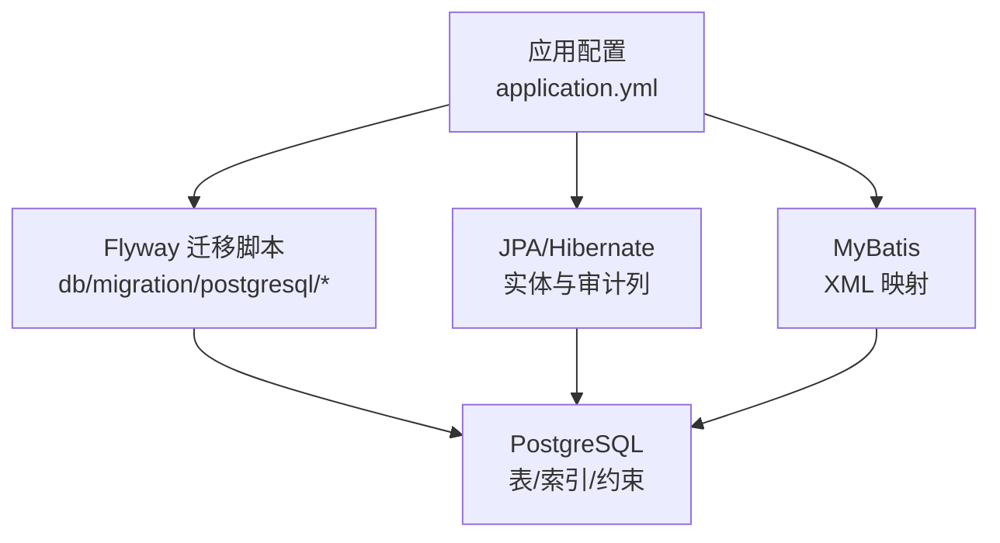
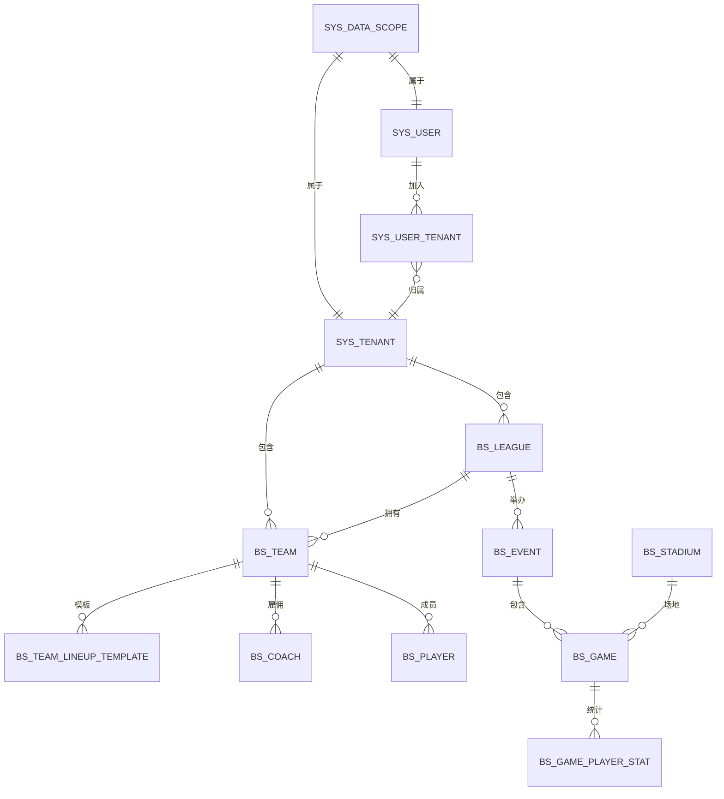
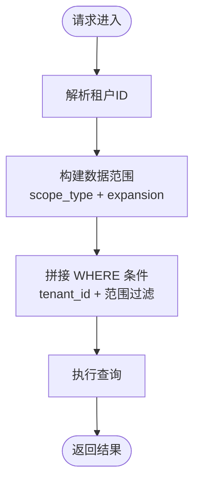
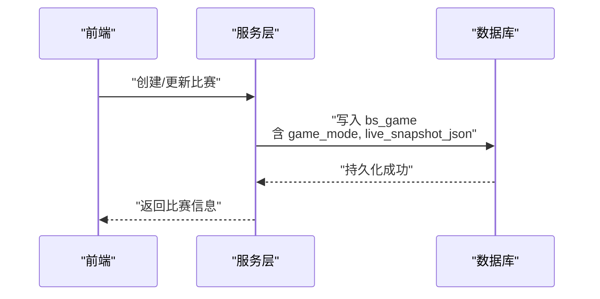
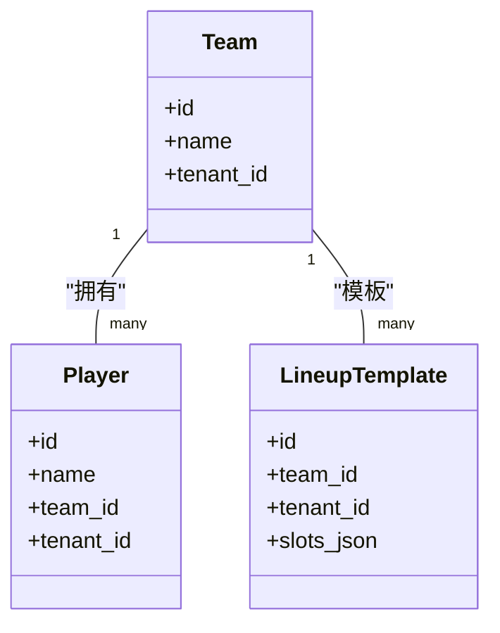
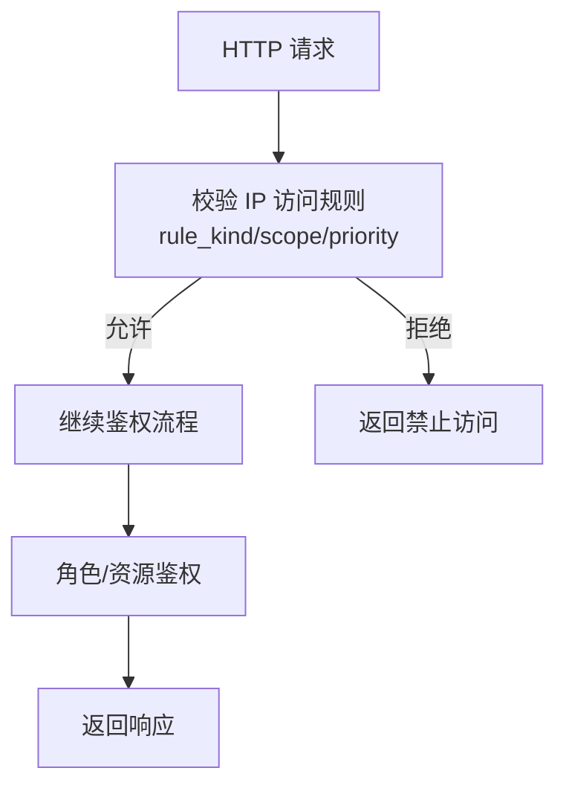
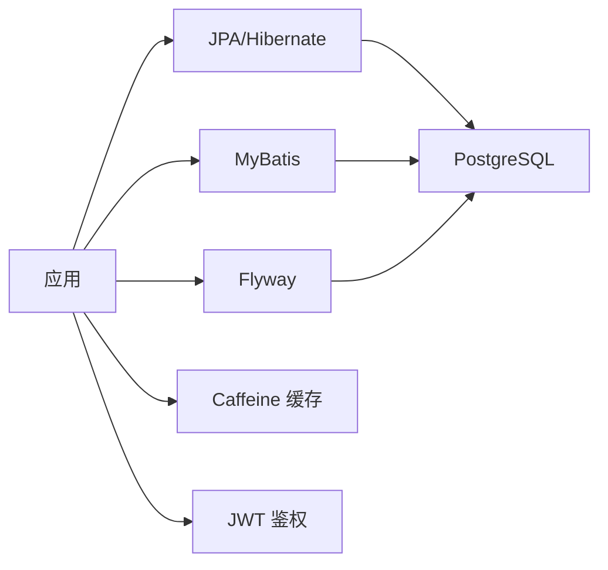

# 数据模型设计

## 目录
1. [简介](#简介)
2. [项目结构](#项目结构)
3. [核心组件](#核心组件)
4. [架构总览](#架构总览)
5. [详细组件分析](#详细组件分析)
6. [依赖关系分析](#依赖关系分析)
7. [性能考虑](#性能考虑)
8. [故障排查指南](#故障排查指南)
9. [结论](#结论)
10. [附录](#附录)

## 简介
本文件面向“棒垒球比赛数据管理系统”的数据模型设计，聚焦核心实体（Game、Team、Player、SysUser 等）的关系与字段定义，说明数据库表结构、主外键、索引与约束，解释数据验证规则与业务规则在数据层的实现方式，并给出 Flyway 迁移版本管理、数据访问模式、查询优化策略、性能考量以及数据生命周期管理（备份恢复与归档）建议。

## 项目结构
- 后端采用 Spring Boot + JPA/MyBatis + PostgreSQL，使用 Flyway 进行数据库版本化迁移。
- 应用配置集中在 application.yml，默认关闭内置 Flyway，由自定义配置在 Hibernate 建表后执行迁移，避免建表顺序问题。
- 多租户能力通过 sys_tenant、sys_user_tenant、sys_data_scope 及在各业务表中引入 tenant_id 实现。
- 统计类 SQL 通过 MyBatis XML 映射，JPA 负责领域对象持久化。

## 核心组件
- 核心业务实体：Game（比赛）、Team（球队）、Player（球员）、Event（赛事）、Stadium（球场）、Coach（教练）、PersonnelChange（人员变动）、GamePlayerStat（比赛球员统计）。
- 系统与管理实体：SysUser（系统用户）、SysTenant（租户）、SysUserRole/SysRole（角色与权限）、SysConfig（系统配置）、SysDictType/SysDictData（字典）、PortalVisitHit（门户访问打点）、IpAccessRule（IP 访问规则）。
- 扩展能力：多租户隔离（tenant_id）、数据范围（scope_type/expansion）、实时录入快照（live_snapshot_json）、先发阵容模板（team_lineup_template）、特殊比赛标记（is_special_result 等）、比赛模式（BASEBALL/SOFTBALL）。

## 架构总览
下图展示了核心实体之间的主要关系与多租户边界。所有业务表均通过 tenant_id 实现租户隔离；部分表通过 scope_type/expansion 控制数据可见范围。

## 详细组件分析

### 多租户与数据范围
- 租户表 sys_tenant 提供租户标识与状态，code 唯一。
- 用户-租户成员关系 sys_user_tenant 限制用户可访问的租户集合。
- 数据范围表 sys_data_scope 支持按联盟/球队维度限定数据可见性，并提供展开策略（SELF / INCLUDE_DESCENDANTS）。
- 业务表（如 bs_league、bs_team、bs_player、bs_coach、bs_stadium、bs_game_player_stat、portal_visit_hit 等）统一增加 tenant_id 列，并在查询中结合数据范围进行过滤。

### 比赛与事件（Game、Event）
- 赛事表 bs_event 与比赛表 bs_game 通过关联组织赛程。
- 新增 game_mode 字段区分棒球（BASEBALL）与垒球（SOFTBALL），用于规则与统计差异。
- 比赛表新增 live_snapshot_json 用于断线恢复与前端状态同步。
- 特殊比赛标记 is_special_result、show_remark_in_card、include_stats_in_ranking 控制展示与统计行为。

### 球队与球员（Team、Player）
- 球队表 bs_team 与球员表 bs_player 通过 team_id 关联。
- 球员表增加 tenant_id 以支持多租户隔离。
- 球队模板 bs_team_lineup_template 存储先发阵容 JSON（slots_json），便于快速复制与编辑。

### 系统用户与权限（SysUser、SysRole、SysConfig、IP 访问规则）
- SysUser 作为系统用户基础实体，配合角色与菜单资源完成权限控制。
- IP 访问规则表 sys_ip_access_rule 支持全局或预留的角色/API 前缀级别黑白名单，配合优先级与启用状态生效。
- 字典类型与数据去重：确保 dict_type 的唯一性与数据一致性。

## 依赖关系分析
- 技术栈依赖：Spring Boot Web、JPA、MyBatis、PostgreSQL、Druid、Flyway、Hibernate Spatial（PostGIS）、JWT、Caffeine、Jackson。
- 迁移依赖：Flyway 在应用启动时（经自定义配置）执行 db/migration/postgresql 下的脚本，保证表结构与索引一致。
- 运行时依赖：Redis 自动配置被排除，缓存默认使用本地 Caffeine；可选 MySQL/SQLite 驱动为可选依赖。

## 性能考虑
- 批量插入：Hibernate 开启 JDBC batch_size=400，配合 PostgreSQL reWriteBatchedInserts 提升导入性能。
- 索引设计：
  - 多租户查询：各业务表 tenant_id 建立索引，结合数据范围过滤提升检索效率。
  - 模板与访问日志：bs_team_lineup_template 对 team_id、tenant_id 建立部分索引（WHERE deleted_at IS NULL）；portal_visit_hit 建立 (tenant_id, hit_date) 复合索引。
  - IP 访问规则：按 scope_type、enabled、rule_kind、priority DESC 建立查找索引。
- 序列化与日志：Jackson 默认 non_null 输出减少负载；SQL 格式化开关可按环境调整。
- 缓存策略：默认本地缓存（Caffeine），可通过配置切换 Redis；访客 API 权限缓存降低重复查询。

## 故障排查指南
- 迁移失败：检查 Flyway 是否启用与数据库方言匹配；确认 Druid WallFilter 不支持 PL/pgSQL 匿名块时的替代写法（已在脚本中使用 DO $$ 兼容处理）。
- 多租户数据不可见：确认当前租户解析正确、用户已加入目标租户、数据范围未设置为严格空范围。
- 字典数据异常：若出现重复 type 或 value，参考去重迁移脚本修复并建立唯一约束。
- 访问被拒：检查 sys_ip_access_rule 的规则优先级与启用状态，必要时调整 bypass 路径。

## 结论
该数据模型以多租户为核心，围绕赛事、比赛、球队、球员、统计与系统管理能力构建，通过 Flyway 版本化迁移保障演进可控。借助合理的索引与约束、批量导入优化与缓存策略，满足高并发与可扩展需求。建议在后续迭代中持续完善审计列、软删除策略与数据归档方案，确保长期可维护性与合规性。

## 附录

### 数据库表结构与主外键关系（基于迁移脚本）
- 租户与成员
  - sys_tenant：主键 id，唯一 code，状态与排序。
  - sys_user_tenant：主键 id，user_id + tenant_id 唯一，外键引用 sys_tenant。
  - sys_data_scope：主键 id，user_id + tenant_id + scope_type + ref_id 唯一，外键引用 sys_tenant。
- 业务表租户化
  - bs_league、bs_team：新增 tenant_id 并建立外键至 sys_tenant。
  - bs_game_player_stat、bs_stadium、bs_player、bs_coach、bs_personnel_change、portal_visit_hit：新增 tenant_id 并建立相应索引。
- 其他关键表
  - bs_team_lineup_template：主键 id，tenant_id、team_id，JSON slots_json，部分索引 on team_id、tenant_id。
  - sys_ip_access_rule：主键 id，rule_kind 枚举校验，scope_type 枚举校验，索引 lookup(scope_type, enabled, rule_kind, priority DESC)。
  - bs_event、bs_game：新增 game_mode（BASEBALL/SOFTBALL）。
  - bs_game：新增 live_snapshot_json、is_special_result、show_remark_in_card、include_stats_in_ranking。

### 数据验证规则与业务规则（数据层实现）
- 枚举与约束：rule_kind 仅 ALLOW/DENY；scope_type 仅 GLOBAL/ROLE/API_PREFIX；game_mode 仅 BASEBALL/SOFTBALL。
- 唯一性：sys_tenant.code 唯一；sys_user_tenant.user_id+tenant_id 唯一；sys_data_scope.user_id+tenant_id+scope_type+ref_id 唯一；sys_dict_type.type（未删除）唯一。
- 外键约束：bs_league.tenant_id、bs_team.tenant_id 引用 sys_tenant.id；sys_user_tenant.tenant_id 引用 sys_tenant.id；sys_data_scope.tenant_id 引用 sys_tenant.id。
- 业务规则落地：
  - 多租户隔离：所有业务查询需携带 tenant_id 过滤，并结合数据范围表进行展开。
  - 比赛模式：根据 game_mode 决定统计口径与展示逻辑。
  - 特殊比赛：is_special_result 等字段影响排行榜与卡片显示。
  - 实时录入：live_snapshot_json 用于断线恢复与前端状态同步。

### Flyway 数据库迁移版本管理
- 版本命名：YYYYMMDDHHMMSS__描述.sql，按时间戳递增，确保幂等与可回滚性。
- 执行时机：主配置关闭内置 Flyway，由自定义配置在 Hibernate 建表后执行，避免建表顺序冲突。
- 兼容性：脚本尽量使用 IF NOT EXISTS、ALTER TABLE ADD COLUMN IF NOT EXISTS 等幂等操作；对复杂逻辑使用 DO $$ 兼容处理。
- 示例脚本：
  - V20260410160000__tenant_and_data_scope.sql：创建租户、用户-租户、数据范围，并为业务表添加 tenant_id 与外键。
  - V20260415150000__tenant_stat_stadium_player_coach_pc_visit.sql：为统计、球场、球员、教练、人员变动、门户访问表添加 tenant_id 与索引。
  - V20260518100000__team_lineup_template.sql：创建球队先发阵容模板表与索引。
  - V20260429100000__sys_ip_access_rule.sql：创建 IP 访问规则表与约束、索引。
  - V20260419100000__dict_type_dedupe_unique_content.sql：字典类型去重与唯一约束。
  - V20260323120000__game_live_snapshot.sql：为比赛表添加实时快照字段。
  - V20260529120000__game_special_result.sql：为比赛表添加特殊结果相关字段。
  - V20260605100000__event_game_game_mode.sql：为赛事与比赛添加比赛模式字段。

### 数据访问模式与查询优化
- 访问模式：JPA 负责实体持久化与审计列；MyBatis 负责复杂统计 SQL。
- 查询优化：
  - 多租户过滤：所有查询必须包含 tenant_id 条件，优先使用索引。
  - 复合索引：对高频查询列组合建立索引（如 portal_visit_hit 的 tenant_id+hit_date）。
  - 部分索引：对软删除场景使用 WHERE deleted_at IS NULL 的部分索引提升性能。
  - 批量操作：利用 Hibernate batch_size 与 PostgreSQL 重写批量插入提升吞吐。
- 缓存策略：默认本地缓存（Caffeine），可配置 TTL；访客 API 权限缓存减少重复查询。

### 数据生命周期管理（备份恢复与归档）
- 备份恢复：
  - 定期全量备份与增量 WAL 归档，确保 RPO/RTO 目标。
  - 迁移脚本幂等设计，支持回滚与重试。
- 归档策略：
  - 历史比赛与统计按时间分表或分区归档，保留活跃数据在热表。
  - 门户访问日志按日期滚动归档，清理过期数据释放空间。
- 软删除：
  - 广泛使用 deleted_at 字段，结合部分索引优化查询。
  - 清理任务定期归档或删除超期数据。

[本节为通用实践建议，不直接分析具体文件]

---

> 本文整理自 Qoder RepoWiki（基于代码自动生成），仅供参考，以代码为准。
