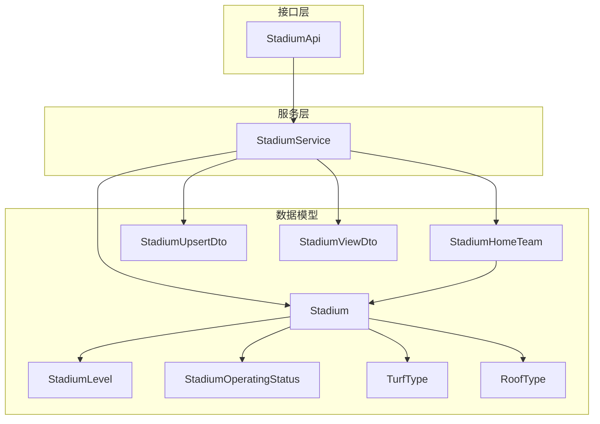
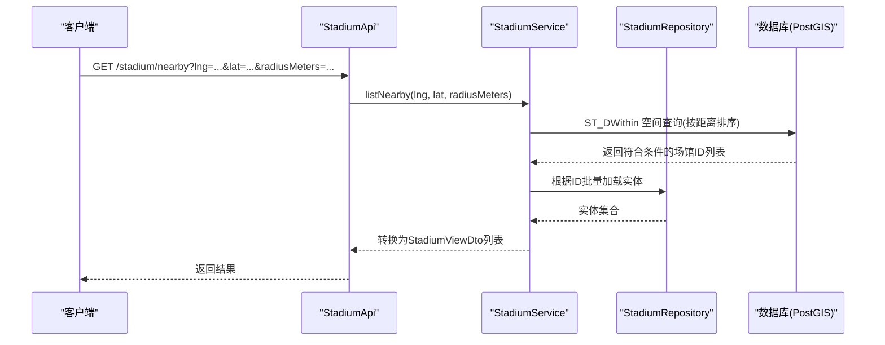
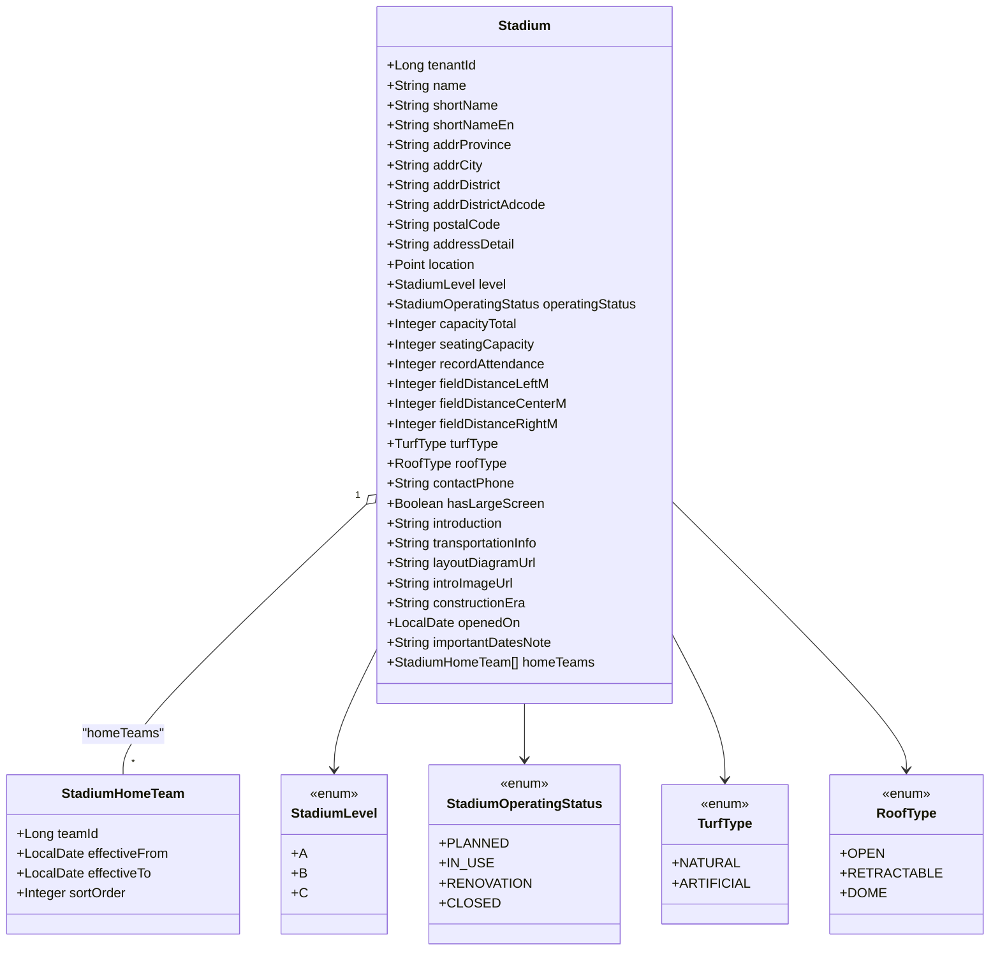
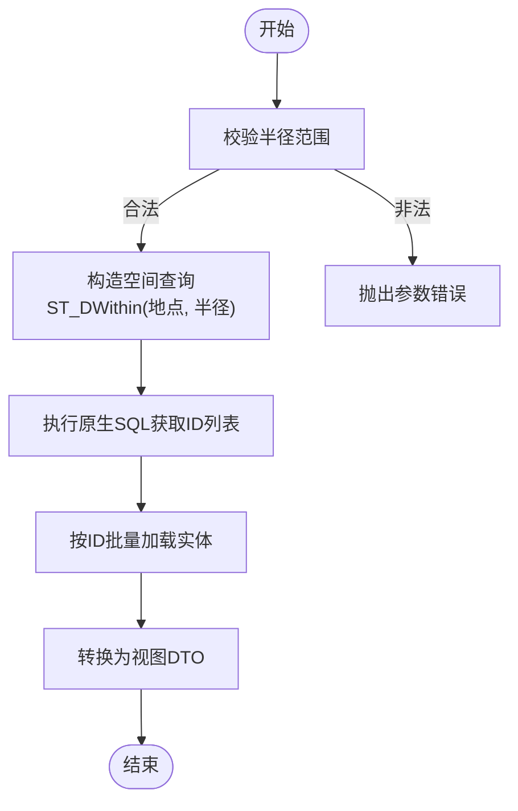
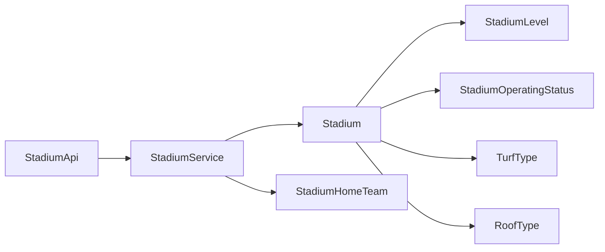
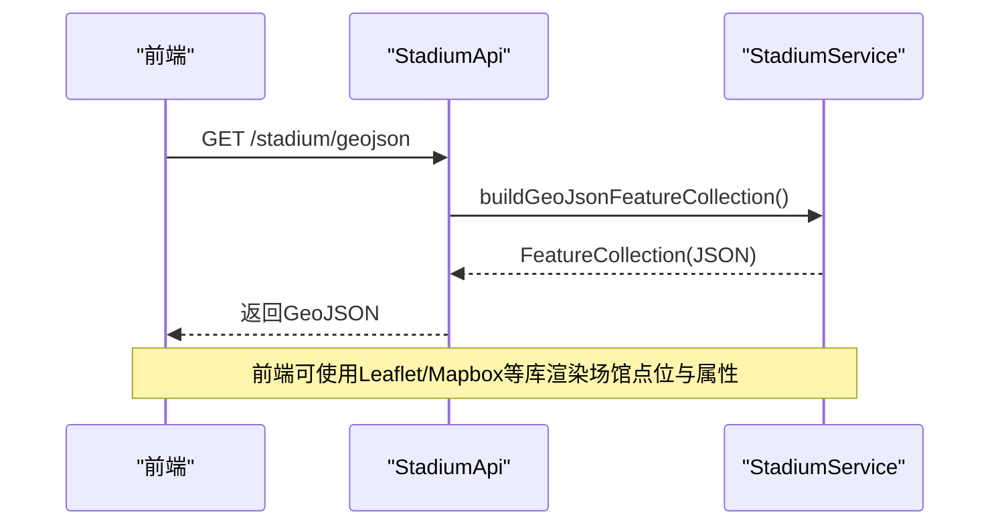

# 场馆实体(Stadium)

## 目录
1. [简介](#简介)
2. [项目结构](#项目结构)
3. [核心组件](#核心组件)
4. [架构总览](#架构总览)
5. [详细组件分析](#详细组件分析)
6. [依赖关系分析](#依赖关系分析)
7. [性能与空间查询](#性能与空间查询)
8. [故障排查指南](#故障排查指南)
9. [结论](#结论)
10. [附录：API与地图集成示例](#附录api与地图集成示例)

## 简介
本文件围绕场馆实体（Stadium）的数据模型进行系统化说明，覆盖基本信息、设施属性、空间信息、运营状态、关联关系（主场球队）、以及地图与导航能力。文档以代码为依据，提供类图、序列图与流程图等可视化表达，帮助开发者快速理解并正确使用该领域模型。

## 项目结构
围绕场馆的领域实现主要包含以下层次：
- 实体层：Stadium、StadiumHomeTeam
- 数据传输层：StadiumUpsertDto、StadiumViewDto
- 枚举层：StadiumLevel、StadiumOperatingStatus、TurfType、RoofType
- 接口层：StadiumApi
- 服务层：StadiumService（含地理围栏、GeoJSON构建、附近查询等）

## 核心组件
- 场馆实体 Stadium：承载场馆的基本信息、设施参数、空间坐标、运营状态及与主场球队的关联。
- 主场球队关联 StadiumHomeTeam：描述某支球队在特定时间段内将某场馆作为主场的关系。
- 视图与入参 DTO：StadiumViewDto 用于对外展示；StadiumUpsertDto 用于创建/更新输入校验与映射。
- 枚举：等级、运营状态、草皮类型、屋顶类型，统一约束取值范围。
- 服务与接口：StadiumService 提供分页、详情、创建/更新/删除、GeoJSON 导出、附近查询等能力；StadiumApi 暴露 REST 端点。

## 架构总览
场馆模块采用典型的分层架构：API 接收请求，Service 编排业务逻辑与空间计算，Repository 访问数据库，Entity/DTO/Enum 定义数据契约。

## 详细组件分析

### 实体与字段模型（Stadium）
- 基本信息
  - 名称：name（必填，最大长度限制）
  - 简称：shortName、shortNameEn
  - 地址：addrProvince、addrCity、addrDistrict、addrDistrictAdcode、postalCode、addressDetail
- 空间信息
  - location：JTS Point，坐标系为 GCJ-02（SRID 4326），用于地图展示与空间计算
  - 视图层同时提供 longitude、latitude、geometry（GeoJSON Point）
- 设施属性
  - 容量：capacityTotal、seatingCapacity、recordAttendance
  - 场地尺寸：fieldDistanceLeftM、fieldDistanceCenterM、fieldDistanceRightM
  - 草皮类型：turfType（NATURAL/ARTIFICIAL）
  - 屋顶类型：roofType（OPEN/RETRACTABLE/DOME）
- 运营信息
  - 等级：level（A/B/C）
  - 运营状态：operatingStatus（PLANNED/IN_USE/RENOVATION/CLOSED）
  - 其他：contactPhone、hasLargeScreen、introduction、transportationInfo、layoutDiagramUrl、introImageUrl、constructionEra、openedOn、importantDatesNote
- 关联关系
  - homeTeams：一对多关联 StadiumHomeTeam，支持生效起止时间与排序

### 数据传输对象（DTO）
- StadiumUpsertDto：创建/更新输入，包含名称、地址、经纬度、等级、运营状态、设施参数、图片与介绍文本、主场球队列表等，并带有校验注解。
- StadiumViewDto：对外展示视图，包含基础信息、经纬度、几何对象 geometry、等级、运营状态、设施参数、主场球队视图、创建/更新时间等。

### 服务与业务流程（StadiumService）
- 列表与详情：分页查询、关键词与等级过滤、租户隔离、软删除过滤。
- 创建/更新：从 DTO 映射到实体，规范化空字符串，设置位置坐标（GCJ-02），处理主场球队关联（校验团队归属当前租户）。
- 删除：软删除场馆及其主场球队关联。
- GeoJSON 导出：构建 FeatureCollection，包含每个场馆的点几何与属性（名称、等级、状态、城市、主场球队标签等）。
- 附近查询：基于 PostGIS 的 ST_DWithin 空间查询，按距离排序，返回半径范围内的场馆。

### 关联关系与预订管理
- 主场球队关联：通过 StadiumHomeTeam 记录 stadium_id、team_id、生效起止时间、排序。支持多支球队在不同时段共用同一场馆。
- 预订管理：当前仓库未提供独立的“预订”实体或接口；如需实现赛事/活动占用与冲突检测，建议在 Service 层基于时间区间与场馆维度扩展校验逻辑，并在未来引入专门的 Booking/Reservation 实体。

## 依赖关系分析
- 实体依赖枚举：Stadium 依赖 StadiumLevel、StadiumOperatingStatus、TurfType、RoofType。
- 关联依赖：Stadium 与 StadiumHomeTeam 为一对多关系；StadiumHomeTeam 反向引用 Stadium。
- 服务依赖：StadiumService 依赖 Repository 与外部工具（如 ChinaAdcodeUtils、PostGIS 函数）。
- 接口依赖：StadiumApi 仅依赖 StadiumService 进行业务编排。

## 性能与空间查询
- 空间索引：location 使用 JTS Point 存储，并通过 PostGIS 的 geography 类型进行距离计算，建议为 bs_stadium.location 建立空间索引以提升 nearby 查询性能。
- 查询优化：nearby 接口使用原生 SQL 直接调用 ST_DWithin 并按距离排序，避免多次往返；随后按 ID 批量加载实体，减少 N+1 问题。
- 分页与过滤：list 接口支持关键字模糊匹配与等级过滤，结合租户隔离条件，保证数据安全性与查询效率。
- GeoJSON 输出：buildGeoJsonFeatureCollection 仅包含必要属性，便于前端地图渲染与交互。

## 故障排查指南
- 参数校验失败
  - 经纬度需成对出现或同时为空，否则抛出参数错误。
  - 半径需在 (0, 500000] 范围内，超出则报错。
  - 区划代码必须有效且为区县级别，否则提示无效或上级地区不存在。
- 数据一致性
  - 主场球队 ID 必须存在且属于当前租户，否则拒绝保存。
- 软删除
  - 删除操作为软删除，查询时自动过滤 deletedAt 不为空的记录。

## 结论
场馆实体模型完整覆盖了基本信息、设施参数、空间坐标、运营状态与主场球队关联，并通过服务层提供了丰富的查询与导出能力。结合 PostGIS 的空间能力，系统可高效支持附近场馆检索与地图可视化。若后续需要更复杂的预订与冲突检测，可在现有模型基础上扩展独立预订实体与相应校验逻辑。

## 附录：API与地图集成示例
- 列出场馆（分页、关键词、等级过滤）
  - 方法：GET /stadium/list
  - 参数：page、pageSize、sortProp、sortOrder、keyword、level
- 获取场馆详情
  - 方法：GET /stadium/{id}
- 创建场馆
  - 方法：POST /stadium/create
  - 请求体：StadiumUpsertDto
- 更新场馆
  - 方法：PUT /stadium/update/{id}
  - 请求体：StadiumUpsertDto
- 删除场馆
  - 方法：DELETE /stadium/delete/{id}
- 导出 GeoJSON（用于地图标注）
  - 方法：GET /stadium/geojson
- 附近场馆查询
  - 方法：GET /stadium/nearby
  - 参数：lng、lat、radiusMeters

---

> 本文整理自 Qoder RepoWiki（基于代码自动生成），仅供参考，以代码为准。
