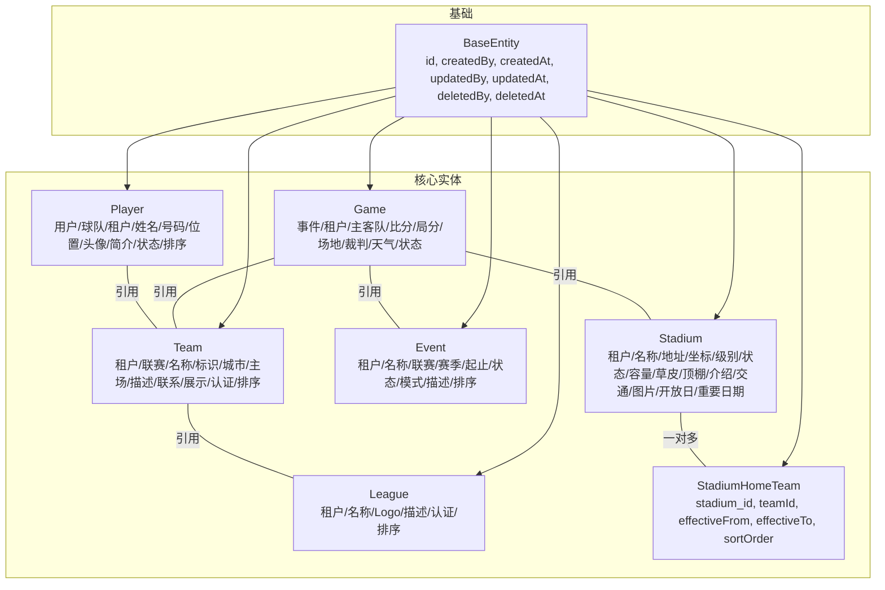
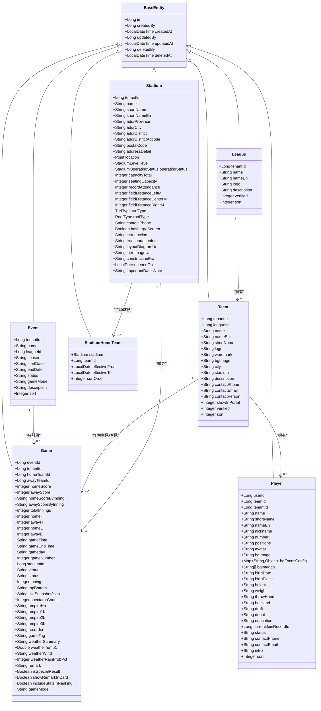
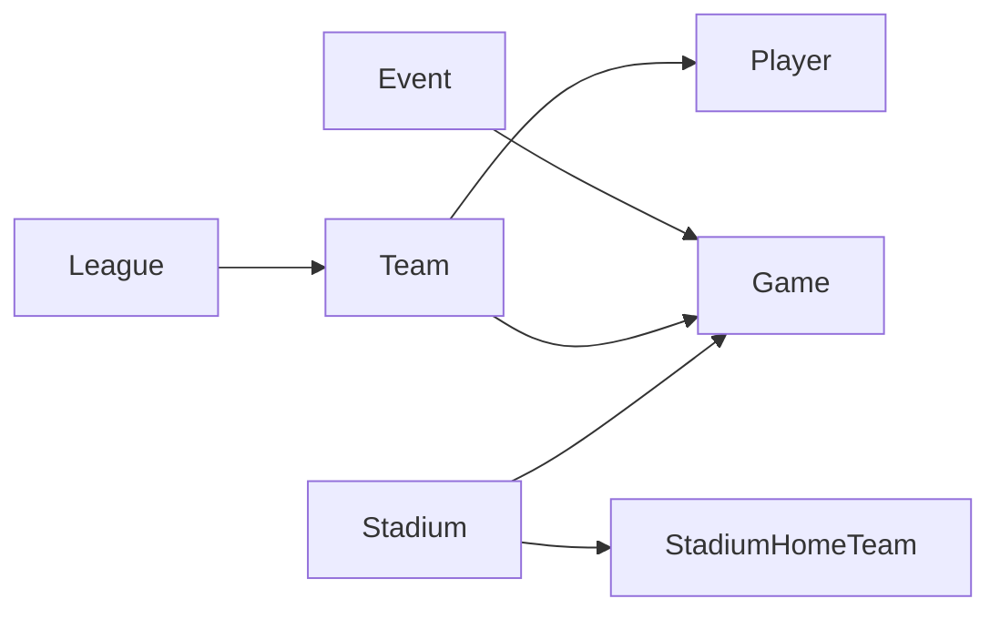
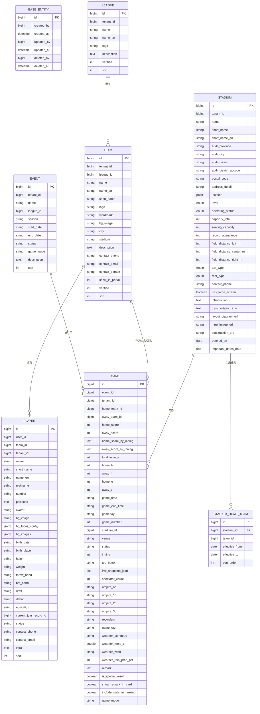
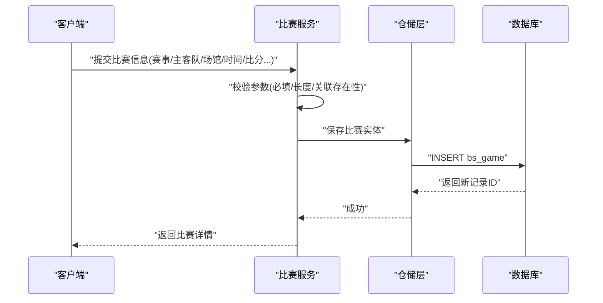
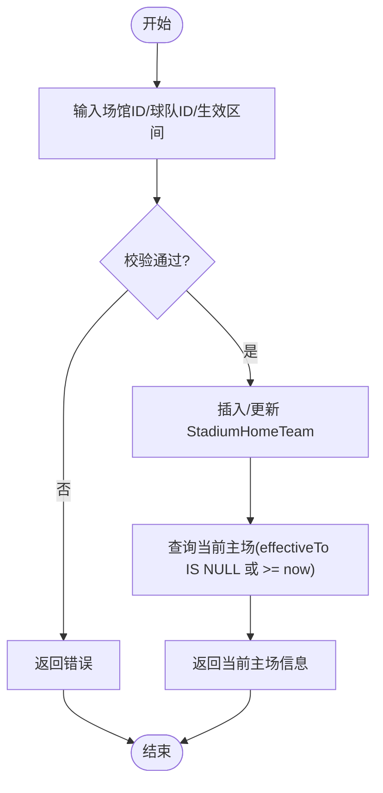

# 核心业务实体

## 目录
1. [简介](#简介)
2. [项目结构](#项目结构)
3. [核心组件](#核心组件)
4. [架构总览](#架构总览)
5. [详细组件分析](#详细组件分析)
6. [依赖关系分析](#依赖关系分析)
7. [性能考虑](#性能考虑)
8. [故障排查指南](#故障排查指南)
9. [结论](#结论)
10. [附录](#附录)

## 简介
本文件聚焦于棒球业务系统的核心数据模型，围绕比赛(Game)、球队(Team)、球员(Player)、赛事(Event)、联赛(League)、场馆(Stadium)等实体进行系统化说明。内容涵盖字段定义、数据类型与业务含义、实体间关联关系、主外键约束与索引设计建议、查询优化策略、生命周期管理、数据验证规则与业务约束，并提供实体关系图与典型数据流示例，帮助读者快速理解并正确使用这些核心实体。

## 项目结构
- 实体位于 model/entity 包下，统一继承 BaseEntity，具备通用审计字段（创建人、创建时间、更新人、更新时间、删除人、删除时间）和自增主键 id。
- 核心实体：
  - Game：记录单场比赛信息，包含比分、局分、场地、裁判、天气、状态等。
  - Team：球队基本信息，归属租户与联赛，支持展示与认证标记。
  - Player：球员档案，归属球队与租户，支持多位置、头像、简介等。
  - Event：赛事（如赛季/锦标赛），包含时间范围、状态、模式等。
  - League：联赛组织信息，支持认证与排序。
  - Stadium：场馆信息，含地址、坐标、容量、草皮/顶棚类型、运营状态等，并与主场球队存在一对多关系。
  - StadiumHomeTeam：场馆与主场球队的关联表，支持生效起止日期与排序。

## 核心组件
- 基类 BaseEntity
  - 提供统一主键 id（自增）、审计字段（创建/更新/删除人与时间）。
  - 通过 JPA 监听器在持久化与更新时自动填充时间戳。
- 实体概览
  - Game：比赛维度，包含赛事、租户、主客队、比分、每局得分 JSON、总局数、安打/失误、开赛/结束时间、比赛日、场次编号、场馆、地点、状态、当前局/上下半局、实时快照 JSON、观众人数、裁判、记录员、标签、天气、备注、特殊结果标记、是否计入统计、比赛模式等。
  - Team：球队维度，包含租户、联赛、名称、英文名、简称、Logo、字标、背景图、城市、主场文本、描述、联系方式、门户展示、认证标记、排序。
  - Player：球员维度，包含用户ID、球队ID、租户、姓名、简称、英文名、昵称、号码、位置(JSON)、头像、背景图、背景配置(JSON数组)、生日、出生地、身高、体重、投打惯用手、选秀、首秀、学历、当前加入记录ID、状态、联系方式、简介、排序。
  - Event：赛事维度，包含租户、名称、联赛、赛季、起止日期、状态、比赛模式、描述、排序。
  - League：联赛维度，包含租户、名称、英文名、Logo、描述、认证标记、排序。
  - Stadium：场馆维度，包含租户、名称、简称、英文名、省市区及区划代码、邮编、详细地址、地理坐标(Point)、级别、运营状态、容量、座位数、历史最高入场、外野距离、草皮类型、顶棚类型、联系电话、大屏、简介、交通、布局图、主图、建造年代、开放日、重要日期备注、以及主场球队集合。
  - StadiumHomeTeam：场馆与主场球队关联，包含 stadia 外键、teamId、生效起止日期、排序。

## 架构总览
- 分层与职责
  - 实体层：以 JPA 注解映射数据库表，承载领域语义与约束。
  - 仓储与服务层：基于 Repository/Service 完成 CRUD 与业务编排（不在本文展开）。
- 关键关系
  - Game → Event：通过 eventId 引用赛事。
  - Game → Team：homeTeamId/awayTeamId 分别引用主客队。
  - Game → Stadium：stadiumId 引用比赛场馆。
  - Team → League：leagueId 引用所属联赛。
  - Player → Team：teamId 引用所属球队。
  - Stadium → StadiumHomeTeam：一对多，维护主场球队及其生效区间。

## 详细组件分析

### 实体：比赛 Game
- 字段要点
  - 关联：eventId、tenantId、homeTeamId、awayTeamId、stadiumId。
  - 比分与统计：homeScore/awayScore、homeScoreByInning/awayScoreByInning（JSON）、totalInnings、homeH/awayH、homeE/awayE。
  - 时间与赛程：gameTime、gameEndTime、gameday、gameNumber。
  - 场地与环境：venue、weatherSummary/weatherTempC/weatherWind/weatherRainProbPct。
  - 状态与进度：status、inning、topBottom、liveSnapshotJson（实时快照）。
  - 人员与记录：spectatorCount、umpireHp/1b/2b/3b、recorders。
  - 展示与规则：gameTag、remark、isSpecialResult、showRemarkInCard、includeStatsInRanking、gameMode。
- 业务含义
  - 用于记录一场比赛的完整上下文与结果，支持按局统计、实时快照、天气与裁判信息、是否计入排名等。
- 约束与校验
  - 长度限制：部分字符串字段使用 @Size 控制长度；备注字段有最大长度提示。
  - 默认值：status 默认为“scheduled”，gameMode 默认为“BASEBALL”。
- 关联关系
  - 通过 eventId 关联赛事 Event。
  - 通过 homeTeamId/awayTeamId 关联球队 Team。
  - 通过 stadiumId 关联场馆 Stadium。
- 索引与查询优化建议
  - 高频查询条件建议建索引：tenantId、eventId、status、gameday、stadiumId、homeTeamId、awayTeamId。
  - 对 JSON 字段（如每局得分、实时快照）若需按内部键检索，建议在数据库层建立函数索引或物化视图。
- 生命周期
  - 继承 BaseEntity 的审计字段；状态机由业务服务驱动（如 scheduled→in_progress→completed）。

### 实体：球队 Team
- 字段要点
  - 关联：tenantId、leagueId。
  - 基本属性：name、nameEn、shortName、logo、wordmark、bgImage、city、stadium（文本）、description。
  - 联系信息：contactPhone、contactEmail、contactPerson。
  - 展示与认证：showInPortal、verified、sort。
- 业务含义
  - 代表一个参赛队伍，可归属于某联赛，支持门户展示与认证标记。
- 约束与校验
  - 名称必填且有限长；其他文本字段均有长度限制。
- 关联关系
  - 通过 leagueId 关联联赛 League。
  - 作为 Game 的主客队被引用。
  - 作为 Player 的归属球队被引用。
- 索引与查询优化建议
  - 建议索引：tenantId、leagueId、name、shortName、verified、sort。
- 生命周期
  - 通过 verified 与 showInPortal 控制对外可见性与可信度。

### 实体：球员 Player
- 字段要点
  - 关联：userId、teamId、tenantId、currentJoinRecordId。
  - 基本属性：name、shortName、nameEn、nickname、number、positions（JSON 列表）、avatar、bgImage、bgFocusConfig（JSON）、bgImages（JSON 数组）。
  - 个人履历：birthDate、birthPlace、height、weight、throwHand、batHand、draft、debut、education。
  - 状态与联系：status、contactPhone、contactEmail、intro、sort。
- 业务含义
  - 球员档案，支持多位置存储、个性化背景配置、当前加入记录追踪。
- 约束与校验
  - 简介字段有最大长度提示；positions 通过工具类序列化为字符串存储。
- 关联关系
  - 通过 teamId 归属球队 Team。
  - 通过 tenantId 实现租户隔离。
- 索引与查询优化建议
  - 建议索引：tenantId、teamId、status、name、shortName、number。
  - 对 positions 等 JSON 字段如需按位置筛选，建议建立函数索引或冗余枚举列。
- 生命周期
  - status 表示活跃/退役等状态；currentJoinRecordId 指向最近一次加入记录。

### 实体：赛事 Event
- 字段要点
  - 关联：tenantId、leagueId。
  - 基本属性：name、season、startDate、endDate、status、gameMode、description、sort。
- 业务含义
  - 表示一个赛事（如赛季或锦标赛），限定时间范围与模式。
- 约束与校验
  - 描述字段有最大长度提示。
- 关联关系
  - 被 Game 通过 eventId 引用。
  - 与 League 通过 leagueId 关联。
- 索引与查询优化建议
  - 建议索引：tenantId、leagueId、status、startDate、endDate。
- 生命周期
  - 状态机由业务驱动（如 draft→published→ended）。

### 实体：联赛 League
- 字段要点
  - 关联：tenantId。
  - 基本属性：name、nameEn、logo、description、verified、sort。
- 业务含义
  - 联赛组织信息，支持认证标记与排序。
- 约束与校验
  - 描述字段有最大长度提示。
- 关联关系
  - 被 Team 通过 leagueId 引用。
- 索引与查询优化建议
  - 建议索引：tenantId、name、verified、sort。
- 生命周期
  - verified 控制平台认证状态。

### 实体：场馆 Stadium
- 字段要点
  - 关联：tenantId。
  - 地址与地理：addrProvince、addrCity、addrDistrict、addrDistrictAdcode、postalCode、addressDetail、location（Point，GCJ-02）。
  - 规格与设施：level、operatingStatus、capacityTotal、seatingCapacity、recordAttendance、fieldDistanceLeftM/CenterM/RightM、turfType、roofType、hasLargeScreen。
  - 展示与资料：contactPhone、introduction、transportationInfo、layoutDiagramUrl、introImageUrl、constructionEra、openedOn、importantDatesNote。
  - 关联：homeTeams（一对多到 StadiumHomeTeam）。
- 业务含义
  - 场馆主数据，支持地理信息与设施属性，以及与主场球队的时间段关联。
- 约束与校验
  - 名称必填且有长度限制；级别与运营状态为必填枚举；坐标为地理点类型。
- 关联关系
  - 被 Game 通过 stadiumId 引用。
  - 通过 StadiumHomeTeam 与 Team 建立主场关系（带生效区间）。
- 索引与查询优化建议
  - 建议索引：tenantId、name、addrDistrictAdcode、operatingStatus、level。
  - 地理查询建议使用空间索引（如 PostGIS）以提升半径/邻近搜索性能。
- 生命周期
  - operatingStatus 控制开放/关闭等状态；openedOn 记录启用时间。

### 实体：场馆主场球队关联 StadiumHomeTeam
- 字段要点
  - 关联：stadium（ManyToOne）、teamId。
  - 时间范围：effectiveFrom、effectiveTo（空表示仍有效）。
  - 排序：sortOrder。
- 业务含义
  - 表达某球队在某场馆的主场关系及其生效时间段，支持历史变更。
- 约束与校验
  - stadium 与 teamId 必填；时间范围用于界定有效性。
- 关联关系
  - 与 Stadium 一对多；与 Team 通过 teamId 间接关联。
- 索引与查询优化建议
  - 建议索引：stadium_id、teamId、effectiveFrom、effectiveTo。
  - 查询“当前主场”可使用 effectiveTo IS NULL 或 effectiveTo >= now 的条件。
- 生命周期
  - 通过新增/修改生效区间实现主场关系的演进。

## 依赖关系分析
- 直接依赖
  - Game 依赖 Event、Team、Stadium。
  - Team 依赖 League。
  - Player 依赖 Team。
  - Stadium 依赖 StadiumHomeTeam（一对多）。
- 间接依赖
  - 通过 Tenant 隔离（所有实体均含 tenantId）。
  - 通过 BaseEntity 统一审计与主键。
- 耦合与内聚
  - 实体间通过 ID 弱耦合，便于扩展与维护。
  - 复杂关系（如主场球队时间段）通过中间表解耦。

## 性能考虑
- 索引策略
  - 外键列：event_id、home_team_id、away_team_id、stadium_id、league_id、team_id、stadium_id（StadiumHomeTeam）。
  - 常用过滤列：tenant_id、status、gameday、start_date/end_date、verified、sort。
  - JSON 列：对频繁查询的 JSON 键建立函数索引（如每局得分的关键键、实时快照关键字段）。
- 查询优化
  - 分页与投影：仅选择必要字段，避免大对象（TEXT/JSON）全量加载。
  - 预取关联：按需使用 JOIN 或延迟加载，避免 N+1 问题。
  - 地理查询：使用空间索引与合适的 SRID（如 4326）提升邻近/半径查询效率。
- 写入优化
  - 批量插入/更新：对 Stadium.homeTeams 等集合采用批量操作。
  - 事务边界：将相关写操作放入同一事务，保证一致性。

[本节为通用指导，不直接分析具体文件]

## 故障排查指南
- 常见校验错误
  - 必填字段缺失：如 Stadium.name、Stadium.level、Stadium.operatingStatus、Team.name 等。
  - 长度超限：如 Event.description、Player.intro、Game.remark 等。
- 关联完整性
  - 外键不存在：确保 Event、Team、Stadium 已存在后再创建 Game。
  - 主场关系冲突：检查 StadiumHomeTeam 的生效区间是否重叠。
- 审计与状态
  - 审计字段异常：确认 BaseEntity 的监听器是否启用。
  - 状态不一致：检查业务服务是否正确推进状态机（如 Game.status）。

## 结论
本数据模型以 BaseEntity 为基础，围绕赛事、联赛、球队、球员、比赛与场馆构建起完整的棒球业务骨架。通过合理的外键与中间表设计，既保证了数据一致性，又支持灵活的历史演进（如主场球队时间段）。结合索引与查询优化策略，可在大规模数据场景下保持良好性能。建议在后续迭代中持续完善枚举与校验、补充必要的函数索引，并对 JSON 字段进行结构化治理。

[本节为总结性内容，不直接分析具体文件]

## 附录

### 实体关系图（ER）

### 数据流示例：创建一场比赛

### 数据流示例：设置场馆主场球队

---

> 本文整理自 Qoder RepoWiki（基于代码自动生成），仅供参考，以代码为准。
