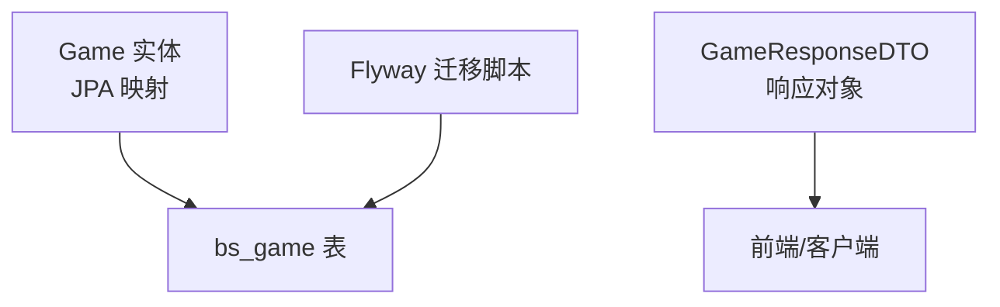
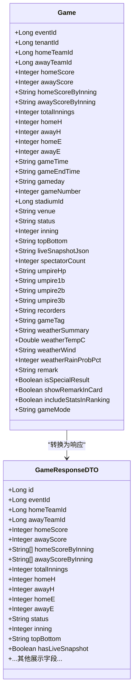
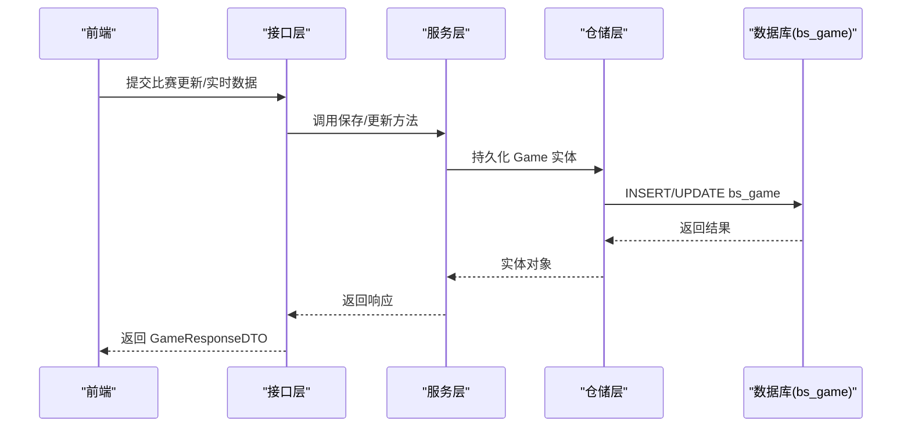
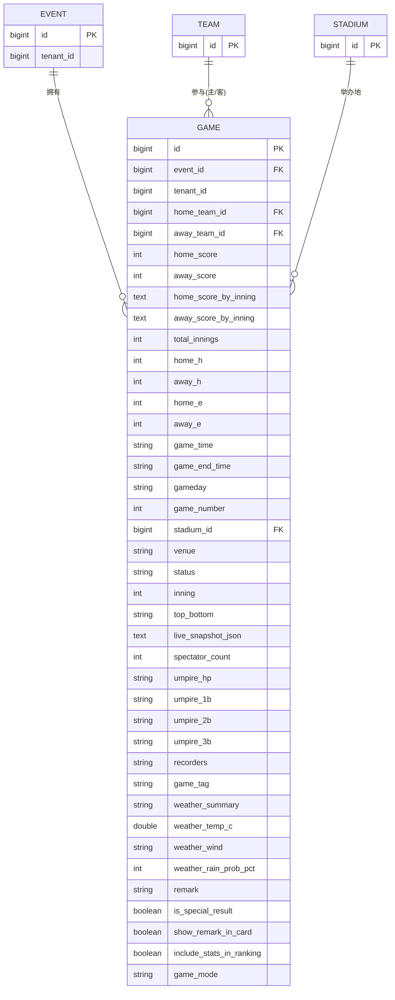

# 比赛实体(Game)

## 目录
1. [简介](#简介)
2. [项目结构](#项目结构)
3. [核心组件](#核心组件)
4. [架构总览](#架构总览)
5. [详细字段说明](#详细字段说明)
6. [依赖关系分析](#依赖关系分析)
7. [性能与存储特性](#性能与存储特性)
8. [故障排查指南](#故障排查指南)
9. [结论](#结论)
10. [附录：实体关系图与JSON示例](#附录实体关系图与json示例)

## 简介
本文件围绕比赛实体 Game 的数据模型进行系统化说明，覆盖核心标识、比分与局分、实时状态、裁判与记录员、天气信息、配置开关等字段的定义与用途，并结合数据库迁移脚本解释持久化细节。同时提供实体关系图与JSON序列化示例，帮助前后端与数据侧协同开发。

## 项目结构
- 领域实体位于 model/entity 包下，Game 为 JPA 实体，映射到表 bs_game。
- DTO 层包含 GameResponseDTO，用于对外响应时转换与展示（如将每局得分字符串解析为列表）。
- 数据库通过 Flyway 迁移脚本逐步扩展 bs_game 表结构，包括租户隔离、实时快照、裁判与天气等列。



## 核心组件
- Game 实体：承载比赛的核心业务数据与动态状态，包含赛事、队伍、比分、局分、统计、时间、场地、状态、裁判、天气、备注及配置项等。
- GameResponseDTO：面向前端的响应对象，负责将实体中的 JSON 文本（如每局得分）转换为更易用的列表结构，并暴露是否有实时快照的布尔标记。

## 架构总览
Game 实体作为领域模型，直接映射到数据库表 bs_game；其部分字段以 TEXT 存储 JSON 文本（如每局得分、实时快照），在 DTO 层进行解析与转换，便于前端消费。



## 详细字段说明
以下按业务维度分组说明 Game 实体的关键字段及其含义、类型与约束要点。

- 标识与会话
  - eventId：赛事ID，关联所属赛事。
  - tenantId：租户ID，实现多租户数据隔离。
  - id：主键（继承自 BaseEntity）。

- 对阵与比分
  - homeTeamId：主队ID。
  - awayTeamId：客队ID。
  - homeScore：主队得分。
  - awayScore：客队得分。
  - totalInnings：总局数。
  - homeH / awayH：主队/客队安打数。
  - homeE / awayE：主队/客队失误数。

- 局分与进度
  - homeScoreByInning：主队每局得分，TEXT 存储 JSON 数组（字符串或数字元素）。
  - awayScoreByInning：客队每局得分，TEXT 存储 JSON 数组（字符串或数字元素）。
  - inning：当前局数。
  - topBottom：上下半局（如“top”、“bottom”）。
  - status：比赛状态（默认 scheduled）。

- 时间与场地
  - gameTime：开始时间。
  - gameEndTime：结束时间。
  - gameday：比赛日期。
  - gameNumber：场次序号。
  - stadiumId：球场ID。
  - venue：场地名称。

- 实时快照
  - liveSnapshotJson：实时录入完整快照（阵容、局面、事件日志等），TEXT 存储 JSON，用于断线恢复。

- 观众与裁判
  - spectatorCount：观众人数（可空）。
  - umpireHp：主审。
  - umpire1b：一垒审。
  - umpire2b：二垒审。
  - umpire3b：三垒审。
  - recorders：记录员（多人可用逗号或顿号分隔）。

- 天气信息
  - weatherSummary：天气简况（如晴/阴）。
  - weatherTempC：气温（摄氏度，可空）。
  - weatherWind：风速/风向描述（可空）。
  - weatherRainProbPct：赛前预报降雨概率 0-100（可空，非实况降水量）。

- 备注与显示控制
  - remark：备注（长度限制，最大约2000字符）。
  - showRemarkInCard：是否将备注显示在比赛结果卡片中。

- 统计与排名控制
  - includeStatsInRanking：是否将本场比赛球员数据计入统计排行。

- 特殊结果与模式
  - isSpecialResult：是否为特殊结果（如不足人数判负等）。
  - gameMode：比赛模式，BASEBALL（棒球）/ SOFTBALL（垒球），默认 BASEBALL。

- 其他
  - gameTag：场次标签（如冠军赛），有值时前台显示奖杯标识。

## 依赖关系分析
- 实体与表映射：Game 通过注解映射至 bs_game 表，部分字段使用 TEXT 存储 JSON。
- 多租户隔离：通过 tenant_id 列实现，迁移脚本对 bs_game 添加该列并建立索引。
- 实时快照：live_snapshot_json 用于保存前端录入的完整状态，支持断线恢复。
- 裁判与天气：通过额外迁移脚本增加相关列，均为可选字段，便于人工填报。
- DTO 转换：GameResponseDTO 将每局得分 JSON 字符串解析为 List<String>，并提供 hasLiveSnapshot 标志位。



## 性能与存储特性
- 大字段存储：homeScoreByInning、awayScoreByInning、liveSnapshotJson 使用 TEXT 存储 JSON，适合复杂结构但需注意体积增长。
- 查询优化：tenant_id 已建索引，利于多租户场景下的过滤与分页。
- 序列化开销：每局得分在 DTO 层解析为列表，避免前端重复解析；注意异常处理与空值兼容。
- 并发写入：实时更新可能频繁写入 liveSnapshotJson，建议结合缓存或批量策略降低写放大。

[本节为通用指导，不直接分析具体文件]

## 故障排查指南
- 每局得分解析失败
  - 现象：DTO 解析报错或结果为空。
  - 排查：检查数据库中 homeScoreByInning/awayScoreByInning 是否为合法 JSON 数组；确认 DTO 解析逻辑的异常捕获。
  - 参考路径：`GameResponseDTO.parseInningScores:118-136`

- 实时快照缺失
  - 现象：前端无法恢复断线前的录入状态。
  - 排查：确认 live_snapshot_json 是否存在且非空；检查迁移脚本是否成功执行。
  - 参考路径：`V20260323120000__game_live_snapshot.sql:11-13`

- 多租户数据串扰
  - 现象：不同租户看到彼此的比赛数据。
  - 排查：确认 tenant_id 是否正确设置；检查查询是否带上租户过滤条件；确认索引存在。
  - 参考路径：`V20260413140000__tenant_event_game_news_notice_announcement.sql:7-41`

- 裁判/天气字段为空
  - 现象：前端未显示裁判或天气信息。
  - 排查：确认对应列是否已添加并可空；检查输入校验与默认值。
  - 参考路径：`V20260407100000__game_extra_meta.sql:9-35`

## 结论
Game 实体提供了完整的比赛数据模型，涵盖静态信息、动态状态、实时快照、裁判与天气、以及多种配置开关。通过 TEXT 字段灵活存储复杂结构，配合 DTO 层的解析与展示，满足前后端高效协作。多租户隔离与必要的索引优化保障了系统的可扩展性与查询性能。

[本节为总结性内容，不直接分析具体文件]

## 附录：实体关系图与JSON示例
- 实体关系图（概念）


- JSON 序列化示例（示意）
```json
{
  "id": 1,
  "eventId": 100,
  "tenantId": 1,
  "homeTeamId": 10,
  "awayTeamId": 20,
  "homeScore": 5,
  "awayScore": 3,
  "homeScoreByInning": ["1","0","2","0","1","0","1"],
  "awayScoreByInning": ["0","1","0","0","0","2","0"],
  "totalInnings": 7,
  "homeH": 8,
  "awayH": 6,
  "homeE": 0,
  "awayE": 1,
  "gameTime": "2026-04-01T18:00:00",
  "gameEndTime": "2026-04-01T20:30:00",
  "gameday": "2026-04-01",
  "gameNumber": 1,
  "stadiumId": 5,
  "venue": "XX体育场",
  "status": "scheduled",
  "inning": 7,
  "topBottom": "bottom",
  "liveSnapshotJson": "{\"lineup\":{},\"events\":[],\"scoreboard\":{}}",
  "spectatorCount": 1200,
  "umpireHp": "张三",
  "umpire1b": "李四",
  "umpire2b": "王五",
  "umpire3b": "赵六",
  "recorders": "记录员A, 记录员B",
  "gameTag": "冠军赛",
  "weatherSummary": "晴",
  "weatherTempC": 26.5,
  "weatherWind": "东南风3级",
  "weatherRainProbPct": 10,
  "remark": "因雨延期的补赛",
  "isSpecialResult": false,
  "showRemarkInCard": true,
  "includeStatsInRanking": true,
  "gameMode": "BASEBALL"
}
```

[本节为概念性示例，不直接映射具体代码片段]

---

> 本文整理自 Qoder RepoWiki（基于代码自动生成），仅供参考，以代码为准。
