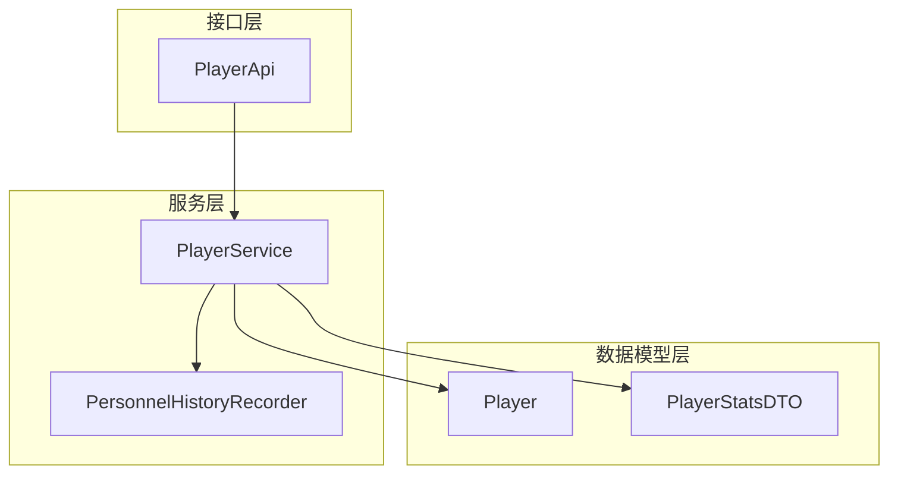
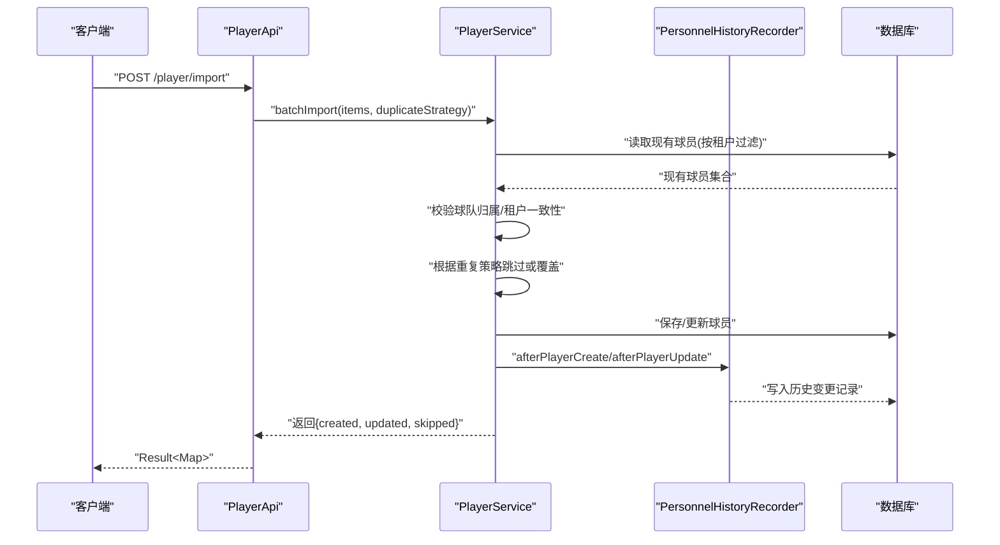
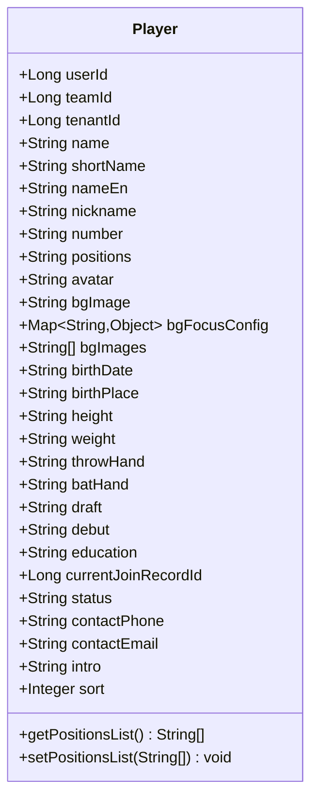
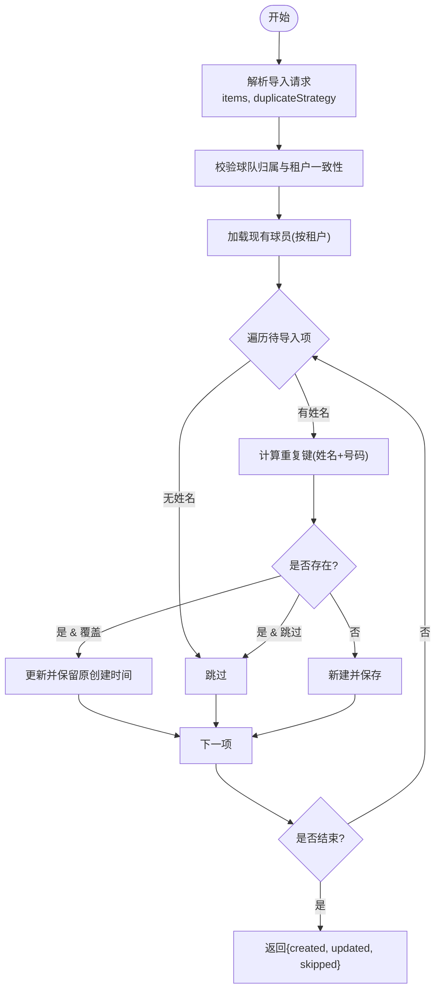
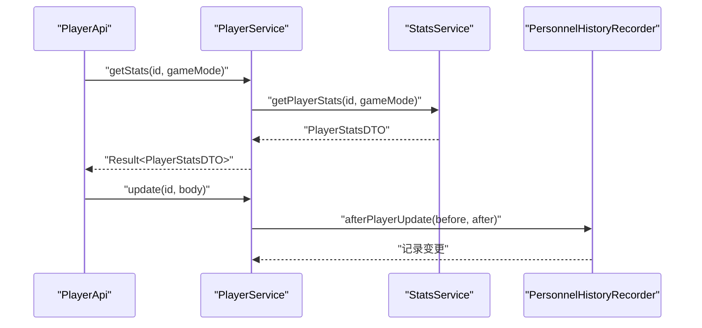
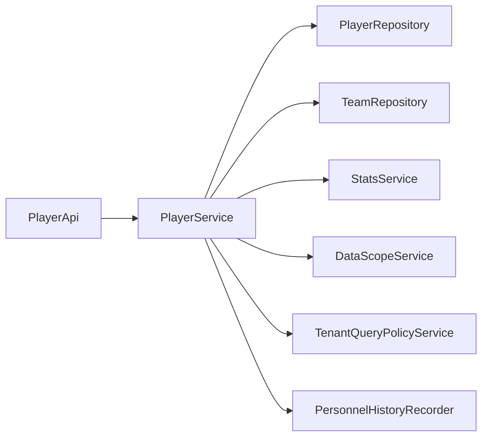

# 球员实体(Player)

## 目录
1. [简介](#简介)
2. [项目结构](#项目结构)
3. [核心组件](#核心组件)
4. [架构总览](#架构总览)
5. [详细组件分析](#详细组件分析)
6. [依赖关系分析](#依赖关系分析)
7. [性能考虑](#性能考虑)
8. [故障排查指南](#故障排查指南)
9. [结论](#结论)
10. [附录](#附录)

## 简介
本文件围绕“球员实体（Player）”的数据模型进行系统化说明，覆盖个人身份信息、职业信息、扩展信息、生命周期字段以及与比赛、统计数据、历史记录的多重关联。同时给出导入导出与批量操作的接口约定与实践建议，帮助开发者快速理解并正确使用该模型。

## 项目结构
围绕球员实体的代码主要分布在以下层次：
- 数据模型层：Player 实体定义所有持久化字段及序列化策略
- 接口层：PlayerApi 暴露 REST 接口，包含查询、创建、更新、删除、导入等能力
- 服务层：PlayerService 实现业务逻辑，包括权限校验、数据归一化、统计聚合、历史变更记录等
- DTO 层：PlayerStatsDTO 等用于对外输出统计数据

## 核心组件
- Player 实体：定义球员的所有基础与扩展字段，以及位置字段的 JSON 存储与列表转换
- PlayerApi：提供球员数据的增删改查、统计查询、导入导出等接口
- PlayerService：封装业务规则（租户隔离、数据范围、去空值、背景图归一化、重复策略、软删除、批量操作等）
- PersonnelHistoryRecorder：记录球员资料变更的历史轨迹
- PlayerStatsDTO：承载击球、投球、防守等多维统计数据

## 架构总览
下图展示从请求到落库的调用链，以及关键的数据流转点：

## 详细组件分析

### 球员实体（Player）数据模型
- 表名与注解：实体映射至表 bs_player，具备注释与 JSONB 列支持
- 个人身份信息
  - 姓名 name、简称 shortName、英文名 nameEn、昵称 nickname
  - 出生日期 birthDate、出生地 birthPlace
  - 身高 height、体重 weight
  - 性别 gender：当前实体未直接定义 gender 字段；如需支持可在后续扩展
- 职业信息
  - 号码 number
  - 守备位置 positions：以 JSON 字符串存储，通过 getter/setter 转换为 List<String> 供外部使用
  - 所属球队 teamId：外键引用球队
  - 所属联赛 leagueId：当前实体未直接定义 leagueId；可通过球队或赛事维度间接关联
  - 投手手 throwHand、打者手 batHand
  - 选秀 draft、首秀 debut
- 扩展信息
  - 头像 avatar
  - 背景图 bgImage、背景图配置 bgFocusConfig（JSON）、背景图列表 bgImages（数组）
  - 教育背景 education
  - 简介 intro（长度限制）
  - 排序 sort
- 生命周期与状态
  - 状态 status：默认 active
  - 继承自 BaseEntity 的生命周期字段（如创建时间、更新时间、删除标记等）由基类提供
  - 当前加入记录 currentJoinRecordId：指向最近一次加入/转会记录
- 其他
  - 认证用户 userId、租户 tenantId、联系方式 contactPhone/contactEmail

### 接口与批量操作（导入/导出）
- 列表查询：支持分页、多条件筛选（关键词、号码、位置、左右手、状态、加入日期区间等）
- 详情与统计：获取球员详情、总体统计、按赛季统计、逐场日志、细分指标下钻
- 创建/更新/删除：单条与批量删除（软删除）
- 导入：批量导入，支持重复策略（跳过或覆盖），返回创建/更新/跳过计数
- 导出：当前未提供专用导出接口；可复用列表查询接口配合前端导出或自行实现

### 与比赛、统计数据、历史记录的关系
- 统计数据：通过 StatsService 聚合击球、投球、防守等指标，并以 PlayerStatsDTO 形式返回
- 比赛日志：提供逐场比赛的明细条目，便于追踪表现趋势
- 历史记录：通过 PersonnelHistoryRecorder 记录资料变更（如姓名、简称、英文名、昵称、号码等），形成可审计的变更轨迹

### 数据处理与约束要点
- 位置字段 positions：内部以 JSON 字符串存储，对外暴露为 List<String>，便于前端多选
- 背景图处理：bgImages 最多保留 5 张，自动去重与裁剪；若为空则回退到 bgImage
- 空值归一化：对空白字符串统一转为 null，避免脏数据
- 租户与数据范围：所有查询与写操作均受租户与数据范围控制，确保多租户隔离
- 软删除：删除操作设置 deletedAt 与 deletedBy，支持批量软删除

## 依赖关系分析
- PlayerService 依赖：
  - PlayerRepository：数据访问
  - TeamRepository：球队存在性与租户一致性校验
  - StatsService：统计数据聚合
  - DataScopeService/TenantQueryPolicyService：数据范围与租户策略
  - PersonnelHistoryRecorder：变更历史
- 对外暴露：
  - PlayerApi 将 REST 请求路由至 PlayerService
  - 统计数据通过 PlayerStatsDTO 返回

## 性能考虑
- 列表查询采用 Specification 动态构建条件，结合分页与排序，减少不必要数据传输
- 位置字段使用 JSON 模糊匹配，注意在大数据量场景下的索引策略
- 背景图列表限制最大数量与去重，降低存储与传输开销
- 批量导入采用内存中重复键判断，避免多次往返数据库；必要时可增加唯一索引提升冲突检测效率
- 软删除与租户隔离在查询中始终生效，避免额外过滤带来的性能损耗

[本节为通用指导，不直接分析具体文件]

## 故障排查指南
- 无权访问：当跨租户或超出数据范围时，会抛出业务异常；请检查当前租户与数据范围
- 球队不存在或不一致：创建/更新/导入时若球队不存在或不属于当前租户，将报错；请先创建球队并确保归属正确
- 重复导入：根据 duplicateStrategy 决定跳过或覆盖；如需覆盖，请确认策略参数
- 历史变更未记录：确认是否在更新路径中触发了 afterPlayerUpdate；检查 PersonnelHistoryRecorder 是否启用

## 结论
Player 实体提供了完整的球员信息管理模型，涵盖身份、职业、扩展与生命周期字段，并通过 API 与服务层实现了安全的 CRUD、统计查询与批量导入。结合历史变更记录与多维统计数据，可满足运营与数据分析需求。建议在后续版本中按需补充性别、联赛等字段，并完善导出能力以满足更多业务场景。

[本节为总结性内容，不直接分析具体文件]

## 附录
- 常用接口参考
  - 列表查询：GET /player/list
  - 详情：GET /player/{id}
  - 统计概览：GET /player/{id}/stats
  - 按赛季统计：GET /player/{id}/stats/by-season
  - 逐场日志：GET /player/{id}/stats/game-log
  - 创建：POST /player/create
  - 更新：PUT /player/update/{id}
  - 删除：DELETE /player/delete/{id}
  - 批量删除：POST /player/delete-batch
  - 批量导入：POST /player/import

---

> 本文整理自 Qoder RepoWiki（基于代码自动生成），仅供参考，以代码为准。
