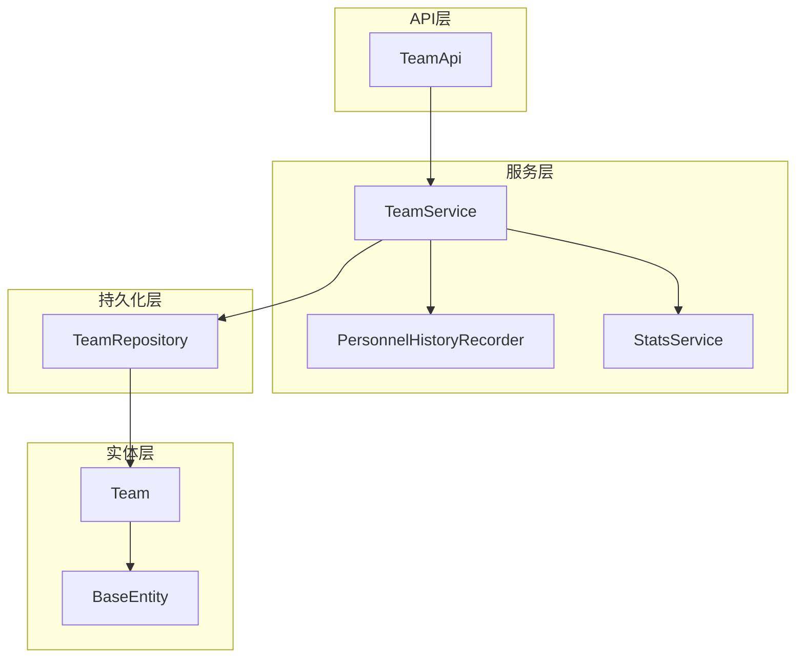
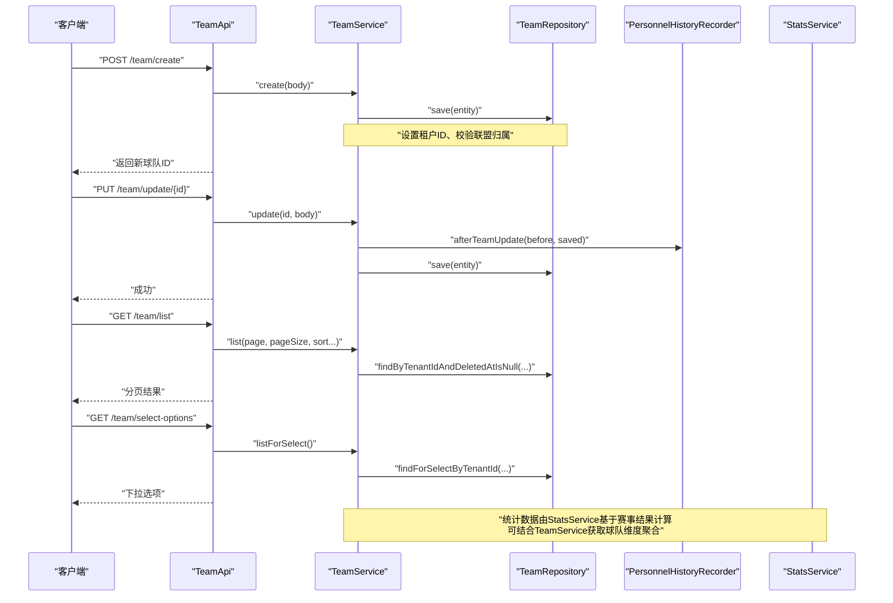
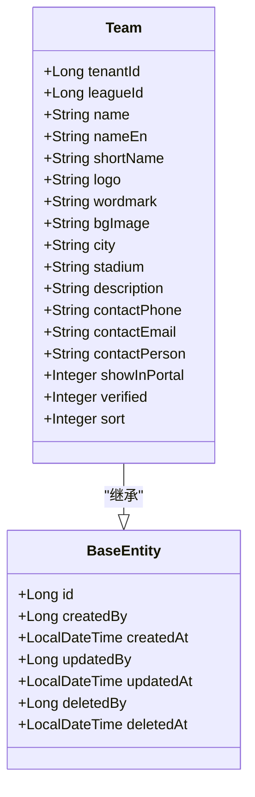
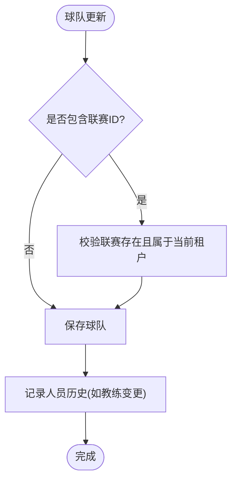
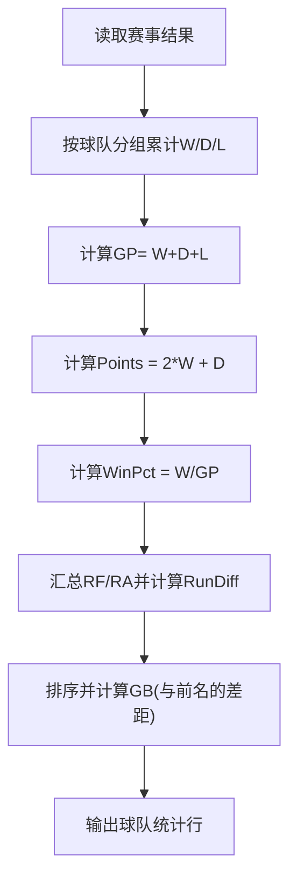
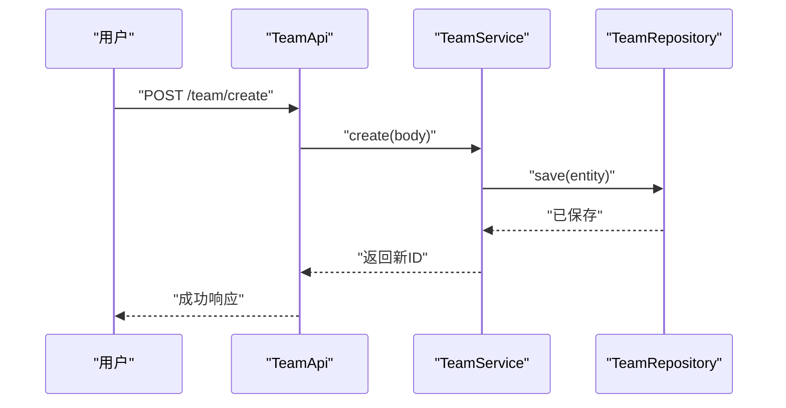
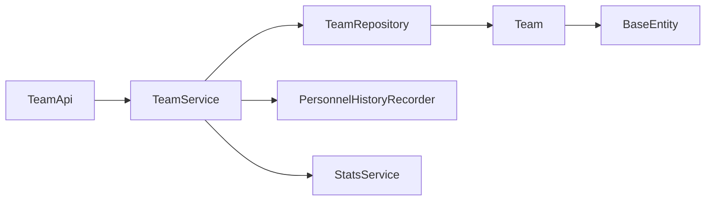

# 球队实体(Team)

## 目录
1. [简介](#简介)
2. [项目结构](#项目结构)
3. [核心组件](#核心组件)
4. [架构总览](#架构总览)
5. [详细组件分析](#详细组件分析)
6. [依赖关系分析](#依赖关系分析)
7. [性能考虑](#性能考虑)
8. [故障排查指南](#故障排查指南)
9. [结论](#结论)
10. [附录](#附录)

## 简介
本文档围绕球队实体 Team 的数据模型与业务实现进行系统化说明，覆盖字段定义、分类信息、生命周期字段、关联关系（球员、教练、比赛）、统计计算逻辑与缓存策略，以及 CRUD 操作示例和数据验证规则。目标是帮助开发者快速理解并正确使用球队实体的数据模型与服务能力。

## 项目结构
- 实体层：Team 继承 BaseEntity，承载球队主数据与审计字段。
- 仓储层：TeamRepository 提供按租户、联赛、ID 集合等查询与分页能力。
- 服务层：TeamService 封装创建、更新、删除、列表与选择项等业务流程，包含数据范围控制与联盟校验。
- API 层：TeamApi 暴露 REST 接口用于前端调用。
- DTO：TeamOptionDto 用于下拉选项等轻量返回。
- 关联与统计：通过 PersonnelHistoryRecorder 记录人员（教练）与球队的变动；通过 StatsService 计算球队战绩与排名。

## 核心组件
- 球队实体 Team：定义球队标识、基本信息、分类与展示配置等字段。
- 基础实体 BaseEntity：统一的主键、审计与软删除字段。
- 仓储 TeamRepository：提供按租户、联赛、ID 集合的查询与分页方法。
- 服务 TeamService：实现 CRUD、数据范围控制、联盟校验、历史变更记录。
- API TeamApi：对外暴露 /team 相关接口。
- DTO TeamOptionDto：用于下拉选项等场景的轻量数据传输对象。

## 架构总览
下图展示了从请求到存储的完整链路，包括权限与数据范围控制、联盟校验、历史记录与统计计算的参与点。

## 详细组件分析

### 球队实体 Team 数据模型
- 标识与基本信息
  - 名称 name：必填，最大长度限制，用于展示与检索。
  - 英文名 nameEn：可选，国际化展示。
  - 简称 shortName：可选，用于紧凑展示。
  - 队徽 logo：图片 URL，用于图标展示。
  - 文字标 wordmark：简化版队徽图片 URL。
  - 背景图 bgImage：可选，用于页面装饰。
- 分类与归属
  - 租户 tenantId：多租户隔离字段，由服务层在创建时注入。
  - 联赛 leagueId：所属联赛 ID，创建/更新时校验存在性与租户一致性。
  - 城市 city、主场 stadium：可选的地理与场地信息。
- 联系信息
  - 联系人 contactPerson、电话 contactPhone、邮箱 contactEmail：可选。
- 展示与认证
  - 门户展示 showInPortal：默认开启，控制是否在门户中显示。
  - 平台认证 verified：标记已认证球队。
  - 排序 sort：用于列表排序。
- 生命周期字段（来自 BaseEntity）
  - id：自增主键。
  - createdBy/createdAt：创建人与创建时间。
  - updatedBy/updatedAt：更新人与更新时间。
  - deletedBy/deletedAt：软删除标记。

### 数据验证规则
- 非空与长度约束
  - name：非空且最大长度限制。
  - 其他字符串字段：均带有最大长度限制。
- 空白值归一化
  - 服务层在创建/更新前将空白字符串统一置为 null，避免冗余存储。
- 联盟校验
  - 若传入 leagueId，需确保该联赛存在且属于当前租户，否则拒绝写入。

### 生命周期与状态
- 创建：自动填充 createdAt、updatedAt 与 createdBy（由框架监听器处理）。
- 更新：自动刷新 updatedAt 与 updatedBy。
- 删除：采用软删除，设置 deletedAt 与 deletedBy，查询时过滤已删除记录。
- 可见性：showInPortal 控制门户展示；verified 表示平台认证状态。

### 关联关系
- 与联赛 League：通过 leagueId 建立关联，创建/更新时校验联赛存在性与租户一致性。
- 与教练 Coach：通过 PersonnelHistoryRecorder 记录教练加入、离开、转会至某球队的事件，形成“教练-球队”的历史关联。
- 与比赛 Game：通过 StatsService 对每场比赛的胜负平进行聚合，计算球队战绩、积分、胜率、净胜分等指标，间接体现球队与比赛的关联。

### 统计信息与计算逻辑
- 战绩聚合：根据比赛结果累计胜、平、负场次，计算积分、胜率、净胜分等。
- 排名与差距：基于积分、负场、净胜分、队名等进行排序，并计算与前名的差距。
- 最近表现：取最近若干场比赛统计近期胜负平情况，辅助展示趋势。

### 缓存策略
- 当前代码未显式实现针对球队数据的缓存层。
- 建议策略（概念性）：
  - 读多写少场景：对球队下拉选项、详情等热点数据进行缓存（例如 Redis），设置合理过期时间与失效策略。
  - 统计结果：对球队排名、战绩等重计算结果进行缓存，并在赛事结果变更后触发失效或增量更新。
  - 注意：上述为通用优化建议，具体实现需结合系统现有缓存配置与访问模式评估。

[本节为概念性内容，不直接分析具体文件]

### CRUD 操作示例与数据流
- 创建球队
  - 接口：POST /team/create
  - 流程：参数校验 -> 设置租户ID -> 联盟校验 -> 保存 -> 返回新ID
- 更新球队
  - 接口：PUT /team/update/{id}
  - 流程：查找并校验租户 -> 空白归一化 -> 联盟校验 -> 保存 -> 记录人员历史
- 删除球队
  - 接口：DELETE /team/delete/{id}
  - 流程：查找并校验租户 -> 软删除（设置deletedAt/deletedBy）
- 列表与选择项
  - 接口：GET /team/list、GET /team/select-options
  - 流程：根据租户与数据范围构建查询 -> 分页/排序 -> 返回结果

## 依赖关系分析
- Team 依赖 BaseEntity 获得统一的审计与生命周期管理。
- TeamService 依赖 TeamRepository 进行数据存取，依赖 LeagueRepository 进行联盟校验，依赖 PersonnelHistoryRecorder 记录人员历史，依赖 TenantQueryPolicyService 与 DataScopeService 进行租户与数据范围控制。
- TeamApi 仅作为入口，委托 TeamService 执行业务。
- StatsService 通过赛事结果计算球队统计，间接与 Team 产生聚合关系。

## 性能考虑
- 查询优化
  - 使用分页与排序参数减少单次返回数据量。
  - 利用 Repository 提供的按租户、ID 集合查询方法，避免全表扫描。
- 数据归一化
  - 空白字符串归一化为 null，降低无效数据存储与比较开销。
- 统计计算
  - 对球队统计结果可引入缓存以减少重复计算；在赛事结果变更后及时失效或增量更新。
- 并发与事务
  - 删除操作使用事务注解保证一致性；高并发下注意幂等与锁机制。

[本节为通用指导，不直接分析具体文件]

## 故障排查指南
- 联盟不存在或租户不一致
  - 现象：创建/更新时报错提示联盟不存在或与当前租户不一致。
  - 排查：检查传入的 leagueId 是否存在且属于当前租户。
- 无权查看/修改/删除
  - 现象：查询、更新或删除时报 403。
  - 排查：确认当前用户的数据范围与租户匹配；检查数据范围策略。
- 软删除后无法获取
  - 现象：get 或 list 无法返回已删除记录。
  - 排查：确认查询条件过滤了 deletedAt 不为空的记录。

## 结论
Team 实体以清晰的字段划分承载球队标识、分类与展示配置，并通过 BaseEntity 统一管理生命周期。服务层实现了严格的租户隔离、联盟校验与数据范围控制，结合 PersonnelHistoryRecorder 与 StatsService 完善了人员历史与统计计算。整体设计兼顾可扩展性与可维护性，建议在热点场景引入缓存以提升性能。

## 附录
- 常用接口路径
  - 列表：GET /team/list
  - 详情：GET /team/{id}
  - 创建：POST /team/create
  - 更新：PUT /team/update/{id}
  - 删除：DELETE /team/delete/{id}
  - 下拉选项：GET /team/select-options

---

> 本文整理自 Qoder RepoWiki（基于代码自动生成），仅供参考，以代码为准。
