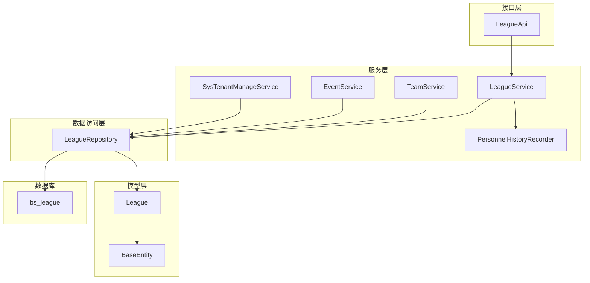
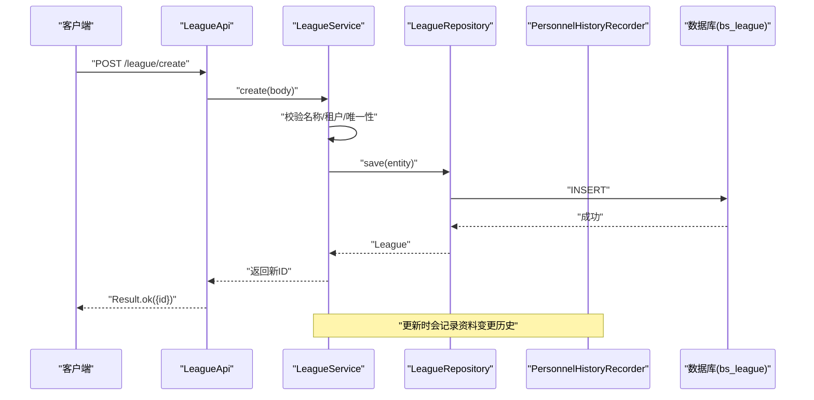
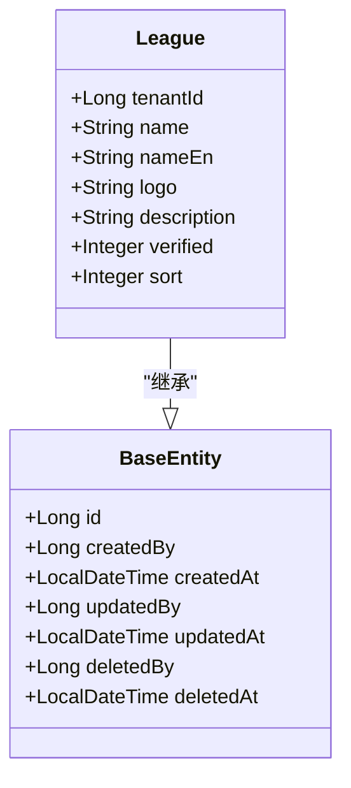
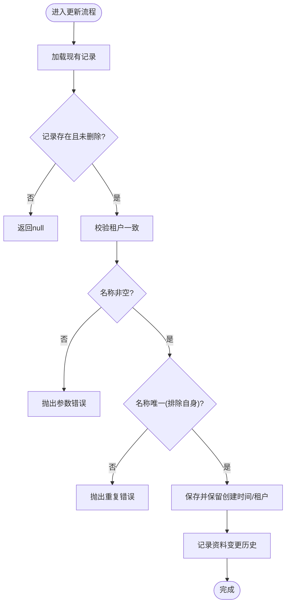
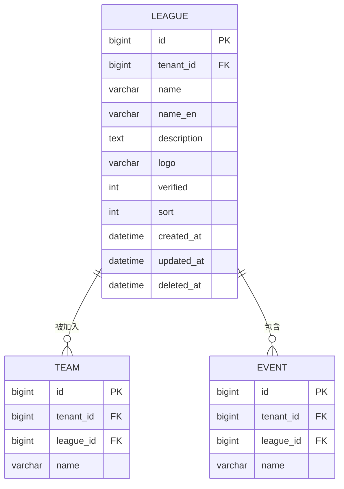
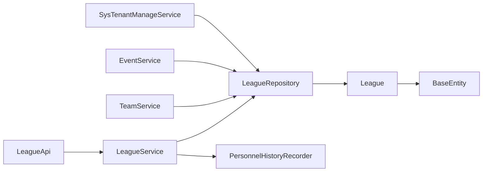

# 联赛实体(League)

## 目录
1. [简介](#简介)
2. [项目结构](#项目结构)
3. [核心组件](#核心组件)
4. [架构总览](#架构总览)
5. [详细组件分析](#详细组件分析)
6. [依赖关系分析](#依赖关系分析)
7. [性能考虑](#性能考虑)
8. [故障排查指南](#故障排查指南)
9. [结论](#结论)
10. [附录](#附录)

## 简介
本文件围绕联赛实体 League 的数据模型与业务实现，系统性说明其标识信息、分类信息、生命周期字段、与赛事/球队/球员的层级关系，以及当前代码中体现的积分规则、排名算法、升降级机制等。同时提供联赛管理的 CRUD 操作示例与配置要点，帮助开发者快速理解并正确使用该领域模型。

## 项目结构
围绕 League 的核心代码分布在以下层次：
- 数据模型层：League 实体定义，继承 BaseEntity 获得通用审计与软删除能力。
- 数据访问层：LeagueRepository 提供分页、租户隔离、名称唯一性校验等查询方法。
- 服务层：LeagueService 封装创建、更新、删除、查询等业务逻辑，集成权限与数据范围控制。
- 接口层：LeagueApi 暴露 RESTful 接口用于前端调用。
- 关联服务：TeamService、EventService 通过 leagueId 与 League 建立关联；SysTenantManageService 提供数据范围选项（联赛列表）。
- 数据库迁移：Flyway 脚本对 bs_league 表进行租户字段增强与约束。

## 核心组件
- 实体 League：承载联赛基本信息与元数据，包含租户、名称、英文名、Logo、描述、认证标记、排序等字段。
- 基础实体 BaseEntity：提供 id、创建人/时间、更新人/时间、删除人/时间等通用审计字段与自动填充。
- 仓库 LeagueRepository：提供按租户、是否已删除、ID 集合、名称存在性等查询能力。
- 服务 LeagueService：实现分页列表、详情获取、创建、更新、删除，内置租户隔离、数据范围控制、名称唯一性校验与历史变更记录。
- 接口 LeagueApi：对外暴露 /league/list、/league/{id}、/league/create、/league/update/{id}、/league/delete/{id} 等接口。
- 历史记录 PersonnelHistoryRecorder：在 League 更新时记录关键资料变更（名称、英文名、Logo）的历史。
- 关联服务 TeamService、EventService：通过 leagueId 与 League 建立“联赛-球队/赛事”的从属关系，并在创建/更新时校验联赛有效性及租户一致性。
- 租户管理 SysTenantManageService：提供数据范围选项，返回联赛与球队列表供界面选择。

## 架构总览
下图展示了从请求到持久化的完整链路，包括权限校验、数据范围过滤与历史记录写入。

## 详细组件分析

### 数据模型与字段语义
- 标识信息
  - 名称 name：必填，去空白后校验非空，同一租户内大小写不敏感的唯一性校验。
  - 简称 shortName：当前模型未定义该字段，如需扩展可在 League 中新增。
  - 描述 description：最大长度限制为 2000 字符。
  - 标志 icon/logo：使用 logo 字段存储 Logo URL。
- 分类信息
  - 类型 type：当前模型未定义该字段，如需扩展可在 League 中新增。
  - 级别 level：当前模型未定义该字段，如需扩展可在 League 中新增。
  - 赛季 season：当前模型未定义该字段，如需扩展可在 League 中新增。
- 生命周期与状态
  - 状态 status：当前模型未定义该字段，如需扩展可在 League 中新增。
  - 开始时间 startAt：当前模型未定义该字段，如需扩展可在 League 中新增。
  - 结束时间 endAt：当前模型未定义该字段，如需扩展可在 League 中新增。
  - 软删除 deletedAt：由 BaseEntity 提供，删除时设置。
  - 创建/更新时间 createdAt/updatedAt：由 BaseEntity 自动填充。
  - 创建/更新/删除人 createdBy/updatedBy/deletedBy：由 BaseEntity 自动或显式设置。
- 其他字段
  - 租户 tenantId：多租户隔离关键字段，创建/更新/查询均强制校验。
  - 认证 verified：平台认证标记，用于门户展示蓝色对勾等。
  - 排序 sort：用于列表排序展示。

### 业务逻辑与处理流程
- 列表查询 list
  - 支持全局模式与租户模式两种查询策略。
  - 根据数据范围 EffectiveDataScope 决定仅查指定联赛 ID 集合或全量。
  - 统一过滤已删除记录（deletedAt IS NULL）。
- 详情 get
  - 校验存在性与租户归属，再依据数据范围判断可读性。
- 创建 create
  - 强制设置租户，校验名称非空与唯一性，保存后返回新 ID。
- 更新 update
  - 校验存在性、租户归属、名称非空与唯一性（排除自身）。
  - 保留原始创建时间与租户，保存后记录资料变更历史（名称、英文名、Logo）。
- 删除 delete
  - 软删除：设置 deletedAt 与 deletedBy，事务保护。

### 与赛事、球队、球员的层级关系
- 联赛-球队：Team 通过 leagueId 关联 League。创建/更新球队时校验 leagueId 存在且未删除，且与当前租户一致。
- 联赛-赛事：Event 通过 leagueId 关联 League。创建/更新赛事时校验 leagueId 存在且未删除，且与当前租户一致，并受数据范围控制。
- 联赛-球员：当前代码未发现 Player 直接关联 League 的字段；通常球员通过球队间接归属联赛。若需直接关联，可在 Player 模型中扩展 leagueId 并在相关 Service 中增加校验。

### 积分规则、排名算法、升降级机制
- 当前代码未在 League 实体或相关 Service 中定义积分规则、排名算法与升降级机制的具体字段或逻辑。
- 建议扩展方向：
  - 在 League 中新增积分规则字段（如胜平负得分、加赛规则 JSON），用于后续统计计算。
  - 在赛事/比赛结果落库后，基于规则计算积分并生成排行榜。
  - 在赛季结束时，依据排名执行升降级，可引入赛季周期与升降级阈值。
- 注意：上述为设计建议，当前仓库未实现，请勿将其视为既有行为。

[本节为概念性说明，不涉及具体文件分析]

### CRUD 操作示例与配置
- 创建联赛
  - 接口：POST /league/create
  - 入参：League 对象（name 必填，去空白后校验；description 最长 2000；logo 可选；verified/sort 可选）
  - 返回：包含新 ID 的结果
  - 参考路径：`LeagueApi.create:58-62`
- 获取联赛详情
  - 接口：GET /league/{id}
  - 返回：League 对象（受数据范围与租户控制）
  - 参考路径：`LeagueApi.get:52-56`
- 更新联赛
  - 接口：PUT /league/update/{id}
  - 入参：League 对象（name 必填且唯一；其余字段按需更新）
  - 行为：保留创建时间/租户，记录资料变更历史（名称、英文名、Logo）
  - 参考路径：`LeagueApi.update:64-68`, `LeagueService.update:108-133`
- 删除联赛
  - 接口：DELETE /league/delete/{id}
  - 行为：软删除，设置 deletedAt 与 deletedBy
  - 参考路径：`LeagueApi.delete:70-74`, `LeagueService.delete:135-148`
- 列表查询
  - 接口：GET /league/list?page=&pageSize=&sortProp=&sortOrder=
  - 行为：分页、排序、租户隔离、数据范围过滤、忽略已删除
  - 参考路径：`LeagueApi.list:46-50`, `LeagueService.list:56-75`

## 依赖关系分析
- 耦合与内聚
  - LeagueService 聚合了 Repository、权限与数据范围、历史记录等能力，职责清晰。
  - TeamService/EventService 仅通过 leagueId 与 League 发生弱耦合，便于扩展与维护。
- 外部依赖
  - Spring Data JPA：分页、排序、命名查询。
  - Flyway：数据库版本管理与字段增强。
- 潜在循环依赖
  - 未见循环引用；League 与 Team/Event 通过外键与 Service 层校验形成单向依赖。

## 性能考虑
- 分页与排序
  - 列表查询通过 Pageable 实现分页与排序，避免一次性加载大量数据。
- 索引建议
  - 建议在 bs_league.tenant_id、deleted_at、name 上建立合适索引以优化分页与唯一性检查。
- 数据范围过滤
  - 通过 EffectiveDataScope 限定联赛 ID 集合，减少不必要扫描。
- 软删除
  - 所有查询默认过滤 deletedAt 非空记录，避免脏数据影响。

[本节为通用性能建议，不涉及具体文件分析]

## 故障排查指南
- 名称为空或重复
  - 现象：创建/更新时报错“联盟名称不能为空”或“联盟名称已存在”。
  - 原因：name 去空白后为空，或在同租户下重复。
  - 定位：`LeagueService.create:93-106`, `LeagueService.update:108-133`
- 无权限查看/修改/删除
  - 现象：报“无权查看/修改/删除该联盟”。
  - 原因：租户不一致或数据范围不包含该联赛。
  - 定位：`LeagueService.get:77-91`, `LeagueService.update:108-133`, `LeagueService.delete:135-148`
- 关联失败（球队/赛事）
  - 现象：创建/更新球队或赛事时报“联盟不存在”或“联盟与当前租户不一致”。
  - 原因：leagueId 无效或租户不一致。
  - 定位：`TeamService.create/update:118-160`, `EventService.create/update:95-139`

## 结论
League 实体在当前代码中提供了完善的标识信息与基础管理能力，并通过 BaseEntity 实现了统一的审计与软删除。结合 Team/Event 的关联校验，形成了清晰的“联赛-球队/赛事”层级关系。当前未实现类型、级别、赛季、状态、起止时间、积分规则、排名算法与升降级机制等高级特性，可按需在 League 及相关 Service 中扩展。建议优先完善字段与规则定义，再逐步实现统计与赛程编排逻辑。

[本节为总结性内容，不涉及具体文件分析]

## 附录
- 数据库字段增强
  - 为 bs_league 添加 tenant_id 并设置非空与外键约束，确保多租户隔离。
  - 参考路径：`V20260410160000__tenant_and_data_scope.sql:61-66`

---

> 本文整理自 Qoder RepoWiki（基于代码自动生成），仅供参考，以代码为准。
