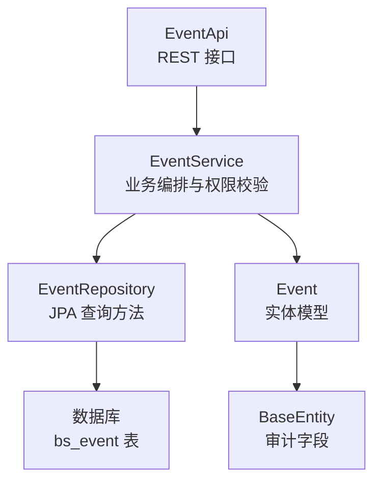
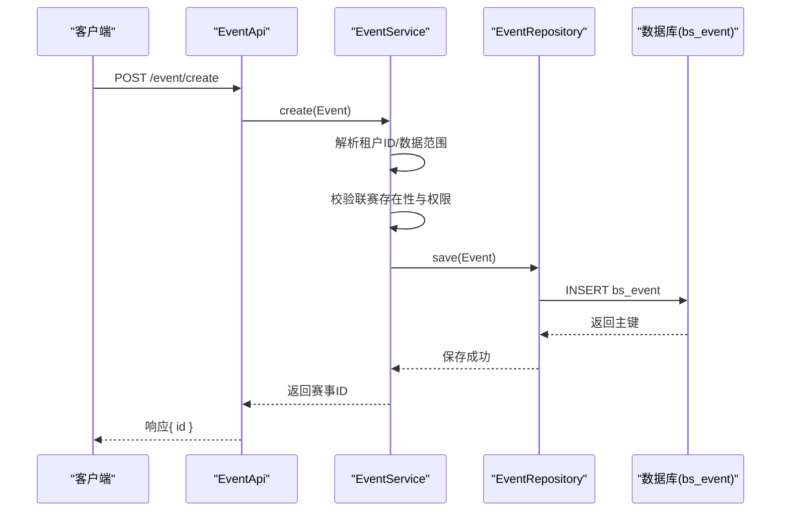
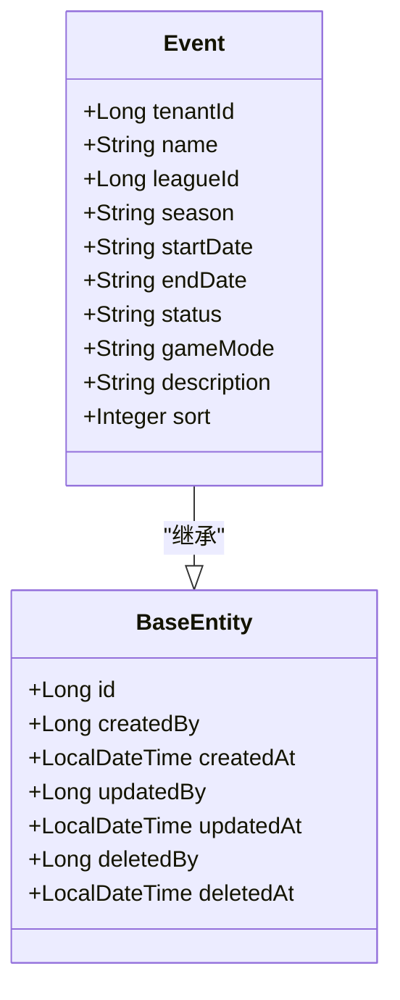
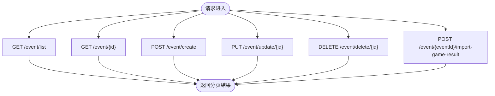
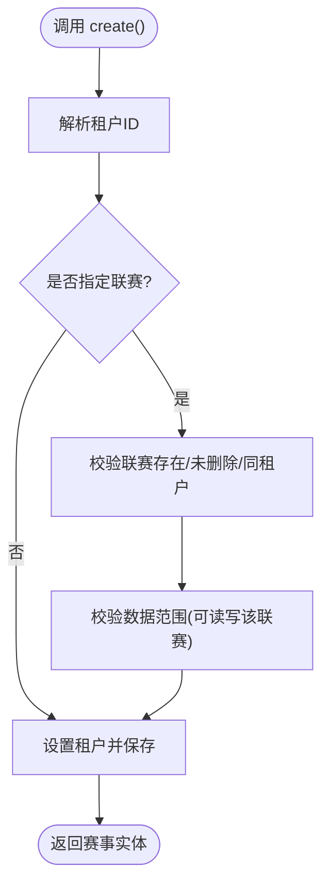
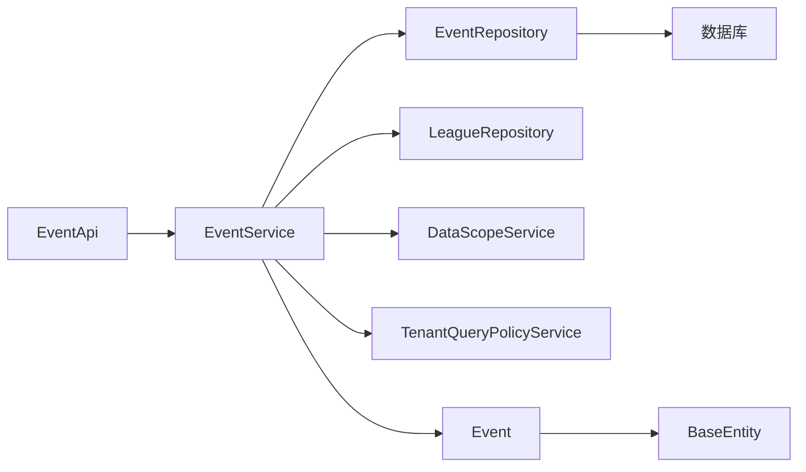
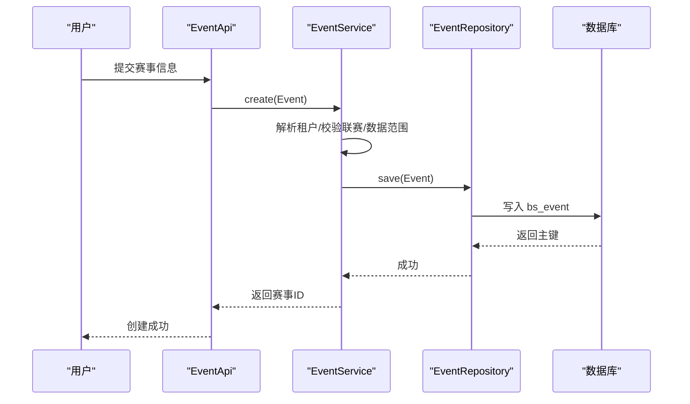

# 赛事实体(Event)

## 目录
1. [简介](#简介)
2. [项目结构](#项目结构)
3. [核心组件](#核心组件)
4. [架构总览](#架构总览)
5. [详细组件分析](#详细组件分析)
6. [依赖关系分析](#依赖关系分析)
7. [性能考虑](#性能考虑)
8. [故障排查指南](#故障排查指南)
9. [结论](#结论)
10. [附录](#附录)

## 简介
本文件围绕“赛事（Event）”数据模型与业务实现进行系统化说明，覆盖以下重点：
- 基本信息：名称、描述、开始/结束时间等
- 分类信息：类型、级别、状态等
- 关联关系：联赛（leagueId）、场馆（stadiumId）、主办方（organizerId）
- 统计信息：赛程安排、比赛数量、参与球队数量
- 业务逻辑：报名管理、资格认证、排名计算
- 生命周期：创建流程与状态转换

## 项目结构
围绕 Event 的核心代码分布在以下层次：
- 实体层：Event 定义数据库表结构与字段约束
- 服务层：EventService 封装创建、更新、删除、查询及权限校验
- 接口层：EventApi 暴露 REST 接口
- 数据访问层：EventRepository 提供分页与条件查询能力
- 基础能力：BaseEntity 提供通用审计字段；DbMigrationRunner 维护数据库迁移

## 核心组件
- 实体 Event：定义赛事主数据字段，包括租户隔离、名称、联赛归属、赛季、起止日期、状态、比赛模式、描述、排序等
- 服务 EventService：负责事件 CRUD、分页查询、数据范围控制、租户隔离、联赛有效性校验、软删除
- 接口 EventApi：对外暴露赛事的列表、详情、创建、更新、删除以及导入比赛结果入口
- 仓库 EventRepository：基于 Spring Data JPA 的分页与条件查询方法
- 基类 BaseEntity：统一审计字段（创建/修改/删除时间与操作人）

## 架构总览
下图展示从请求到持久化的完整链路，并标注关键校验点与权限边界。

## 详细组件分析

### 数据模型：Event 实体
- 标识与审计：继承 BaseEntity，包含 id、创建/更新时间、创建/更新/删除操作人等
- 多租户：tenantId 用于租户隔离
- 基本信息：name（名称）、description（描述，最大长度限制）、sort（排序）
- 时间信息：startDate（开始日期）、endDate（结束日期）
- 分类信息：status（状态，默认草稿）、gameMode（比赛模式，如棒球/垒球）
- 关联信息：leagueId（所属联赛）

### 接口层：EventApi
- 列表查询：支持分页、排序参数
- 详情获取：按 ID 获取，不存在或已删除返回 404
- 创建：接收 Event 对象，返回新赛事 ID
- 更新：按 ID 更新，使用 @Valid 校验
- 删除：软删除
- 导入比赛结果：转发至 GameService

### 服务层：EventService
- 列表：根据全局/租户模式与数据范围过滤，支持分页与排序
- 详情：校验租户与数据范围，无权限抛异常
- 创建：校验联赛存在性、租户一致性与数据范围，设置租户后保存
- 更新：校验原记录与目标联赛权限，保留审计字段
- 删除：软删除，记录删除人与时间

### 数据访问层：EventRepository
- 提供多种分页与条件查询方法，支持按租户、联赛集合、删除标记过滤
- 典型用法：按租户+联赛集合查询、仅按租户查询、忽略删除标记的全局查询

### 数据库迁移与表结构
- 通过 DbMigrationRunner 在启动时执行 SQL 迁移，确保表结构与注释正确
- 涉及人员变更历史等表的字段补齐，间接体现系统对“事件/快照”记录的扩展能力

## 依赖关系分析
- EventApi 依赖 EventService 与 GameService
- EventService 依赖 EventRepository、LeagueRepository、DataScopeService、TenantQueryPolicyService
- EventRepository 依赖 JPA 与数据库
- Event 实体依赖 BaseEntity

## 性能考虑
- 分页与排序：列表查询通过 Pageable 构建，避免全表扫描
- 数据范围过滤：结合租户与联赛集合缩小查询范围，减少不必要的数据加载
- 软删除：通过 deletedAt 过滤，保证查询效率与数据一致性
- 建议：为常用查询条件（tenantId、leagueId、deletedAt）建立索引以提升性能

## 故障排查指南
- 404 未找到：详情接口当赛事不存在或已删除时返回 404
- 403 无权限：更新/删除/创建时若数据范围不允许访问对应联赛，将抛出无权限异常
- 400 参数错误：联赛不存在或未删除或不属于当前租户时，创建/更新会失败
- 软删除：删除接口不会物理删除，而是设置 deletedAt 与 deletedBy

## 结论
Event 作为赛事主数据，具备清晰的字段定义与完善的权限控制。通过服务层的租户隔离与数据范围校验，保障多租户环境下的数据安全。API 层提供完整的 CRUD 与结果导入入口，便于后续赛程与比赛数据的组织。建议在数据库中完善索引以优化查询性能，并在前端配合状态枚举进行可视化展示。

## 附录

### 字段与类型说明（Event）
- 基本标识与审计：id、createdBy、createdAt、updatedBy、updatedAt、deletedBy、deletedAt
- 多租户：tenantId
- 基本信息：name、description（最大长度限制）、sort
- 时间信息：startDate、endDate
- 分类信息：status（默认草稿）、gameMode（BASEBALL/SOFTBALL）
- 关联信息：leagueId（所属联赛）

### 业务流程：赛事创建

### 状态转换图（概念）
- 初始状态：草稿（draft）
- 进行中：scheduled/live
- 结束：final
- 其他：postponed/cancelled
说明：上述状态为常见赛事状态语义，具体枚举值与转换规则需结合前端与业务约定。

[本节为概念性说明，不直接映射到具体源码文件]

### 关联关系说明
- 联赛（leagueId）：Event 通过 leagueId 关联 League，服务层在创建/更新时校验联赛存在性与租户一致性
- 场馆（stadiumId）：当前 Event 实体未包含 stadiumId 字段；如需关联可在实体中扩展并补充校验逻辑
- 主办方（organizerId）：当前 Event 实体未包含 organizerId 字段；如需关联可在实体中扩展并补充校验逻辑

### 统计信息与业务逻辑（现状与建议）
- 赛程安排：可通过赛事的 startDate/endDate 与后续 Game 数据进行编排
- 比赛数量：通过关联 Game 统计
- 参与球队数量：通过关联 Team 与参赛关系统计
- 报名管理：可在赛事维度增加报名相关实体与流程
- 资格认证：可在报名/参赛环节引入资格校验
- 排名计算：可在赛事/联赛维度基于比赛结果计算排名
说明：以上为扩展建议，当前 Event 实体与服务主要聚焦赛事主数据与权限控制。

[本节为概念性说明，不直接映射到具体源码文件]

---

> 本文整理自 Qoder RepoWiki（基于代码自动生成），仅供参考，以代码为准。
