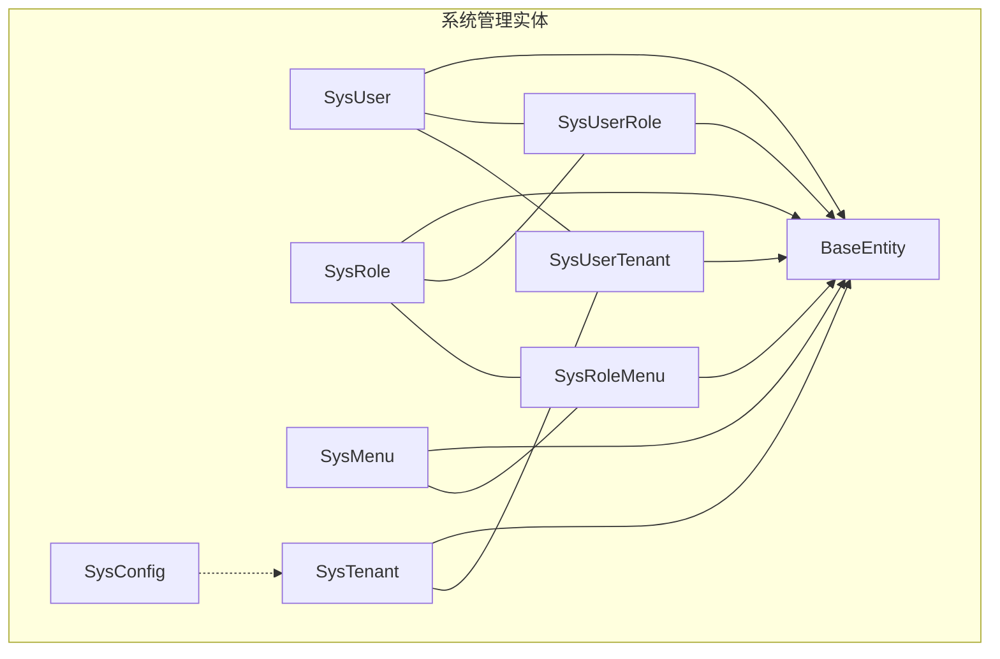
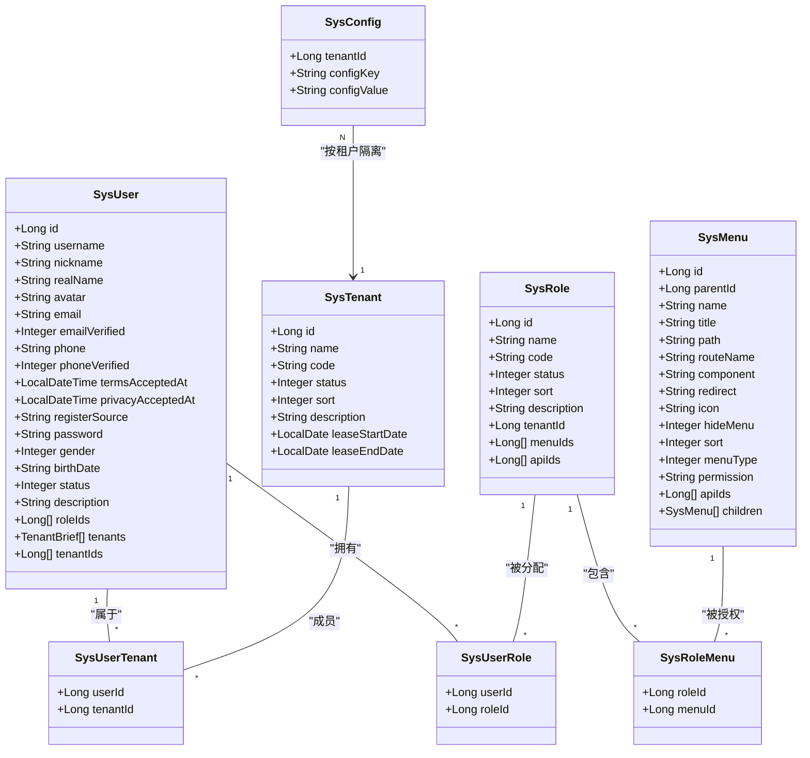
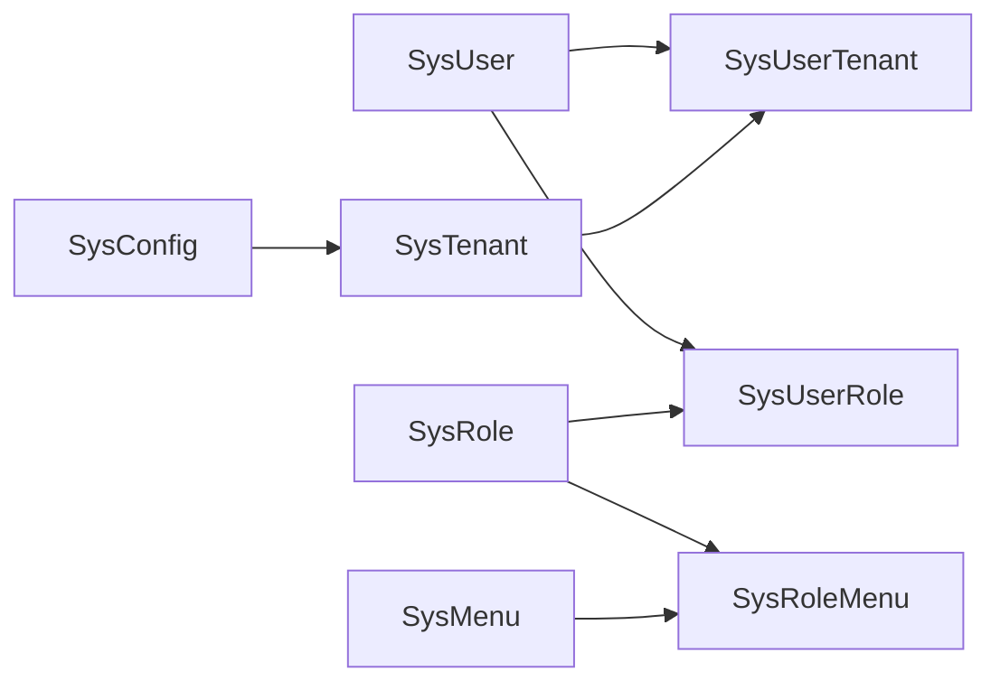
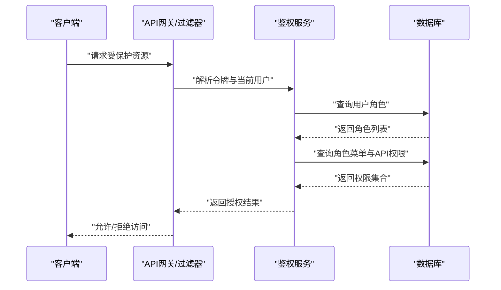
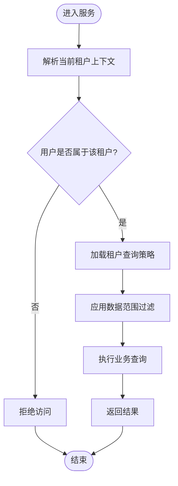

# 系统管理实体

## 目录
1. [简介](#简介)
2. [项目结构](#项目结构)
3. [核心组件](#核心组件)
4. [架构总览](#架构总览)
5. [详细组件分析](#详细组件分析)
6. [依赖关系分析](#依赖关系分析)
7. [性能考虑](#性能考虑)
8. [故障排查指南](#故障排查指南)
9. [结论](#结论)
10. [附录](#附录)

## 简介
本文件聚焦于系统管理实体的数据模型与权限控制机制，覆盖用户、角色、菜单、租户、配置等核心实体，详细说明字段定义、RBAC多对多关系、多租户隔离策略、安全相关字段设计、审计日志记录与操作追踪，以及权限继承与角色分配的数据库实现方案。文档以代码级实体为依据，提供可视化图表辅助理解。

## 项目结构
系统管理相关实体位于 model/entity 包中，采用 JPA 注解映射到数据库表；关联关系通过中间表（如用户-角色、角色-菜单、用户-租户）实现；基础审计字段由 BaseEntity 统一提供；配置项使用复合主键按租户维度隔离。

**图示来源**
- `SysUser.java:31-78`
- `SysRole.java:27-50`
- `SysMenu.java:29-68`
- `SysTenant.java:29-57`
- `SysConfig.java:26-40`
- `BaseEntity.java:37-58`
- `SysUserRole.java:22-30`
- `SysRoleMenu.java:22-30`
- `SysUserTenant.java:20-28`

## 核心组件
- 用户(SysUser)：账号、认证信息、状态、联系方式、协议接受时间、所属租户与角色集合等。
- 角色(SysRole)：角色名称、编码、状态、排序、说明、租户归属、关联菜单与API集合。
- 菜单(SysMenu)：层级化菜单树、类型（目录/菜单/按钮）、路径、路由、组件、图标、隐藏标志、排序、权限标识、关联API集合。
- 租户(SysTenant)：租户名称、唯一编码、状态、排序、说明、租赁起止日期。
- 配置(SysConfig)：按租户+配置键的键值对配置，支持文本型配置值。
- 基础实体(BaseEntity)：统一的主键、创建人/时间、更新人/时间、删除人/时间等审计字段。
- 关联实体：用户-角色、角色-菜单、用户-租户。

## 架构总览
下图展示 RBAC 权限模型中的多对多关系与多租户隔离点：用户通过用户-角色关联获得角色权限，角色通过角色-菜单关联获得菜单与按钮权限；租户维度通过用户-租户关联与角色租户归属进行数据隔离；配置按租户+键隔离。

**图示来源**
- `SysUser.java:31-78`
- `SysRole.java:27-50`
- `SysMenu.java:29-68`
- `SysTenant.java:29-57`
- `SysConfig.java:26-40`
- `SysUserRole.java:22-30`
- `SysRoleMenu.java:22-30`
- `SysUserTenant.java:20-28`

## 详细组件分析

### 用户(SysUser)
- 字段要点
  - 身份与认证：用户名、昵称、真实姓名、头像、邮箱及验证标记、手机号及验证标记、密码（密文存储）。
  - 业务属性：性别、生日、注册来源、状态、说明。
  - 合规与协议：接受服务协议与隐私政策时间。
  - 关联扩展：角色ID列表、租户列表与租户ID列表（用于前端或接口层聚合）。
- 安全相关
  - 密码字段为只写，避免序列化泄露。
  - 邮箱/手机验证标记用于二次校验流程。
- 审计字段
  - 继承自 BaseEntity：id、创建人/时间、更新人/时间、删除人/时间。

### 角色(SysRole)
- 字段要点
  - 角色名称、编码（唯一性标识）、状态、排序、说明。
  - 租户归属：tenantId 为空表示系统级角色，非空表示租户级角色。
  - 关联扩展：菜单ID列表、API ID列表（用于权限装配）。
- 权限控制
  - 通过角色-菜单关联决定菜单与按钮可见性。
  - 通过角色-API关联决定接口访问权限（结合菜单的权限标识）。

### 菜单(SysMenu)
- 字段要点
  - 层级结构：父菜单ID、类型（目录/菜单/按钮）、排序。
  - 展示信息：名称、标题、路径、路由名、组件、重定向、图标、是否隐藏。
  - 权限标识：permission 用于按钮级权限控制。
  - 关联扩展：API ID列表、子菜单集合。
- 权限控制
  - 菜单类型区分导航与按钮，按钮通常绑定具体权限标识。
  - 通过角色-菜单关联将菜单与按钮权限授予角色。

### 租户(SysTenant)
- 字段要点
  - 租户名称、唯一编码、状态、排序、说明。
  - 租赁周期：开始与结束日期，用于租户生命周期管理。
- 多租户隔离
  - 角色可归属特定租户或系统级。
  - 用户通过用户-租户关联加入租户。
  - 配置按租户+键隔离。

### 配置(SysConfig)
- 字段要点
  - 复合主键：租户ID + 配置键，确保每个租户内配置键唯一。
  - 配置值：文本类型，支持复杂配置内容。
- 多租户隔离
  - 通过租户ID限定配置作用域，实现租户级配置隔离。

### 关联实体
- 用户-角色(SysUserRole)
  - 字段：用户ID、角色ID；唯一约束保证用户-角色组合唯一。
  - 作用：实现用户与角色的多对多关系。
- 角色-菜单(SysRoleMenu)
  - 字段：角色ID、菜单ID；唯一约束保证角色-菜单组合唯一。
  - 作用：实现角色与菜单的多对多关系，支撑菜单与按钮权限。
- 用户-租户(SysUserTenant)
  - 字段：用户ID、租户ID。
  - 作用：实现用户与租户的多对多关系，支撑多租户数据隔离。

### 审计与操作追踪
- 基础审计字段
  - 所有实体继承 BaseEntity，自动维护主键、创建人/时间、更新人/时间、删除人/时间。
  - 通过 JPA 监听器在持久化与更新时自动填充审计字段。
- 操作日志
  - 系统提供登录日志与操作日志实体与服务，用于记录登录行为与关键操作轨迹（与本文档主题相关，便于审计追溯）。

## 依赖关系分析
- 实体耦合
  - 用户、角色、菜单通过中间表解耦，降低直接耦合度，提升灵活性。
  - 租户作为隔离维度贯穿角色、用户、配置。
- 外部依赖
  - JPA/Hibernate 注解驱动 ORM 映射。
  - Lombok 生成 Getter/Setter/构造器等样板代码。
- 潜在循环依赖
  - 菜单实体包含子菜单集合，但仅为内存组装视图，不引入持久化循环引用。

**图示来源**
- `SysUser.java:31-78`
- `SysRole.java:27-50`
- `SysMenu.java:29-68`
- `SysTenant.java:29-57`
- `SysConfig.java:26-40`
- `SysUserRole.java:22-30`
- `SysRoleMenu.java:22-30`
- `SysUserTenant.java:20-28`

## 性能考虑
- 索引建议
  - 用户-角色、角色-菜单、用户-租户关联表应建立联合唯一索引（已声明），并针对查询高频列添加索引（如 user_id、role_id、menu_id、tenant_id）。
- 查询优化
  - 菜单树构建建议在应用层缓存，减少递归查询开销。
  - 配置读取可按租户+键缓存，降低重复读取成本。
- 事务边界
  - 批量分配角色/菜单时，合理划分事务边界，避免长事务锁竞争。

[本节为通用指导，无需列出具体文件来源]

## 故障排查指南
- 权限不生效
  - 检查用户是否已分配角色，角色是否已关联菜单/API。
  - 确认菜单类型与权限标识是否正确设置。
- 多租户数据越界
  - 核对用户-租户关联是否存在，查询是否携带正确的租户上下文。
  - 检查角色是否误配为系统级导致跨租户可见。
- 配置未生效
  - 确认配置键在目标租户下存在且未被覆盖。
  - 检查配置值格式是否符合预期。

## 结论
本数据模型通过清晰的实体设计与关联表实现了灵活的 RBAC 权限体系与多租户隔离。用户、角色、菜单之间的多对多关系通过中间表解耦，租户维度贯穿角色、用户与配置，确保数据隔离与权限控制的一致性。基础审计字段与操作日志为安全与合规提供了必要支撑。

[本节为总结性内容，无需列出具体文件来源]

## 附录

### RBAC 权限模型关系图

**图示来源**
- `SysUser.java:31-78`
- `SysRole.java:27-50`
- `SysMenu.java:29-68`
- `SysUserRole.java:22-30`
- `SysRoleMenu.java:22-30`

### 多租户数据访问流程图

**图示来源**
- `SysUserTenant.java:20-28`
- `SysTenant.java:29-57`

---

> 本文整理自 Qoder RepoWiki（基于代码自动生成），仅供参考，以代码为准。
