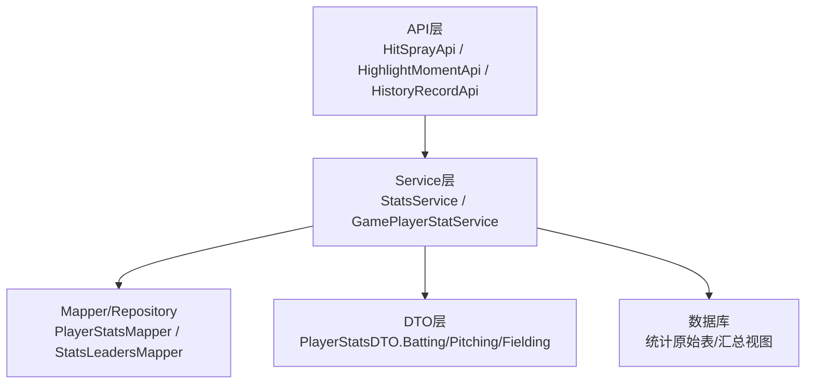
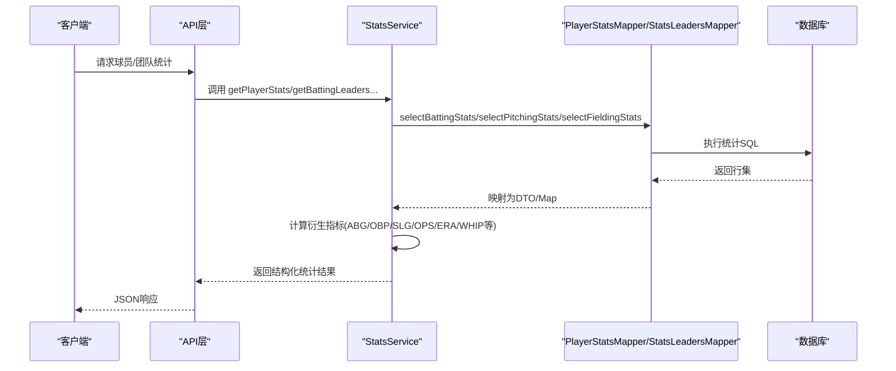
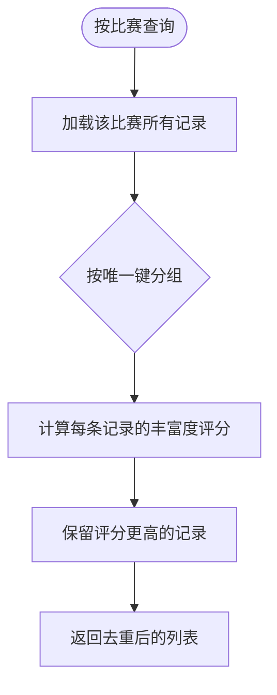
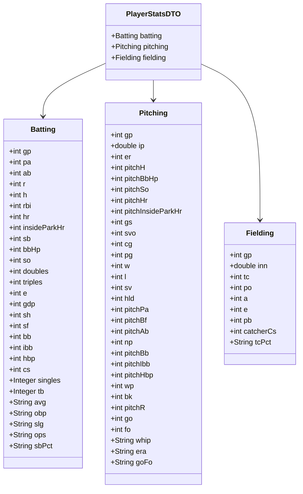
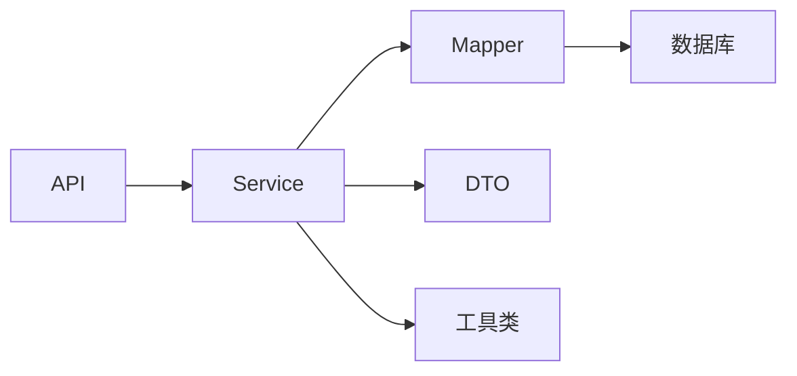

# 统计实体

## 目录
1. [简介](#简介)
2. [项目结构](#项目结构)
3. [核心组件](#核心组件)
4. [架构总览](#架构总览)
5. [详细组件分析](#详细组件分析)
6. [依赖关系分析](#依赖关系分析)
7. [性能考虑](#性能考虑)
8. [故障排查指南](#故障排查指南)
9. [结论](#结论)
10. [附录](#附录)

## 简介
本文件聚焦于棒球统计实体的数据模型与计算逻辑，覆盖比赛球员统计数据（GamePlayerStat）、击球热区（HitSpray）、精彩时刻（HighlightMoment）、历史记录（HistoryRecord）等关键实体。文档重点说明：
- 字段定义与业务含义（含击球率、本垒打数、防守数据等专业指标）
- 统计数据的聚合计算与展示格式
- 缓存策略与性能优化建议
- 历史数据归档、报表生成与导出支持
- 统计查询的SQL优化与索引设计建议

## 项目结构
围绕统计能力的相关代码主要分布在以下层次：
- API层：暴露统计相关接口（如击球热区、精彩时刻、历史记录）
- Service层：负责统计聚合、格式化、分页与排序
- DTO层：承载对外展示的统计结果（击球/投球/防守三维度）
- Repository/Mapper层：提供数据访问与复杂查询（由服务调用）

**图示来源**
- `HitSprayApi.java:35-65`
- `HighlightMomentApi.java:41-67`
- `HistoryRecordApi.java:35-55`
- `StatsService.java:80-110`
- `GamePlayerStatService.java:20-34`

## 核心组件
- 比赛球员统计数据（GamePlayerStat）
  - 用于记录单场比赛中每位球员的击球、跑垒、防守、投球等多维原始统计
  - 服务层提供按比赛查询、去重与“丰富度”择优策略，保证同一角色在同一比赛中保留信息更完整的记录
- 击球热区（HitSpray）
  - 通过API提供保存、批量保存与按比赛/球员/队伍查询的能力，支撑可视化与战术分析
- 精彩时刻（HighlightMoment）
  - 提供列表、创建、更新、删除等基础CRUD能力，支持按主题类型、媒体类型、状态等筛选
- 历史记录（HistoryRecord）
  - 提供分页列表与创建能力，支持按目标类型、关联对象、记录类型、时间范围等条件检索，便于审计与回溯

## 架构总览
统计能力以Service为核心，聚合来自Mapper的数据并转换为统一的DTO结构，再经API暴露给前端或外部系统。

**图示来源**
- `StatsService.java:93-110`
- `StatsService.java:663-726`

## 详细组件分析

### 比赛球员统计数据（GamePlayerStat）
- 职责
  - 存储每场比赛的球员原始统计（击球、跑垒、防守、投球）
  - 提供按比赛查询与去重策略，确保同一角色在同一比赛中仅保留信息最完整的一条
- 关键字段（示例）
  - 击球/跑垒：PA、AB、R、H、RBI、HR、InsideParkHR、SB、SO、Doubles、Triples、BB、HBP、CS、SH、SF、E、GDP
  - 投球：IP、ER、PitchH、PitchBbHp、PitchSo、PitchHr、PitchInsideParkHr、Np、Wp、Bk、PitchPa、PitchBf、PitchAb、PitchR、Go、Fo
  - 防守：PO、A、TC、PB、CatcherCs
  - 角色标识：IsPitcher、BattingOrder、PitcherOrder、ListOrder、Position
- 去重与丰富度评分
  - 构建唯一键：基于比赛ID、队伍ID、球员ID、是否投手、击球顺序、投球顺序、名单顺序、位置
  - 丰富度评分：对关键统计字段非空计数，选择更“丰富”的记录作为最终值
- 典型流程

**图示来源**
- `GamePlayerStatService.java:24-34`
- `GamePlayerStatService.java:54-91`

### 击球热区（HitSpray）
- 职责
  - 记录每次击球的落点/区域信息，用于热区图与战术分析
- 能力
  - 保存单个/批量保存
  - 按比赛、球员+比赛、队伍+比赛查询
- 使用场景
  - 可视化击球分布、评估不同位置打击效率、对比不同打线/对手

### 精彩时刻（HighlightMoment）
- 职责
  - 管理比赛中的高光片段（视频/图片/链接），支持按主题类型、媒体类型、状态筛选
- 能力
  - 列表分页、创建、更新、删除
- 使用场景
  - 赛事集锦、回放、社交媒体传播

### 历史记录（HistoryRecord）
- 职责
  - 记录实体变更历史，支持按目标类型、关联对象、记录类型、时间范围检索
- 能力
  - 列表分页、创建
- 使用场景
  - 审计追踪、问题回溯、合规检查

### 棒球统计指标数据结构与计算逻辑
- 击球（Batting）
  - 基础字段：GP、PA、AB、R、H、RBI、HR、InsideParkHR、SB、BB/HBP、SO、Doubles、Triples、E、GDP、SH、SF、BB、IBB、HBP、CS
  - 衍生字段：Singles、TB、AVG、OBP、SLG、OPS、SB%
  - 计算要点
    - 一安打数 = H - (二垒打 + 三垒打 + 全垒打 + 场内全垒打)
    - 总垒打数 = 一×1 + 二×2 + 三×3 + 全×4 + 场内全×4
    - AVG = H / AB（AB>0时）
    - OBP 分子采用 BB + HBP 或兼容旧字段 BBHP
    - SLG = TB / AB（AB>0时）
    - OPS = OBP + SLG（AB>0且PA>0时）
    - SB% = SB / (SB + CS)（有尝试时）
- 投球（Pitching）
  - 基础字段：GP、IP、ER、PitchH、PitchBbHp、PitchSo、PitchHr、PitchInsideParkHr、GS、SVO、CG、PG、W、L、SV、HLD、PitchPa、PitchBf、PitchAb、NP、PitchBb、PitchIbb、PitchHbp、WP、BK、PitchR、GO、FO
  - 衍生字段：WHIP、ERA、GO/FO
  - 计算要点
    - WHIP = (H + BB/HBP) / IP（IP>0时）
    - ERA = 9 × ER / IP（IP>0时）
    - GO/FO = GO / FO（FO>0时）
- 防守（Fielding）
  - 基础字段：GP、INN、TC、PO、A、E、PB、CatcherCs
  - 衍生字段：TC%
  - 计算要点
    - TC优先取直接值，否则用 PO + A + E
    - TC% = (PO + A) / TC（TC>0时）
    - INN 统一为标准棒球局数格式

**图示来源**
- `PlayerStatsDTO.java:16-19`
- `PlayerStatsDTO.java:105-134`
- `PlayerStatsDTO.java:582-592`
- `PlayerStatsDTO.java:757-789`

## 依赖关系分析
- API → Service：接口层仅做参数校验与转发，不承载业务逻辑
- Service → Mapper：复杂统计查询下推到数据库层，减少内存压力
- Service → DTO：将底层行数据转换为稳定的展示结构，屏蔽实现细节
- Service → 工具类：统一数值格式化与单位换算（如局数标准化、百分比/小数格式化）

**图示来源**
- `StatsService.java:80-110`
- `StatsService.java:663-726`

## 性能考虑
- 查询与聚合
  - 将聚合计算尽量下推到数据库层（通过Mapper SQL），避免在应用层进行大规模计算
  - 使用分页与限制返回条数（如游戏日志limit上限），防止大结果集导致内存抖动
- 去重与择优
  - 对同角色多记录采用“丰富度评分”择优，减少冗余传输与展示
- 缓存策略建议
  - 热点榜单/排行榜可引入Redis缓存，设置合理TTL并按事件/赛季维度分片
  - 玩家个人统计可按“玩家ID+赛季/模式”缓存，结合失效策略（比赛结束后刷新）
- 批处理与异步
  - 批量保存击球热区、精彩时刻等可采用事务批处理，降低往返次数
  - 历史记录的写入可异步化，避免阻塞主流程
- 索引设计建议（面向统计查询）
  - 比赛球员统计：(gameId, teamId, playerId, isPitcher, position) 复合索引，加速去重与过滤
  - 击球热区：(gameId), (playerId, gameId), (teamId, gameId) 索引，加速按维度查询
  - 精彩时刻：(subjectType, subjectId), (mediaType), (status) 索引，提升筛选效率
  - 历史记录：(targetType, targetId), (relatedObjectType, relatedObjectId), (type, recordType), (createdAt) 索引，支持多维检索与时间范围扫描
  - 统计排行：为常用排序列建立合适索引（如era、avg、hr、rbi、so、sb等），并结合覆盖索引减少回表

[本节为通用性能建议，无需特定文件引用]

## 故障排查指南
- 统计为空或异常
  - 检查租户解析与游戏模式归一化是否正确
  - 核对Mapper返回字段名与Service映射是否一致（大小写/驼峰转换）
  - 关注异常捕获与降级返回（空统计/空列表）
- 去重不符合预期
  - 确认唯一键构建逻辑是否包含必要维度（比赛、队伍、球员、角色、顺序、位置）
  - 检查丰富度评分是否覆盖了关键统计字段
- 性能问题
  - 查看慢查询日志，确认是否命中索引
  - 对大结果集查询增加分页与限制
  - 对高频读取的榜单/详情启用缓存

## 结论
本项目围绕比赛球员统计、击球热区、精彩时刻与历史记录构建了清晰的分层架构与完善的统计计算体系。通过Service层的聚合与DTO标准化，既保证了统计口径的一致性，也提升了可读性与扩展性。配合合理的缓存与索引策略，可在高并发场景下稳定输出高质量统计结果。后续可进一步细化历史归档策略与报表导出能力，以满足更广泛的运营与分析需求。

## 附录
- 历史数据归档
  - 建议按赛季/年份对历史数据进行分区或归档表迁移，保持在线表体量可控
  - 归档后保留只读副本供报表与审计使用
- 统计报表生成
  - 基于现有Leader/Team/Standings接口组合数据，生成PDF/Excel报表
  - 支持按事件、年份、队伍、主客场等维度筛选
- 数据导出
  - 提供CSV/Excel导出接口，注意大数据量下的流式导出与内存控制
  - 导出内容应包含必要元数据（时间范围、筛选条件、数据来源）

[本节为概念性说明，无需特定文件引用]

---

> 本文整理自 Qoder RepoWiki（基于代码自动生成），仅供参考，以代码为准。
