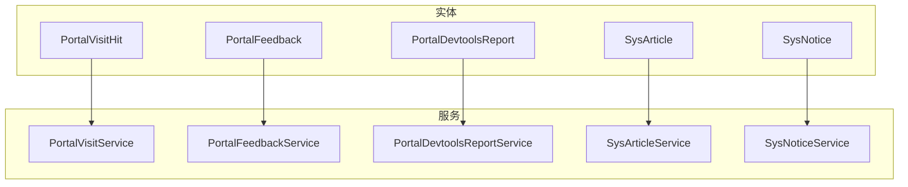
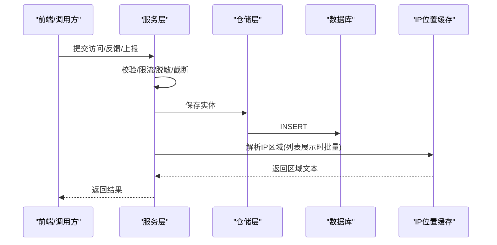
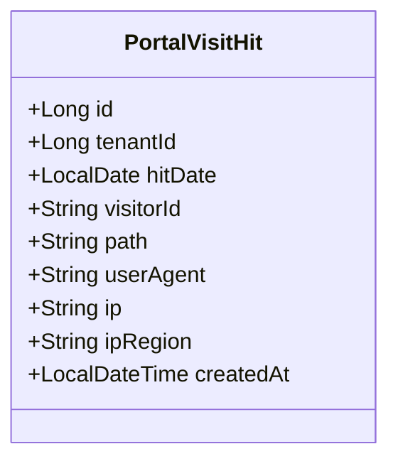
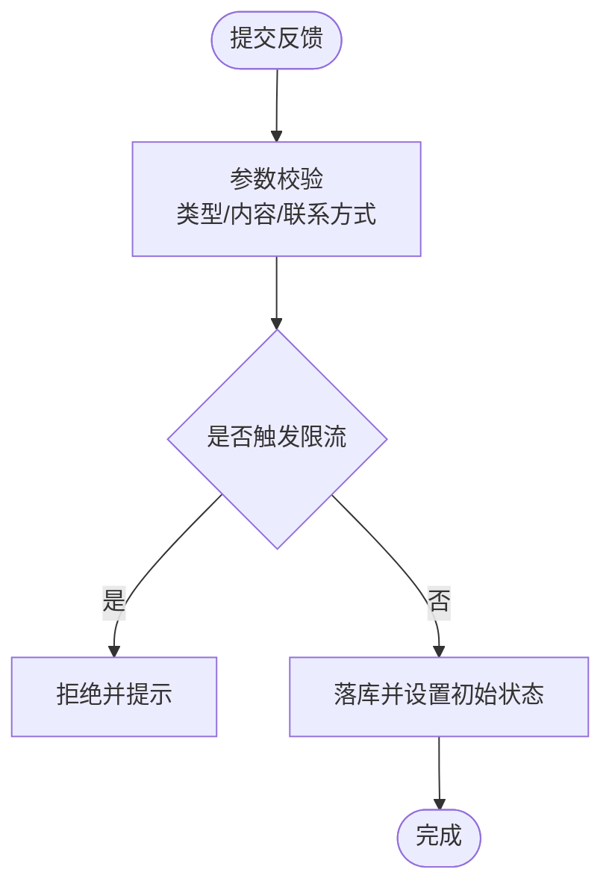
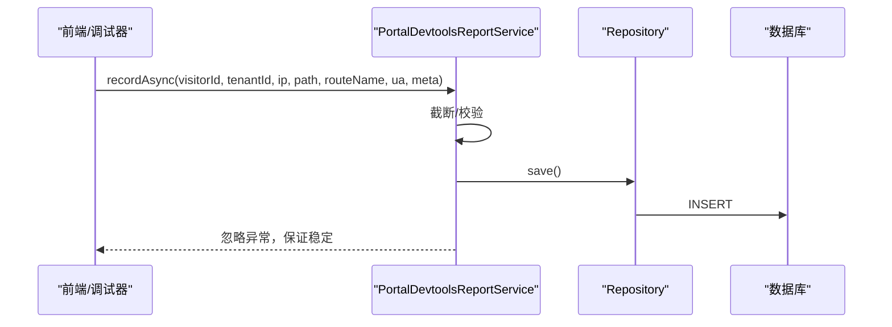
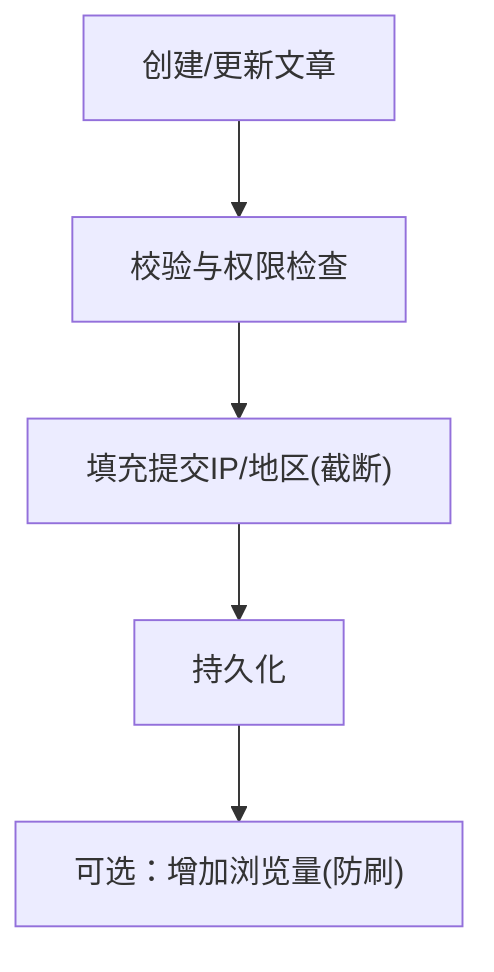
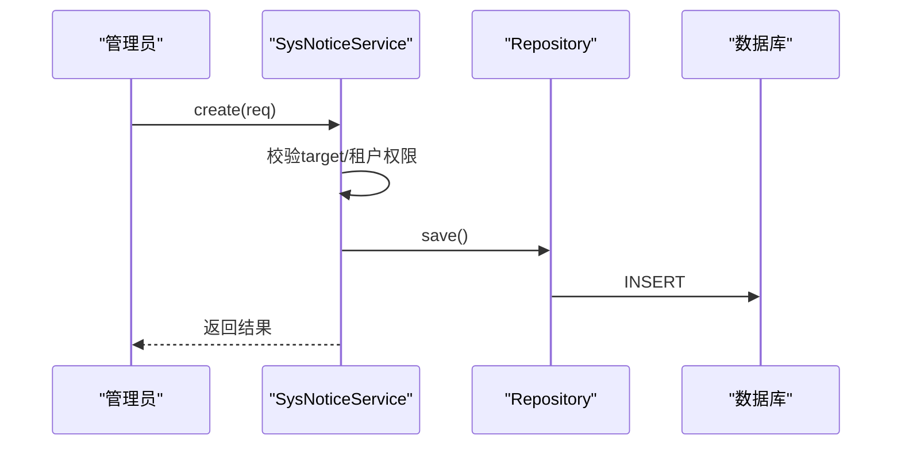
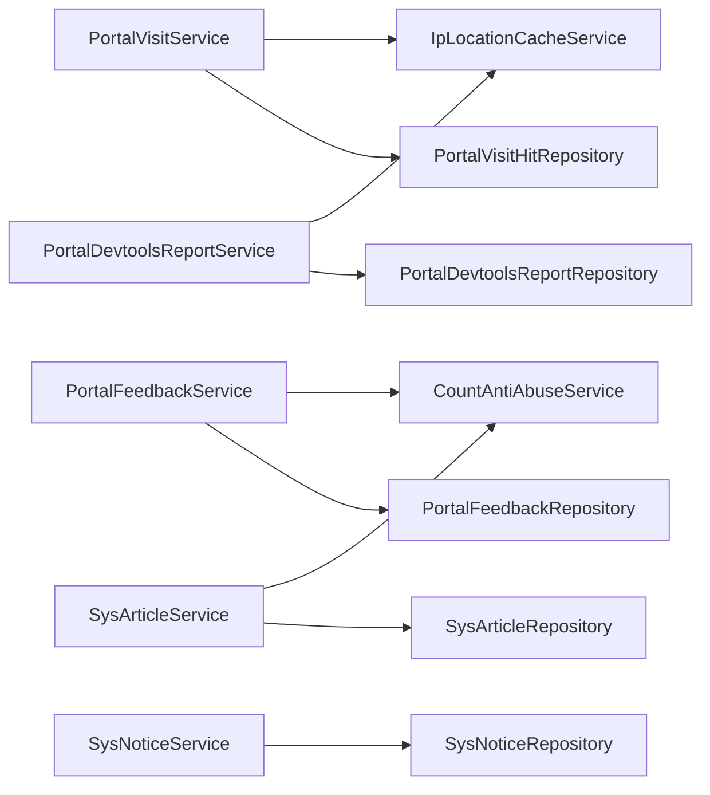
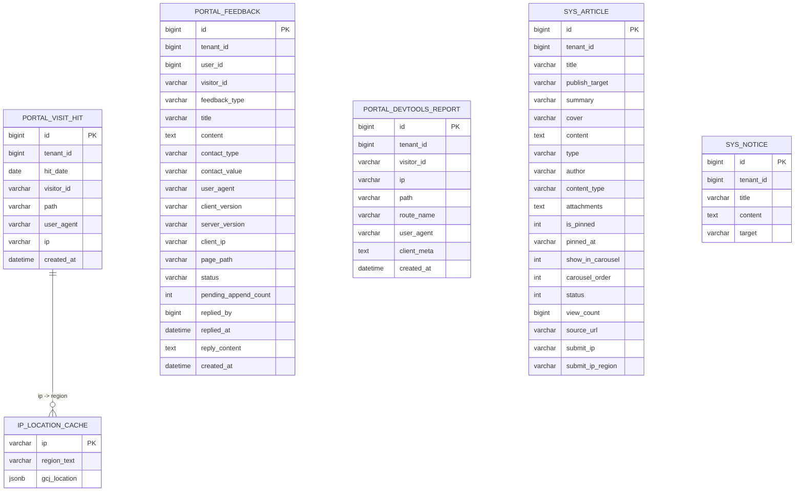

# 门户实体

## 目录
1. [简介](#简介)
2. [项目结构](#项目结构)
3. [核心组件](#核心组件)
4. [架构总览](#架构总览)
5. [详细组件分析](#详细组件分析)
6. [依赖关系分析](#依赖关系分析)
7. [性能考虑](#性能考虑)
8. [故障排查指南](#故障排查指南)
9. [结论](#结论)
10. [附录](#附录)

## 简介
本文件聚焦门户相关实体的数据模型与业务逻辑，覆盖访客记录（PortalVisitHit）、反馈收集（PortalFeedback）、开发工具报告（PortalDevtoolsReport）、文章（SysArticle）、公告（SysNotice）等。重点说明：
- 访客行为追踪的数据采集、存储与分析机制
- IP 地理位置解析、用户代理分析与访问统计的数据结构设计
- 内容管理系统中文章与公告的生命周期管理
- 门户数据统计、报表生成与数据分析的数据库支持方案

## 项目结构
- 实体层：定义门户相关表结构与字段约束
- 服务层：封装业务规则、权限控制、防刷限流、统计聚合
- 仓储层：基于 JPA Repository 提供查询与聚合能力
- 迁移脚本：通过 Flyway 维护数据库演进

## 核心组件
- PortalVisitHit：记录门户访问点击，包含租户、访客ID、路径、UA、IP、统计日期、创建时间；按日分桶便于统计。
- PortalFeedback：记录用户反馈，含类型、标题、内容、联系方式、版本信息、页面路径、处理状态、运营回复等。
- PortalDevtoolsReport：开发者工具上报，包含租户、访客ID、IP、路径、路由名、UA、客户端元信息。
- SysArticle：文章内容实体，支持发布目标、轮播、置顶、状态、浏览量、来源链接、提交IP及地区等。
- SysNotice：系统通知，支持目标范围（门户/后台/全部），用于向不同端推送公告。

## 架构总览
门户数据流围绕“采集—存储—分析”展开：
- 采集：前端或接口触发记录写入（访问、反馈、开发工具上报）
- 存储：JPA 持久化到对应表，附带索引优化查询
- 分析：服务层聚合 PV/UV、小时/日/月趋势、省份城市维度；结合 IP 地理位置缓存进行区域分析

## 详细组件分析

### 访客记录 PortalVisitHit
- 关键字段
  - tenantId：租户隔离
  - hitDate：统计日（服务器时区）
  - visitorId：访客匿名ID（Cookie）
  - path：前端路由路径（不含 query/hash，超长截断）
  - userAgent：客户端 UA
  - ip：客户端 IP（脱敏/截断）
  - createdAt：记录时间
- 索引设计
  - 按 hit_date、tenant_id+hit_date 建立索引，支撑按日/租户聚合与分页查询
- 业务要点
  - 异步写入，避免阻塞主流程
  - 统一截断长度，防止大字段影响性能
  - 列表展示时批量回填 IP 区域文本

### 反馈收集 PortalFeedback
- 关键字段
  - feedbackType：反馈类型（建议/缺陷/内容/账号/其他）
  - title/content：标题与详细描述
  - contactType/contactValue：联系方式类型与值（手机/邮箱/QQ/微信/其他）
  - clientVersion/serverVersion：前后端版本
  - clientIp/pagePath：提交时的客户端IP与页面路径
  - status：pending/replied/closed
  - pendingAppendCount：待处理阶段用户补充次数
  - repliedBy/repliedAt/replyContent：运营回复信息与时间
- 业务要点
  - 提交前进行验证码校验与频率限制
  - 非登录用户必须填写有效联系方式
  - 支持“追加补充”，以保留历史上下文
  - 列表支持关键词、类型、状态筛选

### 开发工具报告 PortalDevtoolsReport
- 关键字段
  - tenantId/visitorId/ip/path/routeName/userAgent/clientMeta/createdAt
- 业务要点
  - 异步写入，异常捕获不阻断主流程
  - 列表支持关键词、排除词、IP、IP区域过滤
  - 列表展示时批量回填 IP 区域文本

### 文章 SysArticle
- 关键字段
  - tenantId/title/publishTarget/summary/cover/content/type/author/contentType/attachments/isPinned/pinnedAt/showInCarousel/carouselOrder/status/viewCount/sourceUrl/submitIp/submitIpRegion
- 生命周期
  - 创建/更新：自动填充提交IP与地区（截断保护）
  - 删除：软删除（记录 deletedAt/deletedBy）
  - 浏览计数：增量计数，带防刷保护
- 查询策略
  - 支持按发布目标、类型、关键词、轮播标记筛选
  - 平台级与租户级权限控制

### 公告 SysNotice
- 关键字段
  - tenantId/title/content/target（portal/admin/both）
- 生命周期
  - 创建：支持指定租户列表（仅超管），否则归属当前租户
  - 更新：权限校验后保存
  - 删除：软删除（记录 deletedAt/deletedBy）
- 查询策略
  - 支持按目标、关键词筛选，默认按创建时间倒序

## 依赖关系分析
- 实体与服务
  - PortalVisitHit 由 PortalVisitService 负责异步写入与统计聚合
  - PortalFeedback 由 PortalFeedbackService 负责提交、追加、审核与列表查询
  - PortalDevtoolsReport 由 PortalDevtoolsReportService 负责异步上报与列表查询
  - SysArticle/SysNotice 由各自 Service 负责 CRUD、权限与软删除
- 外部依赖
  - IpLocationCacheService：批量解析 IP 区域文本，用于列表展示与筛选
  - CountAntiAbuseService：防刷限流（反馈、浏览量等）
  - TenantQueryPolicyService：租户隔离与全局模式切换
  - ApiPermissionService：超管权限判断

## 性能考虑
- 写入优化
  - 访问与开发工具上报采用异步写入，降低请求延迟
  - 字符串字段统一截断（path、userAgent、ip、clientMeta 等），避免大字段
- 查询优化
  - 为高频查询列建立索引（如 hit_date、tenant_id+hit_date、created_at 等）
  - 列表展示时批量解析 IP 区域，减少多次远程调用
- 统计聚合
  - 按日/小时/月多粒度聚合，长跨度使用月度聚合以降低计算成本
  - 对唯一访客数使用专用计数方法，避免重复扫描

[本节为通用性能建议，无需特定文件引用]

## 故障排查指南
- 反馈提交失败
  - 检查验证码是否通过、是否触发限流、联系方式格式是否合法
  - 参考：提交流程与校验逻辑
- 访问记录缺失
  - 确认 visitorId 是否为空、异步写入是否成功、日志是否有异常
  - 参考：异步记录入口
- 开发工具上报丢失
  - 关注异常捕获日志，确认字段截断是否导致入库失败
  - 参考：上报写入与异常处理
- 文章/公告权限问题
  - 检查租户隔离策略、超管权限、软删除状态
  - 参考：权限与租户策略

## 结论
本模块通过清晰的实体设计与服务层封装，实现了门户访客行为追踪、反馈闭环、开发工具上报以及内容与公告管理的完整链路。借助索引与聚合查询、IP 地理位置解析与租户隔离策略，既保证了高并发下的稳定性，又提供了丰富的统计分析能力，满足运营与产品分析需求。

[本节为总结性内容，无需特定文件引用]

## 附录

### 数据模型概览（ER 图）

---

> 本文整理自 Qoder RepoWiki（基于代码自动生成），仅供参考，以代码为准。
